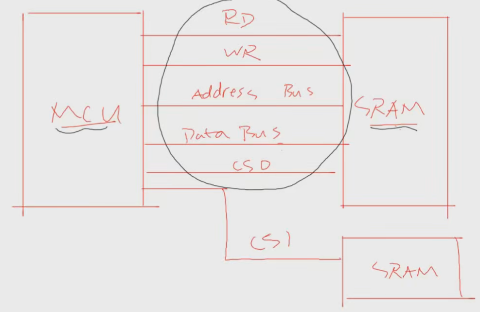
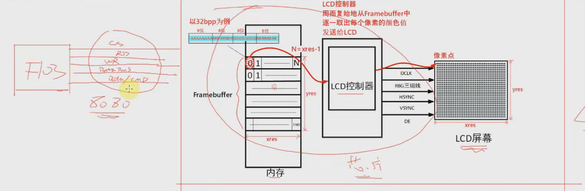
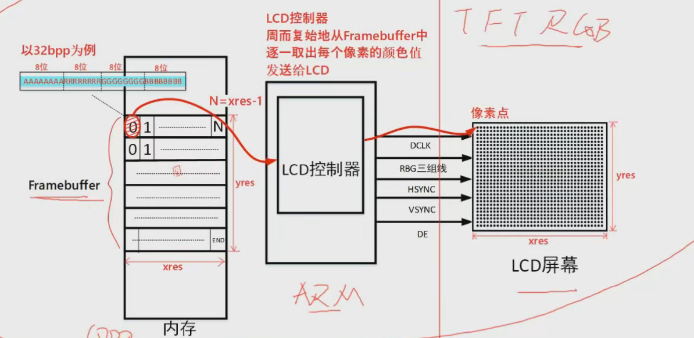
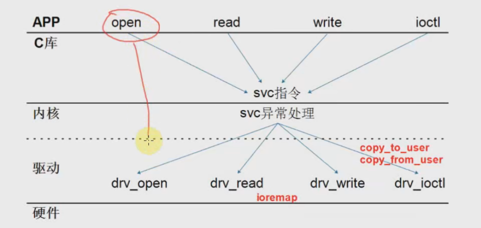

驱动大全

一、LCD

1. Linux下不同接口lcd硬件操作原理
   - 要想控制lcd控制器，需要写Framebuffer控制器，lcd控制器会将显存中的数据搬运到lcd控制器中，更新显示
     - 一个数据的像素位：要想写Framebuffer，就需要知道每个像素的信息，一个位置需要多少个RGB信息，
     - 位置：需要知道lcd显示对应buffer中的位置
   - LCD驱动工程师眼中的控制器：
     - Framebuffer控制器在哪？
     - 谁把Framebuffer中的数据发送给LCD？
   - 常见的lcd控制器：
     - mcu读写内存
     - 
     - 
     - 上图8080：可以采用cs、rd、wr、data bus、data/cmd选择线来精简通信总线，采用此种接口的控制方式，SRAM现存价格昂贵，因此这种方式的像素不会很大，
     - 
     - 第二种就是上图的采用MPU的方式：需要芯片强大，操作大显存
       - dclk用于移动像素点，
       - hsync控制移动行数
       - vsync：最右下角的像素移动到第一行第一个，
       - RGB三组线：数据来源
       - DE：像素移动的时候使能信号
2. Framebuffer驱动框架：字符设备驱动程序
   - 
   - 步骤：这些步骤在fbmem.c中实现了，通用文件不能操作所有的lcd，因此需要单独实现
     - 构造file_operations结构体
     - 注册register_chardev（major,name,,,）   class_create   device_create
     - 入口函数：
     - 出口函数：
   - fbmem.c文件(框架函数)：从入口函数开始看，fbmem_init
     - fbmen.c中的函数知识中转作用，最后调用s3c2410fb.c，stm32mp157fb.c等函数中的硬件操作函数
     - 下层函数中fb_info结构体，里面包括lcd参数和操作的函数结构体，
       - 分配结构体：framebuffer_allc
       - 设置fb_info:
       - 注册fb_info：
3. 写出框架：
   - 参考J:\si project\Linux-4.9.88\Linux-4.9.88\drivers\video\fbdev\s3c2410fb.c编写
   - 

