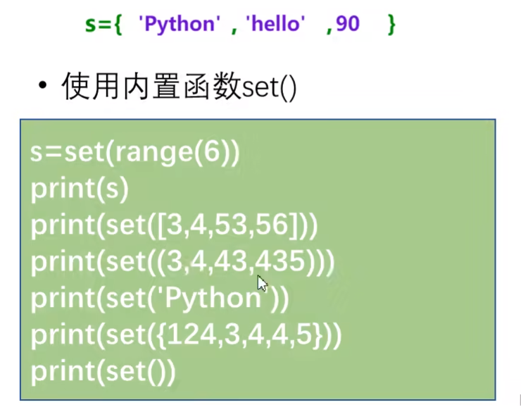
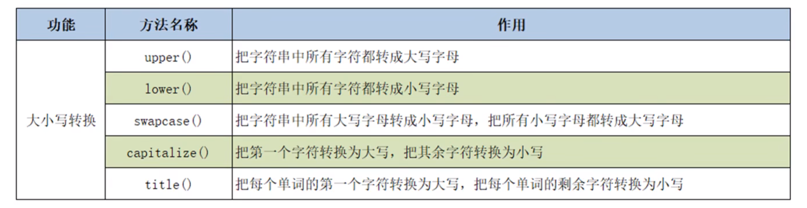
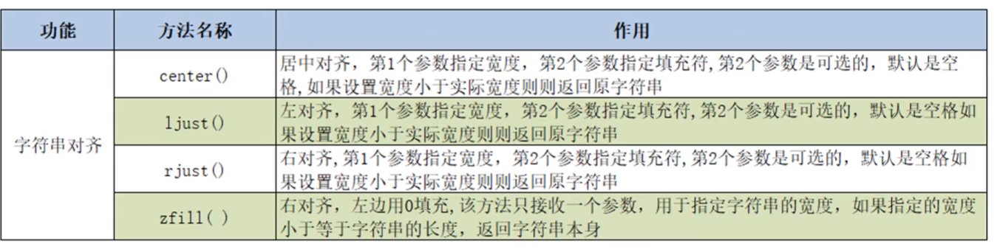
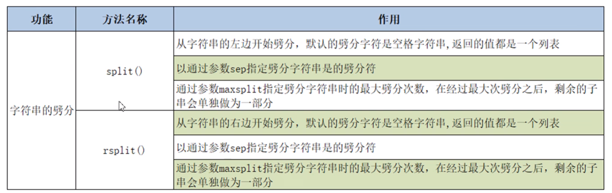
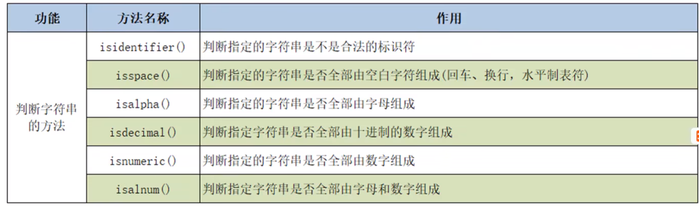
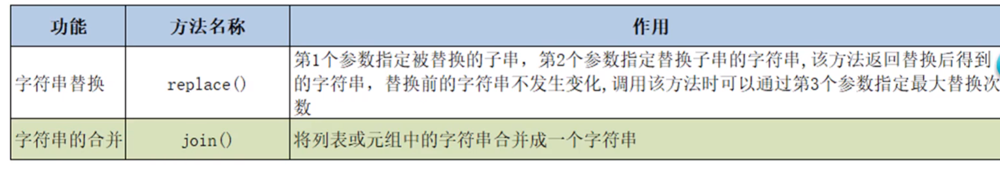
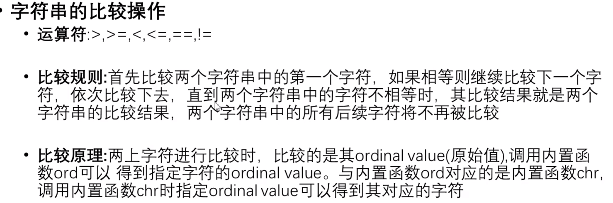
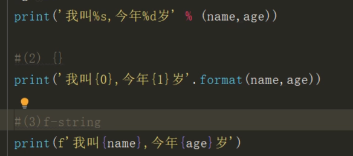

### 一、list

### 二、字典---哈希

1. 大括号键值对
2. dict函数
3. 字典元素操作：
   - sc[]:没有的话会报错
   - sc.get()：没有返回：NONE，99
   - in not in
   - 删除 del sc["张三"]
   - 清空：sc.clear()
   - 添加：sc['陈留']=98
   - 视图操作：
     - key()
     - values()
     - items():转换成list，元组tuple
   - 遍历：
     - for items in sc
   - 字典生成式：
     - d={item:price for item,price in zip(items,prices)}

### 三、元组

1. 可变序列和不可变序列
   - 可变序列：列表和字典
   - 不可变：字符串，元组
2. 创建方式：
   - ()
   - tuple()
3. 元组数据

### 四、集合set

1. 创建：无序
   - {}：不能重复
   - ****
2. 操作：
   - add()
   - update()
   - remove():没有报异常
   - discard()：没有的话不会报错
   - pop()：
   - clear()
3. 集合间的关系：
   - ==
   - issubset
   - issuperset
   - isdisjoint
4. 集合数据操作：
   - 交集
   - 并集
   - 差集
   - 对称差集
5. 集合生成式：
   - 和list一样，花括号{}

### 五、字符串：

1. **驻留：字符串常量在内存中存放一份，变量知识存放字符串地址：只保留一份地址，但是存在**，编译时驻留（常量操作，而不是字符串拼串），而不是运行，
2. 操作：
   - 查询：index() rindex() find() rfind()
   - 大小写：uper() lower() swapcase() capitalize() title()
     - 
   - 对其：center() ljust() rjust() zfill()
     - 
   - 字符串分割：
     - 
   - 字符串的判断：
     - 
   - 其他操作：
     - 
   - 比较操作：
     - 
   - 切片操作：字符串时不可变类型，不具备增删改等操作，切片操作将产生新的对象
   - 格式化字符串：
     - 
   - 字符串编码转换：

六、函数

1. 参数传递：
   - def cal(a,b):
2. 函数多个返回值，结果为元组tuple
3. 关键字参数，位置参数只能有一个，

七、bug

八、类

1. 

