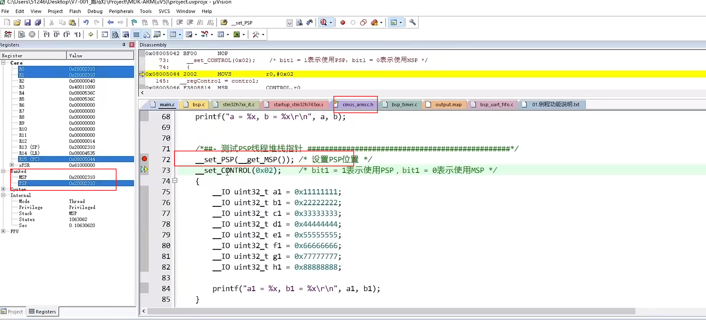
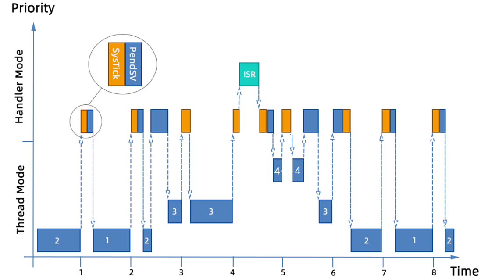
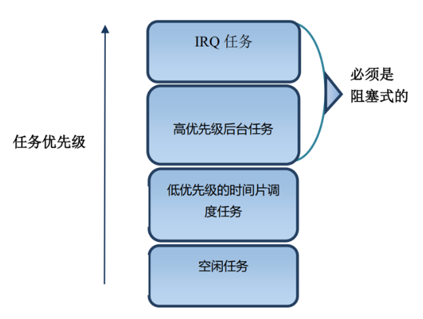
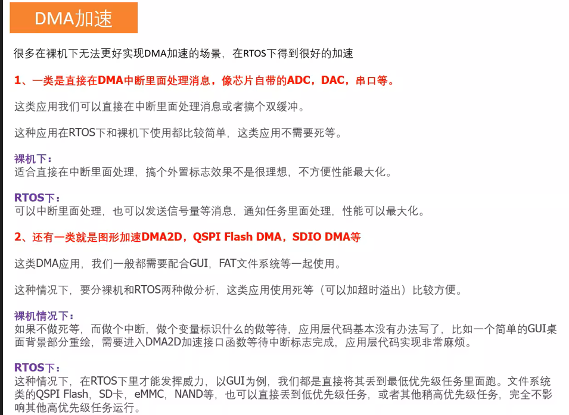
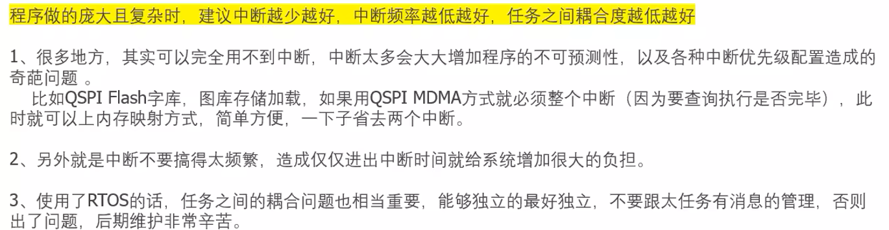

### 一、通俗易懂介绍Cortex-M内核的OS特性，双堆栈，非特权级，Pendsv、svc、Systick等

1. 堆栈：
   - 栈空间向下生长，高地址向低地址
   - 双堆栈MSP和PSP，主堆栈和线程堆栈，使用CMSIS提供的接口使用线程堆栈，查看寄存器指针，**`无论手动指定了PSP，进入中断自动使用MSP`**，退出中断使用PSP，提高安全性
     - 
   - PendSV：可挂起中断，等待CPU空闲再进行调度，RTOS的优先级比中断低，使用PendSV能够更好响应中断，保存当前现场，一部分寄存器是自动保存入栈，另一部分需要手动保存入栈
   - SVC：内核任务在SVC执行，rtos任务和内核隔离，
     - 0号服务软中断，MDK特有的函数，
     - 参数传递，第一个参数传递到R0，以此类推
   - 特权级和非特权级：中断里面是特权级，中断外是都可以，

二、Threadx工程模板框架以及启动执行流程

1. 任务执行流程
   - 
2. 任务切换：
   - 系统栈和任务栈：也就是双堆栈，MSP和PSP，主堆栈和任务堆栈，os内核设置任务堆栈大小，每一个任务都有自己的堆栈空间，且是死循环
   - 两个任务之间耦合项减少，
3. **任务调度**
   - 抢占式调度：谁的优先级高就可以抢占
   - 世间片：
   - 合作调度：
4. 中断中用信号量唤醒irq任务，irq任务优先级较高
   - 
   - 
   - 
5. 中断延迟：M内核中断延迟为12-16个周期
   - 0中断延迟：和裸机一样的中断延迟时间，rtos性能指标
   - 设置_set_BasePRI关闭低于什么值的中断
   - 中断中使用64size_T执行时间非常长，
   - 任务安排：
     - 任务数不要超过32，
     - 挂起类中断延迟时间为无限即可，具体值浪费cpu资源
     - 