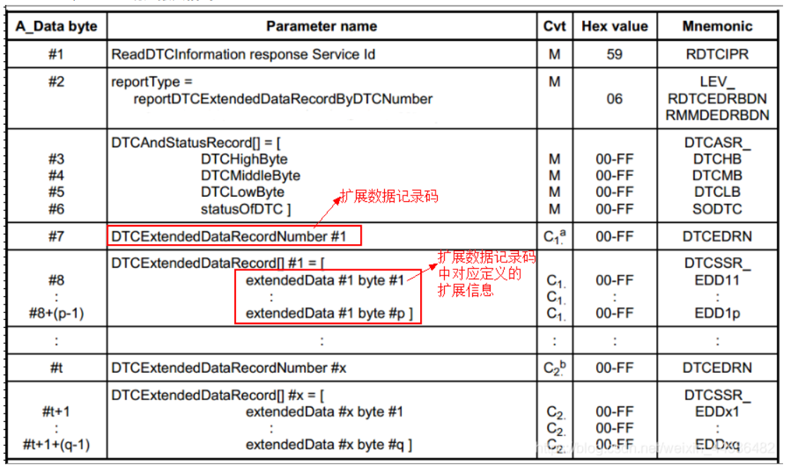
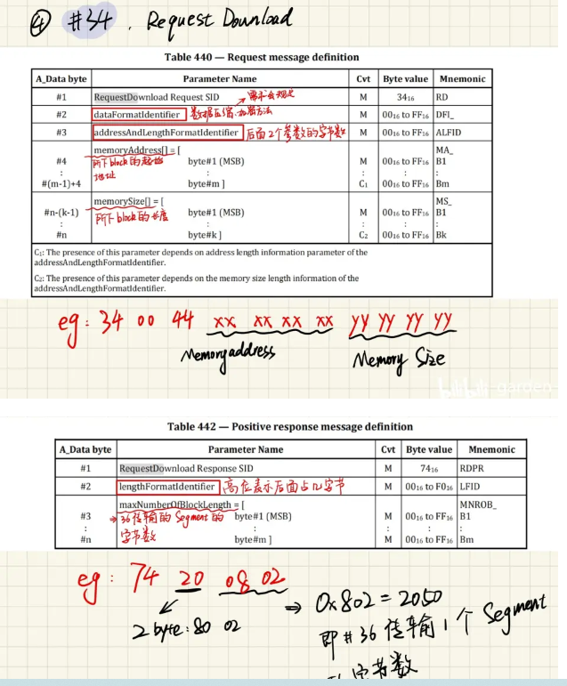
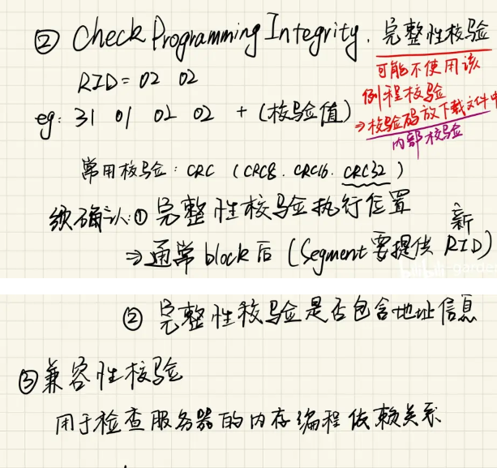

# 一、UDS

### 一、UDS诊断（ISO 14229-1-2020）

1. 概念：类比应用层Http协议，UDS本质就是一些列的服务，通过“请求”和“响应”的形式，对ECU进行检测和诊断，汽车可以用诊断工具Tester连接到汽车总线上。

   - 数据场比较短，can数据帧传输**8个字节**，can fd传输64字节，如果一个诊断命令超过数据场长度，需要分包传输，即多帧传输（**ISO 15765**）
   - 
   - 
   - 单帧SF：  SF_DL代表读取多少个字节，例如0**2** 10 03 55 55 55 55 55，（SF_DL=2,高四位固定为0）有效数据为10 03，其他末尾为填充位（电平跳变数据，55（0101 0101）或者AA这样的填充），
   - 首帧FF：和单帧SF一样
   - 连续帧CF：
     - 1号字节表示BS块大小，接下来发送几帧数据 ，2好字节表示STmin，规定发送最小时间间隔
   - 流控帧FC：0号字节高4为为2，低四位表示包的联系好SN，后面跟着数据，高四位固定为3，第四位表示状态参数FS（`0：继续发送；1：等待，发送方停发，等下一个流控帧；2：溢出；3：保留`）
   - 发送举例：
     - 

2. NRC（negative response code）：否定响应得知道为什么否定请求、响应格式

   - 请求格式
     - SID+SF。服务+子功能 如：10 01
     - SID+DID：服务+DID 读写用，如：22 F15A
     - SID+SF+DID：服务+子功能+DID 例程服务，如：31 01 FF00
     - SID 服务号 如：37
   - 肯定响应
     - （SID+0x40）+SF+（其他）
     - 如:
       - request：10 01/rep：50 01
       - request：27 01/rep：67 01 11 23 33 44
       - request：27 F020/rep：62 F0 20 00 11 22 33 44 55 66
   - 否定响应
     - 7F+服务+NRC（例如 7F 10 13，找专门的否定码意义  ISO 14229  附录A）

3. 常见服务：

   1. 常见服务支持
      - 以某厂商为例
        1. 

   1. 10服务（01、02、03）
      
      - 10服务为诊断会话：ECU根据执行动作权限不同，所处状态分为默认、扩展以及编程会话
      - 默认会话：ECU初始化完成后，默认启动默认会话模式，基础状态，其他模式下请求10 01进入默认会话，
      - 扩展会话（10 03）：此状态支持ECU存储器中操作，#2写服务等
      - 编程会话：支持ECU内存编程操作，执行bootloader等操作
      - 报文格式：
        -  
        - P2Server:诊断工具请求和ECU响应时间的最大时间间隔
        - P2＊server：诊断工具收到否定响应码NRC=0x78（请求报文被收到，参数均有效，但是执行的动作未完成，ECU没有准备好接收另一个请求，启动定时器，返回NRc=78，在P2*server的时间后给与答复，到时后没有完成继续发送0X78，否则开始答复），响应最大时间，
      - 
      - 
      
   1. 11服务：ECU reset

      - 11 +SF(01 02 03 04)

      
   
   1. 3E服务：4s请求一次，周期性请求，保持会话，没必要回复响应，类似于心跳机制
   
      ------
   
      

### 二、UDS诊断二

1. 27服务（解锁流程，请求响应格式，错误计数器，状态切换）p47--访问首先的数据或者其他诊断服务
   - 
   - 上位机向ECU发送请求----->ECU返回seed----->客户端发出密钥----->服务端检查密钥，确认有效“解锁”
   - 注意事项：
     - `任何时刻，只有一个安全等级被激活，安全等级数字随意分配，没有优先级之分`(LV1操作A  LV2操作B LV3操作C)
     - 种子的值为ECU随机产生，应该避开0和F，全0的种子检测当前是否已经被解锁，
     - 密钥有特定安全算法，
     - 上图请求种子及密钥的动作流程是强制性的，当ECU返回否定响应，或者其他原因导致诊断会话模式回到默认模式，种子重新生成
   - 请求格式
     - 
     - 注意事项：
       - 请求种子的子功能SF是奇数（0x01,0x03，0x11），对应的发送密钥的子功能是请求种子的子功能+1（0x02,0x04.0x12）
       - NRC1:12子功能不支持，13报文长度错误，22条件为满足，37延迟时间未到
       - NRC2:12、13、22、24请求序列错误，35密钥错误，36超出访问次数限制
   - 延时机制（NRC=37）-防止多次请求，暴力遍历---在x次请求失败后，等待y秒后接受下一次安全访问请求，ECU成功进行一次解锁后，错误计数器归零
     - 常见策略：
       1. 连续请求种子，种子是否相同，不相同的话只返回最新一次请求的种子计算的密钥通过安全访问
       2. 错误计数器存储位置。错误计数器存在非易失性存储器，ECU上电/复位后闭锁状态，请求安全访问前检测错误计数器，根据不同策略确认：
          1. 错误延时时间：达到错误计数器最大值，NRC=36后，再次请求种子返回NRC=37，错误延时时间未到
          2. 重新上电之后是否开启访问延时？：
             - 无论何时，上电都有延时
             - 掉电前已经达到最大值，上电之后再次等待延时
          3. 如果开启，根据什么条件开启？（错误计数器和错误标志位）
          4. 错误计数器开启条件
          5. 达到最大值，延时结束后，计数器减一还是清零
     - 路径问题：除了35、36和37之外
       1. 安全访问诊断服务的执行策略
          1. 假设错误计数器到3为最大值，10s延时，延时到错误计数器-1   (iso 14229 p451)
          2. 
          3. 
          4. 4个状态转换，10种条件学习，如下状态A到状态A，总共条件6个条件，有的条件内部and的关系，都满足才可发生，6个条件之间or的关系，满足一个就可发生
             1. 

### 三、UDS诊断三---DTC相关（概念、故障码组成以及故障码状态等）19、14、85服务

1. 定义：诊断故障码，故障类型的id
2. 故障码组成（p422 ISO14229）：
   - 
   - 
3. 19服务：读取诊断故障码信息
   - 01子服务：请求ECU中DTC状态与DTC状态码相匹配的故障码个数，匹配之后故障数+1, 
     - 
     - 
     - 
   - 02子服务
     - 按照定义的状态掩码查找故障，返回01服务中匹配的信息
     - 
     - 
   - 04子服务
     - 请求故障码的快照信息（撤诉，电压或者行驶里程等信息）
     - 
     - 
   - 06子服务：
     - 拓展信息记录故障发生的次数、老化次数等信息
     - 
     - 
   - 0A子服务
     - 请求所有支持的DTC信息（3字节的DTC标识符+1字节的DTC状态位）
     - 
     - 
   - 14服务：故障清除信息
     - 
     - 
4. 14服务：
5. 85服务：

# 三、bootloader基于can总线

### 一、概述

1. 程序烧写（基于总线不拆卸ECU）

   - 无bootloader：烧写器进行烧写，拆卸ECU
   - 有bootloader：基于诊断接口于服务器通信，无需拆卸

2. bootloader：一段有下载和引导两种功能的程序，通过can、UDS协议层构成的通信协议栈

3. 相关的诊断服务（#10,11,22,2E，85,28,31,34,36,37,27等）

4. 

5. 

6. 预编程：

   - 
   - 

7. 主编程（flash driver防止擦除重要信息，确定擦除才开始下载擦除程序）

   - 
   - 
   - 
   - 
   - 
   - 
   - 
   - 

8. 后编程

   1. #28->#85->#11(顺序不能反，#11为reset)

9. 测试工作：

   1. 测试项目

   2. 

   3. 

   4. 

   5. 

      

