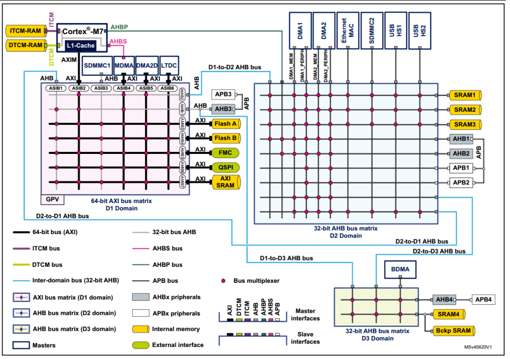

### 一.bootloader（集成UDS的10/27/11基础诊断服务，22/2E读写DID服务支持，31/34/36/37四个bootloader主打服务支持）---app段中，85服务以及28服务需要支持，保证暂停CAN通信，暂停记录DTC，保证设备升级正常

**（1）预编程阶段**

1. 3E TP报文。
2. 10服务切换到03扩展模式。
3. 85服务和28服务，关DTC和非诊断报文。使整个CAN网络处于安静的状态。这是对整车网络进行操作的，一般都是以功能寻址的方式来发送。注意先用85服务关闭DTC，再使用28服务关报文。

**（2）主编程阶段**

1. `10服务切换到编程模式，这里要注意，正确的方式是App段程序回复0x78 NRC，接下来跳转到boot段程序，最后由Boot段程序来回复10 02的肯定响应。错误的方式是由App段回复10 02的肯定响应，再进行跳转。`
2. 读取一个DID，tester要判断一下返回值。返回值里面可能包含密钥的一部分信息。
3. 27服务，解锁，通过安全验证。

注意10 02服务不应直接进行肯定响应，存在风险

1. 写DID指纹，标记写软件人的身份，ECU回复写指纹成功。（根据OEM要求来执行）
2. 31服务-擦除Flash。ECU肯定响应，擦除成功。
3. 34服务，请求数据下载，ECU回复确认最大块大小。
4. 36服务，开始传输数据。每个块传输完成后，ECU肯定响应。判断是否还有更多块需要下载。最多可以支持255个块。
5. 37服务，请求退出传输。ECU肯定响应。
6. 31服务-校验APP段程序，检查编程一致性/完整性。ECU肯定响应。校验成功。
7. 若有更多块需要下载，重新执行31（擦除Flash区域）-34-36-37-31（校验）服务。若无，往下执行。
8. 11服务，ECU复位。之后应直接跳转到新下载的APP段程序中。

**（3）后编程状态**

1. 10服务切换到03扩展会话。
2. 执行28服务和85服务，使能非诊断报文和DTC。这是对整车网络进行操作的，一般都是以功能寻址的方式来发送。注意先执行28，后执行85，避免DTC误报。

1. 27服务，安全校验，准备写入数据。

2. 2E服务，将编程信息写入到ECU中。

3. 10服务，退回01默认会话。结束。

   

   

1. 首先是从0x8000 0000读取，
2. 启动之后可能需要将数据搬到ram或者falsh中，
   - 
   - **跳转失败可以用一劳永逸解决办法**
3. 进入app之后
   - 
   - 注意事项：
     - boot中使用的ram在app可以使用，
     - 跳转之后可以crc校验
4. bootloader实例
   - U盘bootloader
   - nandflash
   - sd卡测试案

1. 为什么stm32flash地址设置到0x8000 0000(地址映射)
   - `M3、M4内核上电之后固定从0x0000 0000地址中读取中断向量表，首地址存取栈地址，0x0000 0004地址存取复位中断服务程序地址`，STM32设置的Flash地址为0x8000 0000，主要是STM32芯片支持内存重映射功能，`将8开头的地址中的内存重映射到0x0000 0000中。`
   - MDK对应的分散加载文件xxx.sct将启动文件中的xxx.S中的RESET段放在了0x8000 0000存储
   - 为什么会有如此设置：因为STM32的启动方式还支持usb、isp等方式，如果直接放置到0x00000000，其他启动方式就不能重映射到0x0000 0000，因此Flash不能安排到0x0000 0000
   - M7内核的芯片，不是固定的从0x0000 0000地址读取中断向量表，STM32H7为例，可以从0x0000 0000~0x3FFF 0000的地址启动，H7的首地址0x0000 0000安排给了ITCM RAM使用
2. BOOT程序：
   - 种类：nand、emmc、U盘、sd卡更新等，或者自制上位机进行更新（usb、can、232、485、spi等）
   - 芯片上电启动流程：
     - 
   - 跳转配置（boot程序设置）：
     - 将app程序加载到支持运行程序的flash中或者ram中
     - 复位RCC时钟
     - 复位所有开启的外设
     - 关闭滴答定时器
     - 设置跳转pc、sp和control寄存器
     - 裸机版和rtos跳转的不同（msp和psp差异）
3. APP程序设置
   - 程序设置
     - app入口为复位中断服务程序
     - 设置app的中断向量表地址
     - boot程序占用的ram可以被app使用
     - app程序版本号和程序完整性问题，（crc检验等）（stm32xxx.s文件中保留的地址可用作版本号存取）
     - 固件加密问题
     - app调回到boot，使用`NVIC_SystemReset`软件复位
4. 调试下载阶段（qspi协议，flash运行app）
5. 常见的开源玩法：Wolfboot、OpenBLT、MCUboot
6. 概念
   - 
   - 
   - 
   - 

### 二、基于NAND、eMMC、U盘等（支持版本控制、CRC完整校验）

1. crc校验实现（MDk实现生成hex文件并且附加到文件末尾，生成最后的bin文件--srec_cat.exe、app.bin），最后与硬件crc计算值做比较
2. 以sd卡bootloader为例（版本控制，crc校验）：
   - 固件加载：
     - 挂载文件系统，获取大小，获取版本号（记录好偏移地址），扇区擦除，
     - 写入内部flash：每次读取一个扇区大小，存取到内部flash
   - CRC校验：读取app.bin文件的的crc值（app.size-4地址），然后boorloader程序采用硬件crc值计算，进行比较，成功之后开始跳转
   - 跳转app（提供干净的运行环境，app需要的外设都进行deinit，）：
     - sd卡复位（deinit--hal库）
     - 关闭中断
     - rcc复位
     - 关闭滴答定时器
     - 关闭所有中断
     - 使能中断
     - 设置一个空的函数指针AppJump，然后将（app+4）地址赋值给函数指针AppJump，app地址设置为主堆栈指针，执行函数AppJump，跳转到0x8100 0004地址开始执行
3. 跳转app软件设计：
   - 首先是中断向量表设计：偏移地址，比如app存储在0x8100 0000（system_stm32xxx.c中设置）
   - crc值：for循环计算固件大小，计算crc，srec_cat.exe将crc值写入到bin文件最后，stm32硬件crc值--->生成app.bin文件
4. **`boot跳转失败解决方案`**：
   - 设置一个不被初始化的变量，用于boot和app共同操作，之后软件复位，复位之后所有都是初始值，保证运行环境，然后直接跳转，
   - 

### 三、Bootloader的AES加密

1. **`固件加密之后，只是降低了被解密的风险，现有的逆向软件很强。（密钥的获取，上位机加密，boot解密然后跳转）`**   boot区域密钥存放在足够安全的flash区域，上位机加密，然后boot校验之后移动到app区域
   - 4k字节读取一次，然后写入到flash，写入完成之后开始crc校验，校验成功开始jumptoapp();
   - 

2. 逆向固件开源软件Ghidra
3. 开源插件SVD-Loader for Ghidra
   - 加载对应芯片的svd包，点击对应的外设，可显示伪代码
   - 

### 四、bootloader设计中用到的分散加载的知识

1. stm32H7  5块内存基础知识（ITCM，DTCM，AXI SRAM，SRAM1，SRAM2，SRAM3，SRAM4和备份SRAM）
   - 首先ITCM，TCM指紧密耦合内存，ITCM用于指令，DTCM用于数据，速度和内存怒一样，片上RAM达不到这个速度
   - 
   - ITCM和DTCM直连CPU，
     - DTCM：0x2000 0000，大小128kb（速度400mhz）
     - ITCM：0x0000 0000，大小64kb（速度400mhz）
     - AXI SRAM（速度200mhz）：地址0x2400 0000，大小512kb，可用于数据存储或者lcd显存
     - SRAM1、SRAM2、SRAM3（速度200mhz）：
       - SRAM1：地址ox3000 0000，大小128kb，可用于D2域中DMA缓冲，也可用于D1域断电后运行程序代码
       - SRAM2：地址0x3002 0000，大小128kb，D2域中DMA缓冲，也可用于用户数据存取
       - SRAM3：地址0x3004 0000，大小32kb，用途不限，主要是以太网和usb缓冲
     - SRAM4（速度200mhz）：地址0x3800 0000，大小64kb，用于D3域中DMA缓冲，
     - back SRAM区：地址0x3880 0000，大小4kb，用于系统进入功耗模式后，继续保存数据
     - AXI SRAM,SRAM4,IRTCM,DTCM上电后可直接使用，其他需要使能
2. 使用方式（MDK的optiopns操作flash和分散加载）：
   - 
   - 解读：
     - 
     - LR代表加载域，ER代表执行域，首地址都是0x0800 0000，大小都是0x0020 0000，为H7芯片的flash地址和对应大小
     - 第3行的*.o（RESET。+First），启动文件中starup_strm32h743xx.s中有个段为reset的代码段，存储了终端向量表，将其放在Flash的首地址
     - 第4行的*(InRoot$$Sections),将MDK的库文件放在根域，比如__main.o（包含复制到执行域的函数等）等
     - 第5行的.ANY(+R),将目标文件中的ROg只读属性的数据放在这，（**any属性代表当前位置内存已满，从下面接着申请内存**）
     - 第9-11行，RW_IRAM1执行域，配置的是DTCM,首地址是0x2000 0000，大小128kb，通过__attribute__(section("name")分配到这个RAM域
     - 第14-16：RW_IRAM2执行域，配置的是AXI SRAM,首地址是0x2400 0000，大小512kb
     - 第19-21行：RW_IRAM3执行域，配置的是D2域的SRAM1,SRAM2，SRAM3,首地址是0x3000 0000，总计大小288kb，起名.RAM_D2,通过__attribute__((section("name")))分配到RAM域
     - 第24-26行，RW_IRAM3执行域，配置的D3域的SRAM4，首地址0x3800 0000，总计大小64kb，起名.RAM_D3,
3. **`分散加载例程`**
   1. **跑马灯例程介绍**：
      - MDK target页面设置flash和ram就是对分散加载进行设置
      - 
   2. **内部TCM以及SRAM使用方式（手动分配变量存放的地址）**
      - 
      - 
      - **上图中SDRSAM需要时钟初始化，防止内存存放别的变量，加一个zero_init，分散加载文件里面定义UNINIT**
      - 仿真结果显示各个变量均存放在预期地址，SDRAM改变了三个变量，其他变量均为随机数，
      - 
   3. 时间关键代码存放到ITCM（64kb）中运行：**单个文件夹下面进行设置分散加载地址，仿真结果显示存放在ITCM中代码按照预期执行**
      - 
      - 
      - 
   4. **内部flash和QSPI flash混合运行方式，无需boot和app（比如字库文件可存放在QSPI flash中，执行速度不高）**，采用单个文件夹设置地址的方式
      - 
      - 生成的hex文件烧录的时候自动分散成两个bin文件，分别烧录即可
      - 
      - 
      - https://developer.arm.com/documentation/ka003046/latest（MDK AC5和AC6未初始化定义区别）
      - root region（https://developer.arm.com/documentation/dui0474/f/using-scatter-files/what-is-a-root-region-?lang=en）：
         - 根域具有相同的加载地址和执行地址，并且系统的进入地址必须存放在根域，启动文件纸偶更难的RESET存放了中断向量表，存放在根域中