can fd和can

### 一、经典can总线：

1. #### ISO11898
   
   - 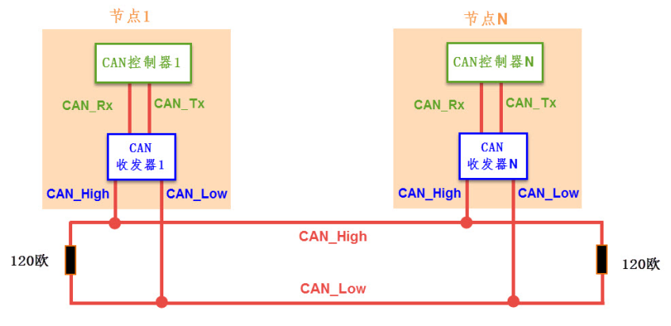
2. #### ISO11519-2开环低速网络
   
   - 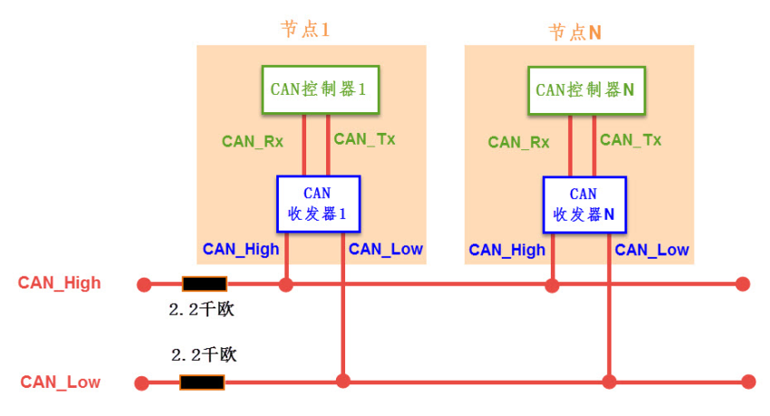
3. #### can协议的差分信号（**线与特性**）半双工通信，一段时间只有一个节点在发送，其他都在接收
   
   - 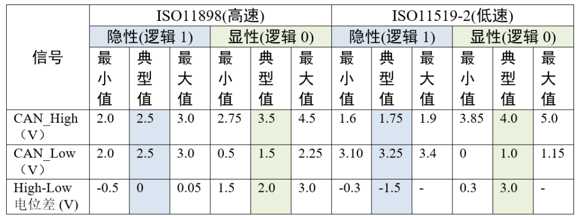
4. ### 协议层：
   
   - 位时序：一个数据位分为ss、pts、pbs1、pbs2组成，总共由8~25个Tq组成。
   - 同步过程：
     - 硬同步（帧起始信号才起作用）：总线发出帧起始信号后，节点检测到自己的ss段不在总线出现下降沿的地方，节点开始平移自己时序的ss段到总线出现下降沿的地方，获得同步，就可正确获得数据。
       - 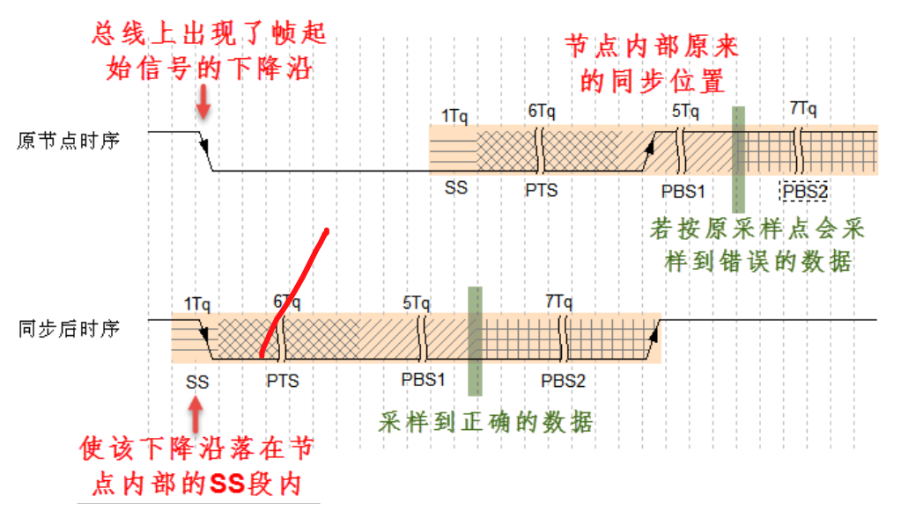
     - 重新同步：也是检测ss段，使自己内部的ss段将总线上的ss段包起来，分为超前和滞后；子节点超前的话在pbs1段加长对应的几个Tq；滞后的话在PBS2段中减少对应的几个Tq
       - 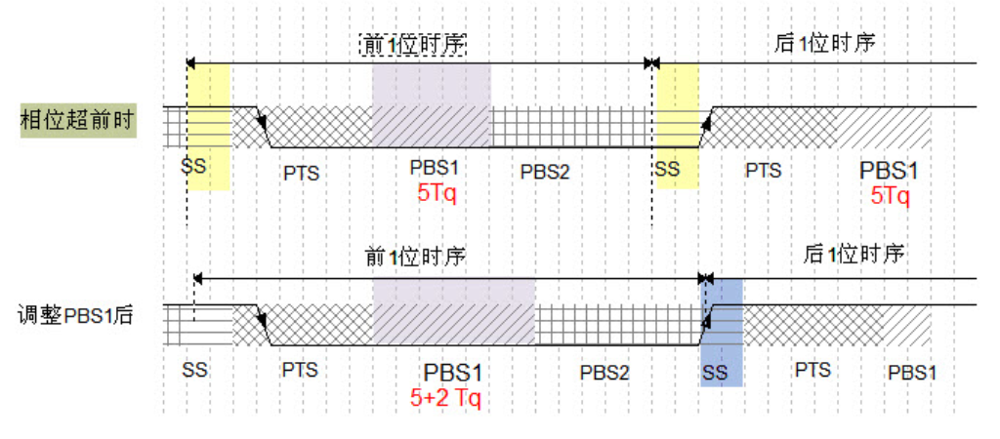
       - 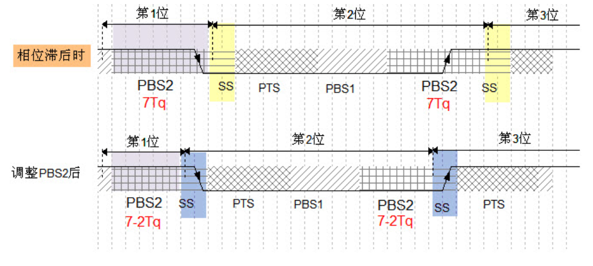
       - 一般来说，单次调整不会超过3个Tq
5. ### 报文种类：数据帧，遥控帧，错误帧，过载帧，帧间隔
   
   - 数据帧
     - 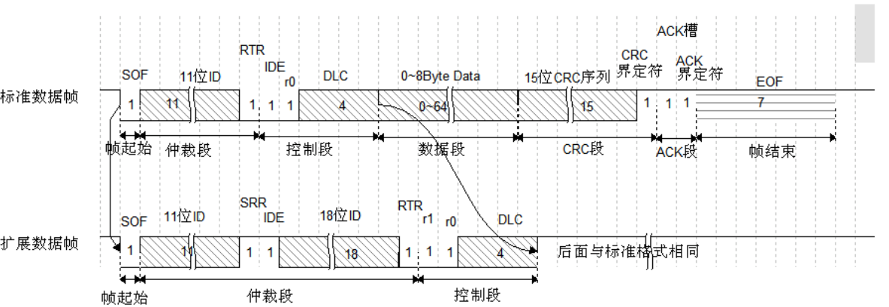
     - SOF：一个显性位起始信号
     - 仲裁段：通过线与特性决定高优先级发送
     - RTR：0代表数据帧，1代表遥控帧
     - IDE：0代表标准格式，1代表扩展帧
     - SRR：替代标准格式的RTR，为1，线与特性导致标准格式优先级较高
     - 控制段：r1和r0默认为0，再加4位表示数据长度（0~8）
     - 数据段：8字节数据长度，MSB先行
     - CRC段：can控制器计算得到的crc和收到的不同，则反馈错误信号
     - CRC界定符：1隐形位，间隔先后信号
     - ACK段：发送隐形位，接收方发送显性0表示应答，ACK界定符
     - EOF段：7位1隐形位表示结束
   - 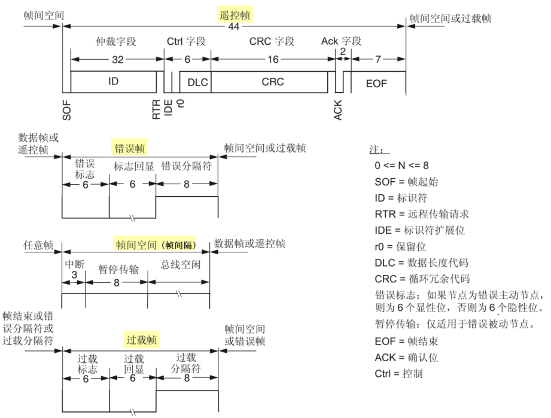
6. ### can错误处理：
   
   - 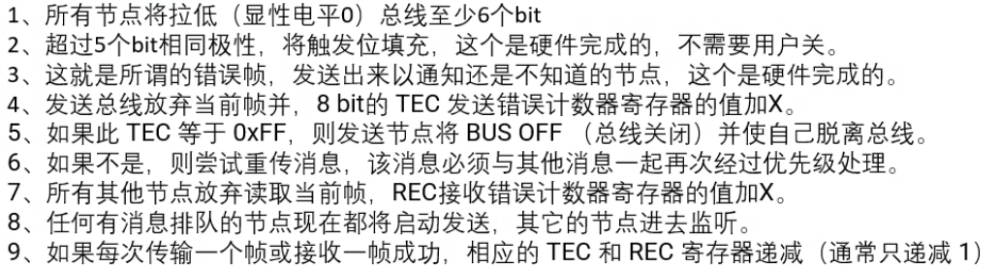
   - 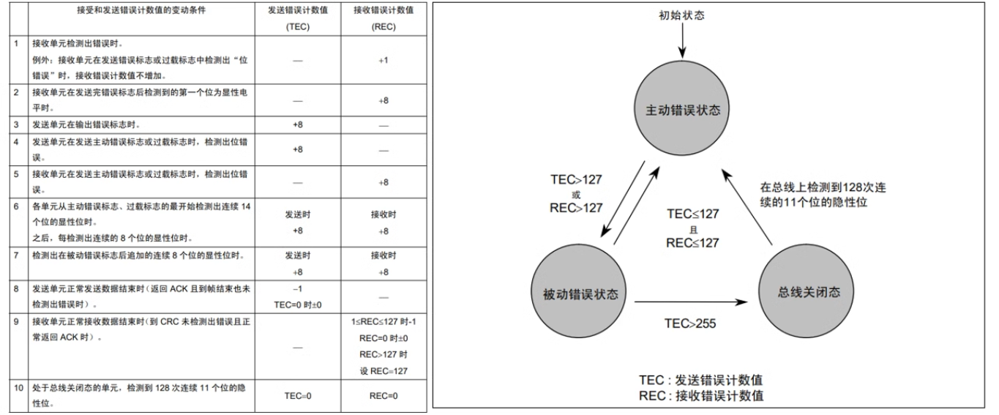
   - 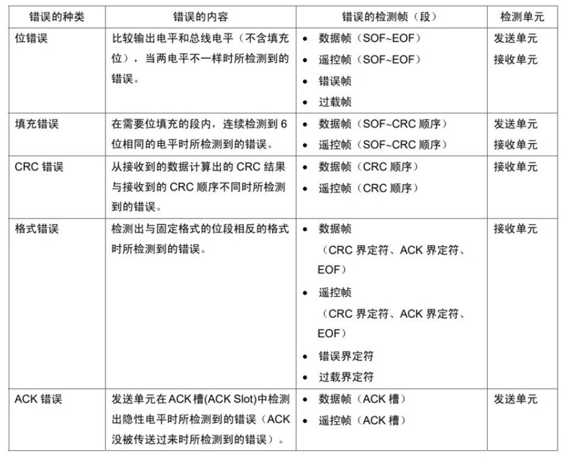

### 二、CAN FD

1. #### 标准桢

   - 
   - 
   - 
   - can fd特性：
      - 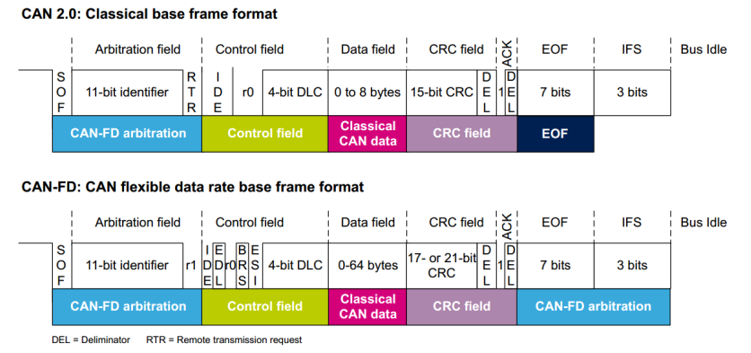
      - （1）兼容经典CAN，可以遵循ISO 11898-1做数据收发。
         （2）提升错误检测，支持高达CRC 21位的校验和。
         （3）消息优先级。
         （4）保证延迟时间。
         （5）配置灵活性。
         （6）具有时间同步的组播接收。
         （7）系统范围内的数据一致性，每条消息最多64个字节。
         （8）多主机。
         （9）错误检测和信号。
         （10）区分节点的临时错误和永久性故障以及自动关闭缺陷节点。
      - dlc在can2.0和can fd中的差别
         - 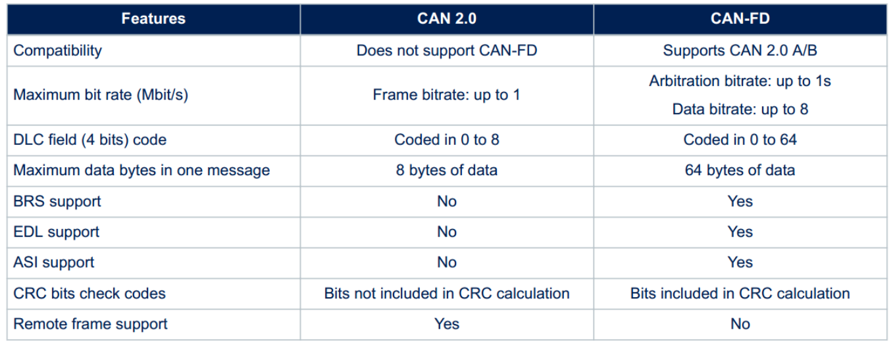
         - 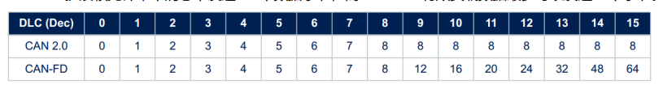

2. #### can fd协议介绍（FDCAN peripheral on STM32 devices.pdf）：

   - can fd在stm32上的功能
      - （1）符合CAN协议2.0版A，B和ISO 11898-1：2015，-4。
         （2）可访问的10 KB RAM内存，最多可分配2560个字。
         （3）改进了接收过滤。
         （4）两个可配置的接收FIFO。
         （5）多达64个专用接收缓冲区。
         （6）接收高优先级消息时的单独信令。
         （7）多达32个专用发送缓冲区。
         （8）可配置的发送FIFO和发送队列。
         （9）可配置的发送事件FIFO。
         （10）时钟校准单元。
         （11）收发器延迟补偿。
   - 功能框图（**canfd1和canfd1公用一个ram空间；没个canfd有自己的内核;can内核实现协议控制和收发移位寄存器；tx handle控制消息从can消息ram到can内核；rx handle控制can内核到ram**）：
      - 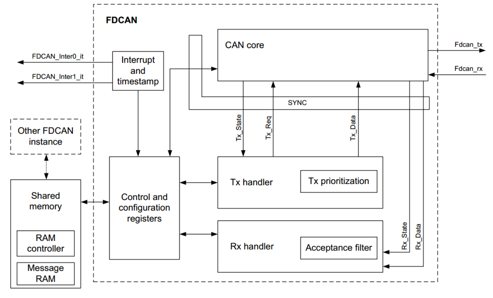

3. #### RAM管理：必须配置每条消息的字节数，确定每条消息的内存大小，总共可用内存为2560*4个32bit的数据

   - 分区：
      - 11bit过滤和29过滤
      - 接收区（Rx FIFO0，Rx FIFO1和Rx Buffer）
      - 发送区（Tx FIFO0，Tx FIFO1和Tx Buffer）
      - 触发空间（trigger memory）
   - 所有功能均可自定义配置，但是不能超过总得RAM大小，没个元素大小为标头信息(两个保留的32bit，分配标识符和DLC字段等信息)+数据（数据字段/4）
   - 有效使用CAN消息RAM的示例。 这个例子假设配置了FDCAN外设的应用程序
      - 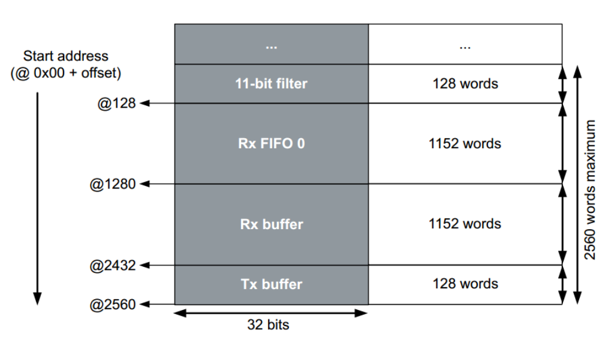
      - （1）在ID-11位部分分配128个字。
         （2）保留1152个字用于接收Rx FIFO 0部分中的元素。
         （3）保留1152个字，用于接收Rx缓冲区中的元素。
         （4）为发送缓冲区中发送的元素保留128个字。
   - 多个can fd外设使用：
      - 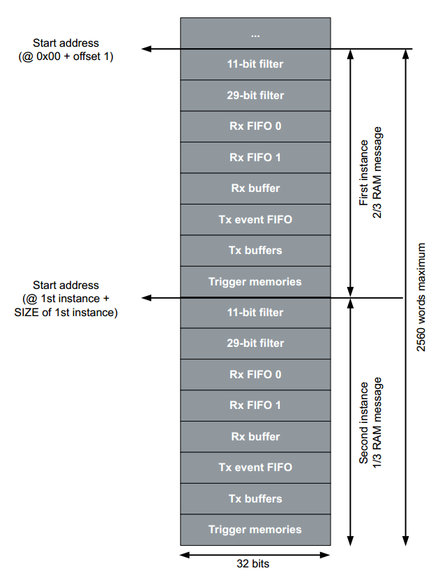

4. ### RAM过滤区（fdcan外设可配置两套过滤器，一个标准，一个扩展标识符，用于接受和拒绝收到的消息）：

   - 总共128个过滤元素，可配置128个11bit的标准id或者64个29bit的扩展id，将这些过滤器分配给Rx FIFO0/1或专用的Rx buffers（**`消息遍历过滤器，匹配之后停止，因此过滤器顺序对性能影响重大`**）
      - 范围过滤器（两个id范围内的所有消息）
      - 专用id过滤器
      - 位屏蔽过滤器
   - **高优先级消息**
      - 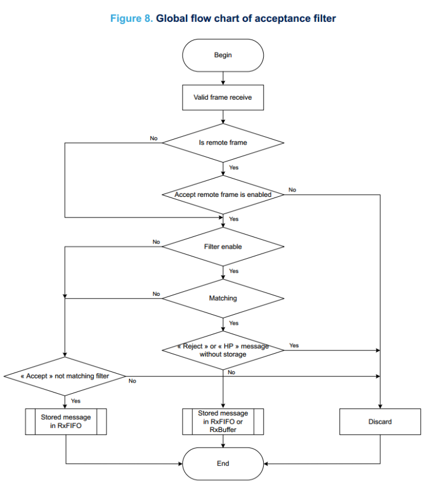
      - 针对上图举例说明
         - 用户需要的标识符：
         - （1）拒绝所有标识符在[0x16到0x20]范围内的消息
            （2）接受所有标识符等于0x15或0x120的消息，并将它们存储在FIFO 1中
            （3）接受标识符等于0x130的消息并将其存储在Rx缓冲区索引4中
            （4）接受具有与以下内容相对应的标识符的消息：
            –bit[10..6] = 0b111 00
            –bit[5..4] = 不管，任意值
            –bit[3..0] = 0b00000
         - 在这种情况下，必须将过滤器配置为经典位屏蔽过滤器，因为可接受的标识符对应于0b11100XX0000，可接受的标识符为：
         - – 0b111 0000 0000（0x700）
           – 0b111 0001 0000（0x710）
           – 0b111 0010 0000（0x720）
           – 0b111 0011 0000（0x730）
         - 因此，基本过滤器id可以是0x700、0x710、0x720、0x730中的任何值，屏蔽id为0b111 1100 1111，过滤器包含（SFT/SFEC/SFID1/SFID12）
         - 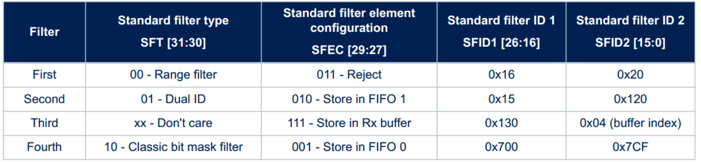
         - 注意：如果将SFEC配置为“存储到"Rx buffer”，则将忽略SFT的配置，验收过滤器停在第一次匹配。**`因此，筛选器顺序很重要。`**

5. #### 接收区（Rx FIFO0和Rx FIFO1）

   - 每个Rx FIFO可存储64个元素，每个元素指定在一个Rx FIFO元素中，如果FIFO满了，可以通过
      - 阻塞模式：直到一个元素被读出才开始写入，默认方式
      - 覆盖模式：新的元素覆盖FIFO中最旧的元素，并且FIFO中put和get索引加1
   - 读取元素cpu执行：
      - 读取寄存器FDCAN＿RXF1S了解Rx_FIFO状态
      - 计算最旧的元素地址Oldest element address = CAN_message_RAM_base_address + FDCAN_RXF1C.F1SA (start address) + FDCAN_RXF1S.F1GI (get Index) x Rx FIFO_element_size.
   - 从计算出的地址读取元素
      - 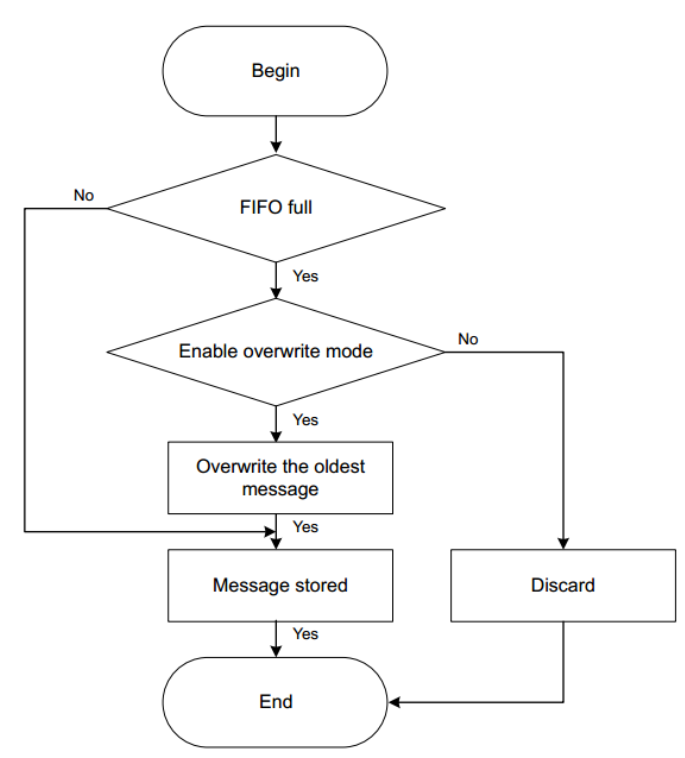
   - 专用的Rx buffer
      - FDCAN支持64个专用的Rx buffers，没个专用的buffers存储一个元素，Rx buffers的大小可以通过FDCAN＿RXESC寄存器设置，R buffers最大春初1152个字，
      - 要从专用的Rx buffer读取元素，cpu执行
         - 检查FDCAN_NDAT1/2中的位，判断是否有新元素达到专用的Rx缓冲区
         - 计算CAN消息RAM中的地址，Reference Rx buffer address = CAN_message_RAM_base_address + FDCAN_RXBC.RBSA (startaddress) + dedicated Rx buffer index x Rx_Buffer_element_size.
         - 从计算出的地址读取信息：过滤器元素可以引用**Rx缓冲区索引（0到63）**作为接收元素的目的地。如果相应的过滤器匹配，则FDCAN仅执行对引用的Rx缓冲区位置的写操作。 换一种说法，FDCAN不会写入未引用的Rx缓冲区位置。
      - Rx缓冲区操作流程图
         - 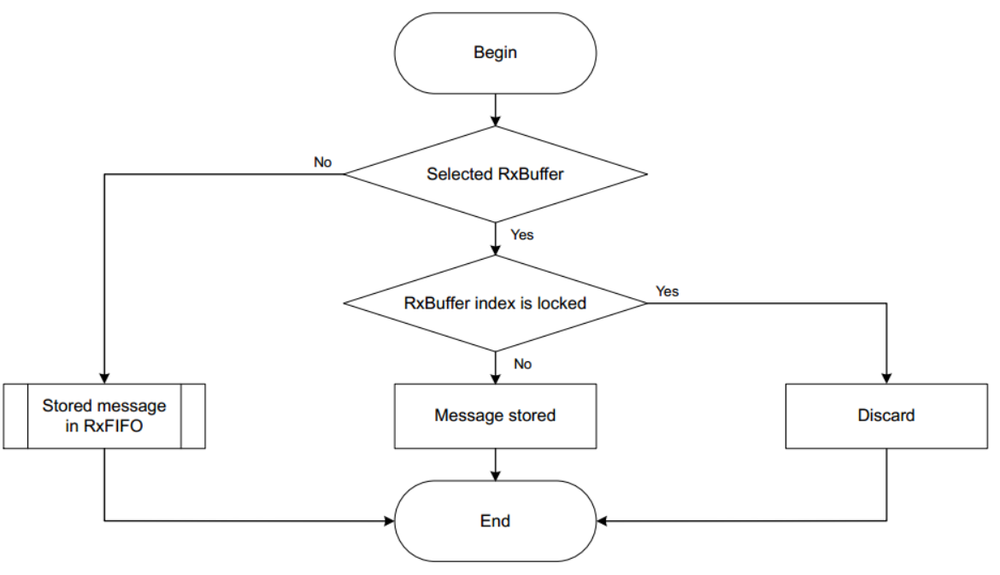
   - Rx FIFO和Rx buffer的不同
      - 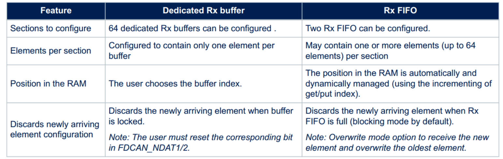

6. #### 发送区：通过Tx event FIFO，CPU可知元素传输的顺序和没个元素传输的本地时间

   - RAM的分配顺序：如果程序使用了Tx buffer，则在Tx FIFO和Tx queue之前分配，同一队列中智能使用Tx queue或者是Tx FIFO，不能混合使用
   - Tx buffer
     - 每个的Tx buffer都有自己的标识符，存储一个元素，根据最高优先级先发送；相同id的数据，第一个传输请求的先发送
     - 缓冲区地址计算：Dedicated Tx buffer address = CAN_message_RAM_base_address + FDCAN_TXBC[TBSA] (start address)+ Tx_buffer_index x Tx_buffer_element_size
   - Tx FIFO：
     - get索引指向的元素发送数据，每次发送，get递增，直到缓冲区为空
     - Tx buffer下一个空闲地址计算：
       - Next free Tx FIFO buffer address = CAN_message_RAM_base_address + FDCAN_TXBC.TBSA (startaddress) + FDCAN_TXFQS.TFQPI (put Index) x Tx_FIFO_element_size
     - 
     - 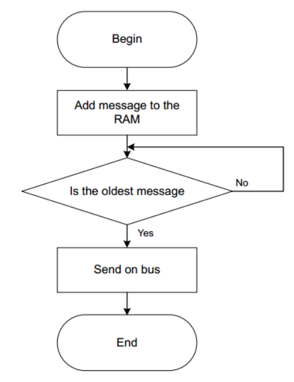
   - Tx queue：
     - 新消息必须写入到放置索引引用的Tx队列缓冲区中。周期性添加请求将put索引递增到下一个空闲Tx队列缓冲区。
     - 下一个可用发送地址：Next free Tx queue buffer address = CAN_message_RAM_base_address + FDCAN_TXBC.TBSA (startaddress) + FDCAN_TXFQS.TFQPI (put index) x Tx_Buffer_element_size
   - 三者差异
     - 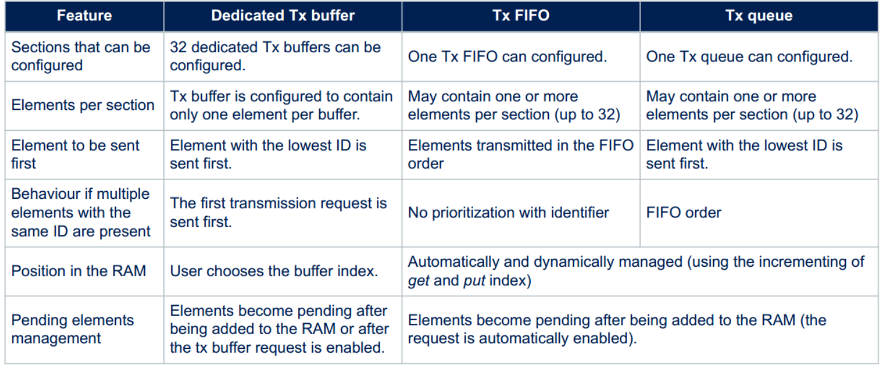
     - 支持Tx buffer和Tx queue混合使用
     - 支持Tx buffer和Tx FIFO混合使用

7. #### 测试模式：生产测试和自测

   - 限制操作模式：Restricted-operation mode

     - 在受限操作模式下，FDCAN能够：
       --接收数据帧
       --接收远程帧
       --确认有效帧
     - 该模式不支持：
       --数据帧发送
       --远程帧发送
       --活动错误帧或过载帧发送
     - 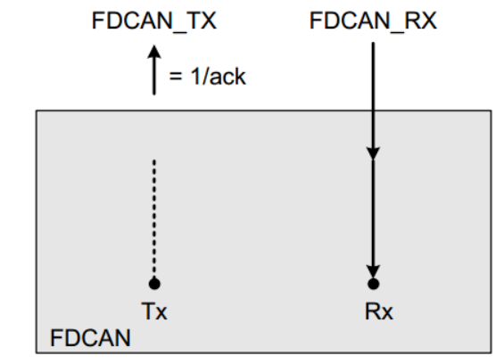

   - 总线监控模式：Bus-monitoring mode，

     - --接收有效的数据帧
       --接收有效的远程帧
     - 该模式不支持：
       --传输开始
       --确认有效帧（与受限操作模式不同）
     - 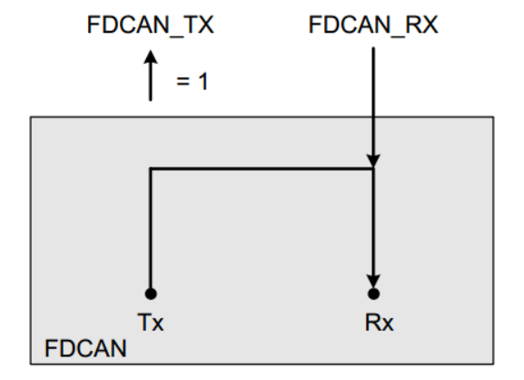

   - 外部环回模式External loop-back mode

     - 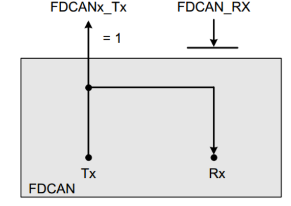

   - 内部环回模式Internal loop-back mode

     - 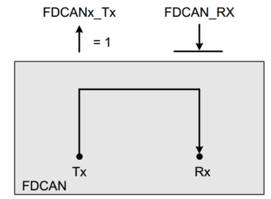

     - 收发器错误补偿

       - 在采样点，所有发送器都检查先前发送的位是否被正确采样。 **这需要一种机制来检查问题并检测其他节点错误帧**。 由于发射器看到了自己的发送位由收发器环路延迟而延迟，此延迟为TSEG1设置了下限，如图所示。下图（采样点之前的时间段），这也是数据比特率的上限。 这是引入收发器延迟补偿机制（TDC）的原因。

       - 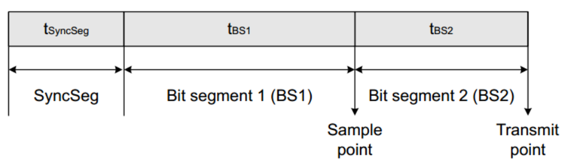

       - 为了在检查误码时补偿此环路延迟，定义了一个辅助采样点（SSP）。而不是在采样点完成，而是在SSP中检查传输的位。 该检查的结果是直到达下一个采样点为止。为数据阶段中发送的每个位生成一个SSP。 收发器不对称和总线振铃必须考虑SSP位置，但是没有时钟容限，因为收发器会监视自己的位置位流。通过将1写入FDCAN_DBTP中的TDC位来启用收发器延迟补偿。 测量在数据阶段开始之前（在信号的下降沿之前）在每个发送的FDCAN帧内开始FDF逐位解析。 当在示波器的“接收”输入引脚FDCAN_RX看到该边沿时，测量将停止。 此测量的分辨率为1 mtq（最小时间量）

       - 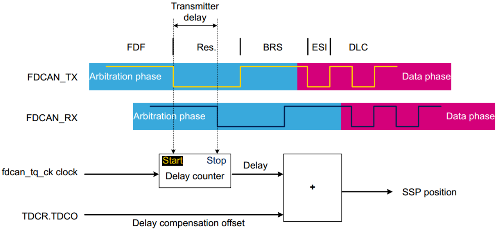

       - 注意：

         - 在仲裁阶段，始终禁用延迟补偿。SSP位置定义为从FDCAN_TX引脚到FDCAN_RX引脚测得的延迟之和，加上通过FDCAN_TDCR中的TDCO [6：0]字段配置的发送器延迟补偿偏移。
         - 发送器延迟补偿偏移量用于调整SSP在接收位内部的位置。存储已发送位的值，直到达到其SSP，然后将其与实际接收到的位进行比较，如下图所示，该值表示发送的比特序列A到K和接收的比特序列AR到KR，以及从SSPA到SSPK的一系列SSP。 通过比较SSBR来检查接收到的比特BR与延迟位B1。 SSPB的位置在发送的比特B开始之后的特定时间。特定时间是测得的收发器延迟与配置的SSP偏移之和。

       - 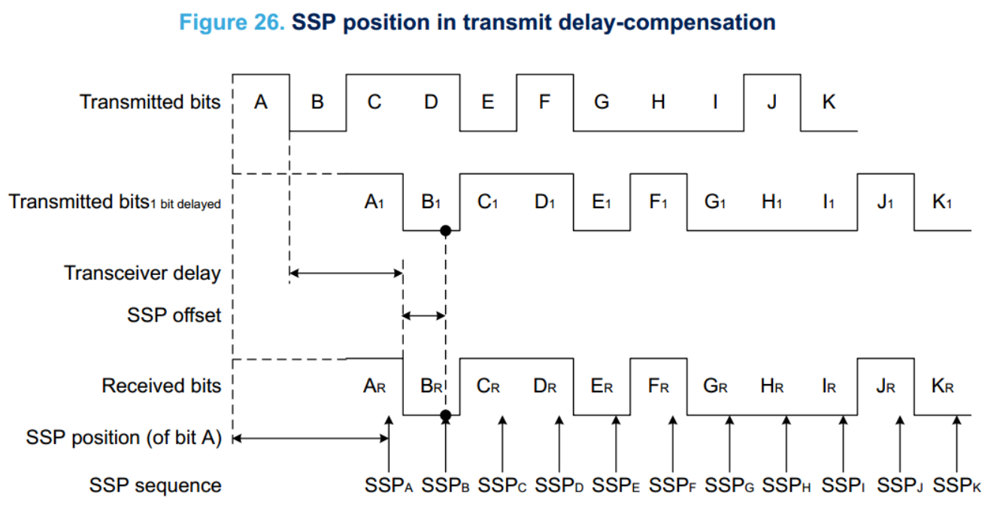

       - 根据博世（Bosch）文档确定，必须考虑以下边界条件FDCAN中实现的发射机延迟补偿：
         ----从FDCAN_Tx到FDCAN_Rx测得的延迟与已组态的发送器延迟之和在数据阶段，补偿偏移量必须小于六位时间。
         ----从FDCAN_Tx到FDCAN_Rx测得的延迟与已组态的发送器延迟之和补偿偏移不得超过127 mtq。

         注3：如果总和超过127 mtq，则最大值（127 mtq）用于发射机延迟补偿。数据阶段在CRC分隔符的采样点结束，该采样点停止检查SSP处的接收位。本文档的下一部分将说明时钟校准单元，并对其功能和操作进行说明。

8. #### FDCAN时钟校准（CCU）：允许用户校准FDCAN

   - CCU运行条件：当FDCAN在125kbit或者1Mbit之间，CCU才能运行
   - 校准状态机：
   - 基础校准：
   - 校准看门狗：
   - 校准实例：FDCAN主机校准FDCAN接收器
     - 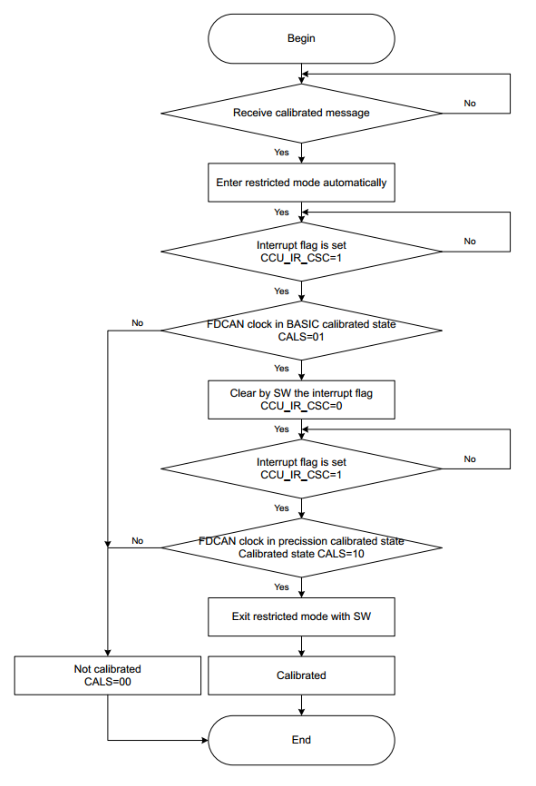

9. #### FDCAN相比can2.0的提升

   - 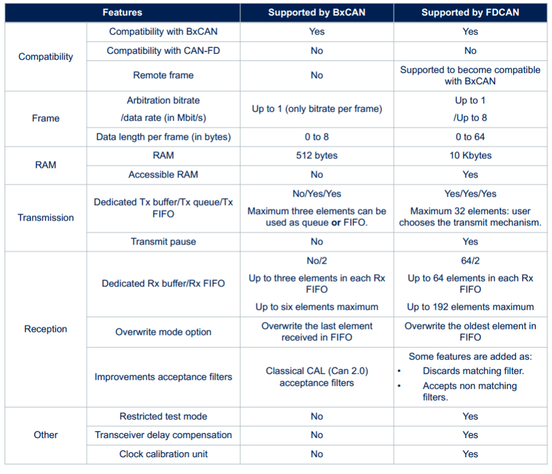

### 三、can fd工程实例：

1. bsp_init_can

   - 基础设置：	

     - 	/* 第1步：基础配置 ==================================================================================*/
         	hfdcan1.Instance = FDCAN1;                     /* 配置FDCAN1 */             
         	hfdcan1.Init.FrameFormat = FDCAN_FRAME_FD_BRS; /* 配置使用FDCAN可变波特率 */  
         	hfdcan1.Init.Mode = FDCAN_MODE_NORMAL;         /* 配置使用正常模式 */ 
         	hfdcan1.Init.AutoRetransmission = ENABLE;      /* 使能自动重发 */ 
         	hfdcan1.Init.TransmitPause = DISABLE;          /* 配置禁止传输暂停特性 */
         	hfdcan1.Init.ProtocolException = ENABLE;       /* 协议异常处理使能 */

   - 仲裁阶段波特率配置

     - 		CAN时钟20MHz时，仲裁阶段的波特率就是
         		CAN FD Freq / (Sync_Seg + Pro_Seg + Phase_Seg1 + Phase_Seg2) = 20MHz / （1+0x1F + 8） = 0.5Mbps	
         		
       
         		其中Sync_Seg是固定值 = 1 ， Pro_Seg + Phase_Seg1 = NominalTimeSeg1， Phase_Seg2 = NominalTimeSeg2
       
     - 	hfdcan1.Init.NominalPrescaler = 0x01; 	/* CAN时钟分配设置，一般设置为1即可，全部由PLL配置好，tq = NominalPrescaler x (1/ fdcan_ker_ck), 范围1-512*/
         	hfdcan1.Init.NominalSyncJumpWidth = 0x08; /* 用于动态调节  Phase_Seg1和 Phase_Seg1，所以不可以比Phase_Seg1和 Phase_Seg1大，范围1-128 */
         	hfdcan1.Init.NominalTimeSeg1 = 0x1F; 	  /* 特别注意这里的Seg1，这里是两个参数之和，对应位时间特性图的 Pro_Seg + Phase_Seg1，范围2-256 */
         	hfdcan1.Init.NominalTimeSeg2 = 0x08;      /* 对应位时间特性图的 Phase_Seg2，范围2- 128 */

   - 数据阶段波特率

     - ```c
       	CAN时钟20MHz时，数据阶段的波特率就是
       	CAN FD Freq / (Sync_Seg + Pro_Seg + Phase_Seg1 + Phase_Seg2) = 20MHz / 2 / （1+5+ 4） = 2Mbps
       ```

     - 	hfdcan1.Init.DataPrescaler = 0x01;      /* CAN时钟分配设置，一般设置为1即可，全部由PLL配置好，tq = NominalPrescaler x (1/ fdcan_ker_ck)，范围1-32 */
         	hfdcan1.Init.DataSyncJumpWidth = 0x04;  /* 用于动态调节  Phase_Seg1和 Phase_Seg1，所以不可以比Phase_Seg1和 Phase_Seg1大，范围1-16 */
         	hfdcan1.Init.DataTimeSeg1 = 0x05; 		/* 特别注意这里的Seg1，这里是两个参数之和，对应位时间特性图的 Pro_Seg + Phase_Seg1，范围 */
         	hfdcan1.Init.DataTimeSeg2 = 0x04;       /* 对应位时间特性图的 Phase_Seg2 */ 

   - RAM管理器：

     - 	hfdcan1.Init.MessageRAMOffset = 0;      			/* CAN1和CAN2共享2560个字, 这里CAN1分配前1280字 */
         	hfdcan1.Init.StdFiltersNbr = 4;         			/* 设置标准ID过滤器个数，范围0-128 */       
         	hfdcan1.Init.ExtFiltersNbr = 4;         			/* 设置扩展ID过滤器个数，范围0-64 */   
         	hfdcan1.Init.RxFifo0ElmtsNbr = 3;                   /* 设置Rx FIFO0的元素个数，范围0-64 */  
         	hfdcan1.Init.RxFifo0ElmtSize = FDCAN_DATA_BYTES_8;  /* 设置Rx FIFO0中每个元素大小，支持8,12,16,20,24,32,48或者64字节 */   
         	hfdcan1.Init.RxFifo1ElmtsNbr = 3;                   /* 设置Rx FIFO1的元素个数，范围0-64 */
         	hfdcan1.Init.RxFifo1ElmtSize = FDCAN_DATA_BYTES_8;  /* 设置Rx FIFO1中每个元素大小，支持8,12,16,20,24,32,48或者64字节 */	
         	hfdcan1.Init.RxBuffersNbr = 2;                      /* 设置Rx Buffer个数，范围0-64 */
         	hfdcan1.Init.RxBufferSize = FDCAN_DATA_BYTES_8;     /* 设置Rx Buffer中每个元素大小，支持8,12,16,20,24,32,48或者64字节 */	
         	
         	hfdcan1.Init.TxEventsNbr = 16;							/* 设置Tx Event FIFO中元素个数，范围0-32 */	
         	hfdcan1.Init.TxBuffersNbr = 8;							/* 设置Tx Buffer中元素个数，范围0-32 */
         	hfdcan1.Init.TxFifoQueueElmtsNbr = 8;                   /* 设置用于Tx FIFO/Queue的Tx Buffers个数。范围0到32 */
         	hfdcan1.Init.TxFifoQueueMode = FDCAN_TX_FIFO_OPERATION; /* 设置FIFO模式或者QUEUE队列模式 */
         	hfdcan1.Init.TxElmtSize = FDCAN_DATA_BYTES_8;           /* 设置Tx Element中的数据域大小，支持8,12,16,20,24,32,48或者64字节 */
         	HAL_FDCAN_Init(&hfdcan1);

   - 标准id过滤器配置

     - 	sFilterConfig1.IdType = FDCAN_EXTENDED_ID;              /* 扩展ID */
         	sFilterConfig1.FilterIndex = 0;   						/* 用于过滤索引，扩展ID，范围0到64 */
         	sFilterConfig1.FilterType = FDCAN_FILTER_RANGE;         /* 范围过滤 -----------------*/
         	sFilterConfig1.FilterConfig = FDCAN_FILTER_TO_RXFIFO1;  /* 如果过滤匹配，将数据保存到Rx FIFO 1 */
         	sFilterConfig1.FilterID1 = 0x12345678;                  /* 起始ID:0x12345678 */
         	sFilterConfig1.FilterID2 = 0x12345680; 					/* 结束ID:0x12345680 */
         	HAL_FDCAN_ConfigFilter(&hfdcan1, &sFilterConfig1);      /* 配置过滤器 */
         	
         	sFilterConfig1.IdType = FDCAN_EXTENDED_ID;              /* 扩展ID */
         	sFilterConfig1.FilterIndex = 1;   						/* 用于过滤索引，扩展ID，范围0到64 */
         	sFilterConfig1.FilterType = FDCAN_FILTER_DUAL;          /* 专用ID过滤 --------------*/
         	sFilterConfig1.FilterConfig = FDCAN_FILTER_TO_RXFIFO1;  /* 如果过滤匹配，将数据保存到Rx FIFO 1 */
         	sFilterConfig1.FilterID1 = 0x12345681;                  /* 指定ID */
         	sFilterConfig1.FilterID2 = 0x12345682; 					/* 指定ID */
         	HAL_FDCAN_ConfigFilter(&hfdcan1, &sFilterConfig1);      /* 配置过滤器 */
        	
         	sFilterConfig1.IdType = FDCAN_EXTENDED_ID;              /* 扩展ID */
         	sFilterConfig1.FilterIndex = 2;   						/* 用于过滤索引，扩展ID，范围0到64 */
         	sFilterConfig1.FilterType = FDCAN_FILTER_MASK;          /* 过滤器采样屏蔽位模式 ----*/
         	sFilterConfig1.FilterConfig = FDCAN_FILTER_TO_RXFIFO1;  /* 如果过滤匹配，将数据保存到Rx FIFO 1 */
         	sFilterConfig1.FilterID1 = 0x12345683;                  /* 屏蔽位模式下，FilterID1是消息ID */
         	sFilterConfig1.FilterID2 = 0x1FFFFFFF; 					/* 屏蔽位模式下，FilterID2是消息屏蔽位 */
         	HAL_FDCAN_ConfigFilter(&hfdcan1, &sFilterConfig1);      /* 配置过滤器 */
        	
         	sFilterConfig1.IdType = FDCAN_EXTENDED_ID;              /* 扩展ID */
         	sFilterConfig1.FilterIndex = 3;   						/* 用于过滤索引，扩展ID，范围0到64 */
         	sFilterConfig1.FilterType = FDCAN_FILTER_MASK;          /* 忽略 --------------------*/
         	sFilterConfig1.FilterConfig = FDCAN_FILTER_TO_RXBUFFER; /* 如果过滤匹配，将数据保存到Rx Buffer */
         	sFilterConfig1.FilterID1 = 0x12345684;                  /* 接收指定ID消息 */
         	sFilterConfig1.FilterID2 = 0x1FFFFFFF; 					/* 忽略 */
         	sFilterConfig1.IsCalibrationMsg = 0;                    /* 正常消息 */
         	sFilterConfig1.RxBufferIndex = 0;                       /* Rx buffer位置 */
         	HAL_FDCAN_ConfigFilter(&hfdcan1, &sFilterConfig1);      /* 配置过滤器 */

   - 拓展id过滤器：

     - 	sFilterConfig1.IdType = FDCAN_STANDARD_ID;              /* 设置标准ID或者扩展ID */
         	sFilterConfig1.FilterIndex = 0;   						/* 用于过滤索引，标准ID，范围0到127 */
         	sFilterConfig1.FilterType = FDCAN_FILTER_RANGE;         /* 范围过滤 -------------------------*/
         	sFilterConfig1.FilterConfig = FDCAN_FILTER_TO_RXFIFO0;  /* 如果过滤匹配，将数据保存到Rx FIFO 0 */
         	sFilterConfig1.FilterID1 = 0x000;                       /* 起始ID:0x000 */
         	sFilterConfig1.FilterID2 = 0x010; 						/* 结束ID:0x010 */
         	HAL_FDCAN_ConfigFilter(&hfdcan1, &sFilterConfig1);      /* 配置过滤器 */
         	
         	sFilterConfig1.IdType = FDCAN_STANDARD_ID;              /* 设置标准ID或者扩展ID */
         	sFilterConfig1.FilterIndex = 1;   						/* 用于过滤索引，标准ID，范围0到127 */
         	sFilterConfig1.FilterType = FDCAN_FILTER_DUAL;          /* 专用ID过滤 ----------------------*/
         	sFilterConfig1.FilterConfig = FDCAN_FILTER_TO_RXFIFO0;  /* 如果过滤匹配，将数据保存到Rx FIFO 0 */
         	sFilterConfig1.FilterID1 = 0x011;                       /* 指定ID */
         	sFilterConfig1.FilterID2 = 0x012; 						/* 指定ID */
         	HAL_FDCAN_ConfigFilter(&hfdcan1, &sFilterConfig1);      /* 配置过滤器 */
        	
         	sFilterConfig1.IdType = FDCAN_STANDARD_ID;              /* 设置标准ID或者扩展ID */
         	sFilterConfig1.FilterIndex = 2;   						/* 用于过滤索引，标准ID，范围0到127 */
         	sFilterConfig1.FilterType = FDCAN_FILTER_MASK;          /* 过滤器采样屏蔽位模式 -----------*/
         	sFilterConfig1.FilterConfig = FDCAN_FILTER_TO_RXFIFO0;  /* 如果过滤匹配，将数据保存到Rx FIFO 0 */
         	sFilterConfig1.FilterID1 = 0x013;                       /* 屏蔽位模式下，FilterID1是消息ID */
         	sFilterConfig1.FilterID2 = 0x7FF; 						/* 屏蔽位模式下，FilterID2是消息屏蔽位 */
         	HAL_FDCAN_ConfigFilter(&hfdcan1, &sFilterConfig1);      /* 配置过滤器 */
        	
         	sFilterConfig1.IdType = FDCAN_STANDARD_ID;              /* 设置标准ID或者扩展ID */
         	sFilterConfig1.FilterIndex = 3;   						/* 用于过滤索引，扩展ID，范围0到64 */
         	sFilterConfig1.FilterType = FDCAN_FILTER_MASK;          /* 忽略 ---------------------------*/
         	sFilterConfig1.FilterConfig = FDCAN_FILTER_TO_RXBUFFER; /* 如果过滤匹配，将数据保存到Rx BUFFER */
         	sFilterConfig1.FilterID1 = 0x014;                       /* 接收指定ID消息 */
         	sFilterConfig1.FilterID2 = 0x7FF; 					    /* 忽略 */
         	sFilterConfig1.IsCalibrationMsg = 0;                    /* 正常消息 */
         	sFilterConfig1.RxBufferIndex = 1;                       /* Rx buffer位置 */
         	HAL_FDCAN_ConfigFilter(&hfdcan1, &sFilterConfig1);      /* 配置过滤器 */

2. 中断：

   - 配置Rx_FIFO0的阈值中断，配置Rx_FIFO1的新数据中断，配置Rx_buffer新消息中断

   - Rx_FIFO0的阈值中断：全部读取数据到buffer中，然后重新使能中断

   - Rx_FIFO1的新数据中断：读取数据到全局变量，然后重新使能

   - Rx_buffer新消息中断（64个buffer---NDAT1）：

     - 总共两块NDAT

     - 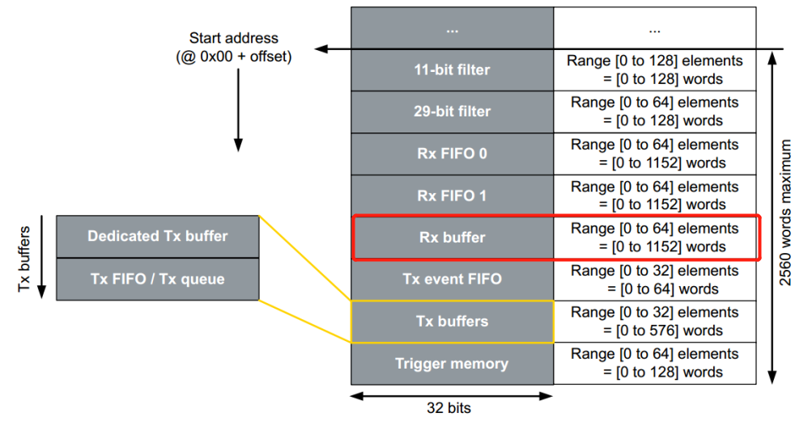

     - 		for(i = 0; i < 32; i++)
         		{
         			off = (hfdcan->Instance->NDAT1 & (1<<i) ) >> i;
         			if(off == 1)
         			{
         				/* 从RX Buffer0读取数据, i值等同于FDCAN_RX_BUFFER */
         				Status = HAL_FDCAN_GetRxMessage(hfdcan, i, &g_Can1RxHeader, g_Can1RxData);	
         			}
         		}
         		
         		for(i = 0; i < 32; i++)
         		{
         			off = (hfdcan->Instance->NDAT2 & (1<<i) ) >> i;
         			if(off == 1)
         			{
         				/* 从RX Buffer0读取数据, i值等同于FDCAN_RX_BUFFER */
         				Status = HAL_FDCAN_GetRxMessage(hfdcan, i+31, &g_Can1RxHeader, g_Can1RxData);	
         			}
         		}

### 四、canopen协议专题

1. 


