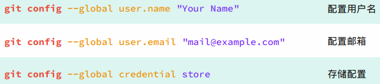
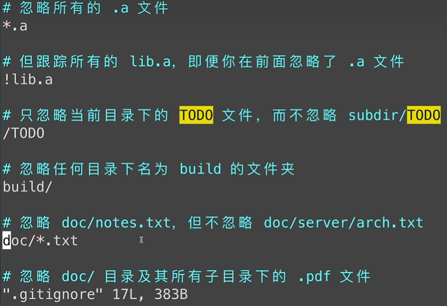

1. 安装和初始化配置

   1. 

2. 新建仓库

   1. 

3. 工作区域和文件状态

   1. 

4. 添加和提交文件

   - 

5. git reset回退版本

   - 
   - 工作区内容ls ，暂存区git ls-files

6. git diff查看差异

   - 默认没有参数是工作区和暂存区之间的差异
   -  工作区和版本库之间的差异git diff HEAD
   - 暂存区和版本库之间的差异git diff --cache
   - git diff id1 id2,查看两个版本之间的差异
   - git diff HEAD~(^) HEAD，这个版本和上个版本的差异，~前面加数字，查看之前几个版本的差异，最后加上文件名，查看特定文件的版本差异

7. git rm删除文件

   - 首先采用rm命令删除文件，再暂存区种删除，git add .
   - **git rm直接工作区和暂存区都删除了，**，最后git commit -m "delete file1.txt"

8. gitignore忽略文件

   - .gitignore文件中进行操作
   - 已经添加到版本库种的文件不会起作用，要删除版本库git rm --cached xxx
   - 空的文件夹不会呗纳入版本控制中
   - 忽略文件夹：xxx/
   - 
   - 

9. 注册github账号

   - 

10. ssh配置和克隆仓库

    1. ssh rsa公钥配置
    2. git clone，cd，
    3. 然后按照git push,pull进行同步

11. 关联本地仓库和远程仓库

    - 远程新建仓库，进行同步，
    - 

12. gitee使用和gitlab本地化部署

13. gui工具

    - vscode侧键

14. vscode种使用git

    - vscode侧边栏的使用

15. 分支简介和基本操作

    - 切换分支  git switch xxxx

    - 切换到目标分支，比如main，然后执行git merge xxx(子分支)

    - 删除分支：git branch -d xxx,如果没有合并强制删除的话，采用-D参数

    - 

      

16. 解决合并冲突

    - s后动查看差异，改变文件，然后merge

17. 回退和rebase

    - rebase找到共同祖先，然后开始讲内容嫁接到目标文件后面（讲内容放到另一个后面）
    - merge和rebase差别
      - merge不会破坏原分支的提交历史，方便回溯和查看，但是会产生额外的提交节点，分支图比较复杂
      - 线性历史，直观干净，但是改变提交历史

18. 分支管理和工作模型

    - gitflow
    - github flow