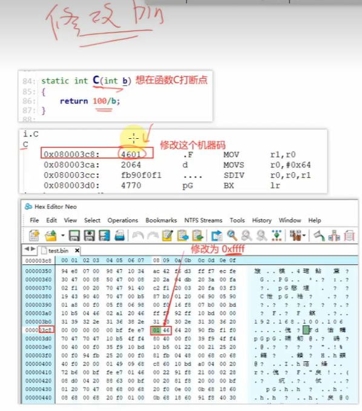

### stm32调试技巧(栈回溯原理、修改bin文件实现断点)：

1. 栈回溯原理：
   1. 根据栈里面函数的返回地址就可以知道整个函数的执行顺序和调用顺序`
2. 修改bin文件实现多个断点（很多时候代码多一条命令就会产生截然不同的结果，因此bin文件不能修改，只能再bin文件的基础上进行debug）：
   1. 得到反汇编文件xxx.dis,分析汇编文件中对应的函数栈执行地址
   2. 

二、map文件：

1. map文件主要包括：段入口、移除

   - **1.Section Cross References：**模块、段(入口)交叉引用

     **2.Removing Unused input sections from the image：**移除未调用模块

     **3.Image Symbol Table：**映射符号表

     **4.Memory Map of the image：**内存（映射）分布

     **5.Image component sizes：**存储组成大小

2. 可以通过KEil软件进行查看，**Memory Map of the image**存放了变量的地址等信息

3. 