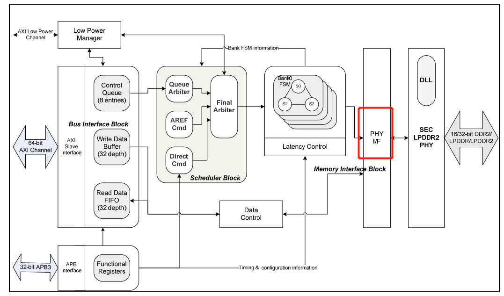
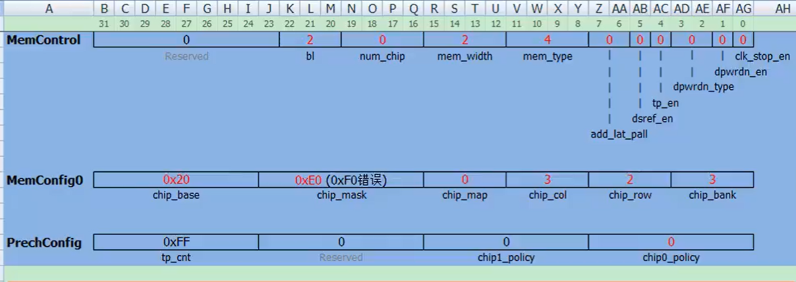

### uboot

一、v210启动机制（uboot\u-boot-2012.10\u-boot-2012.10\arch\arm\cpu\armv7\start.S）：

1. 头文件详解：

   1. 根目录下include和arch/arm/include文件

2. 启动代码(cache、分支预测、流水线等概念)：计算机组成与设计（硬件与软件接口）

   - 首先程序启动后开始b reset，接下来就是异常代码的处理，(异常要比中断的优先级高)，异常是不能屏蔽的，cpu必须处理的

     - 
     - 
     - spl：s5pv210 application note（前代产品6410），首先上电启动，其次开始将sd卡等设备中的bl1（4k）转移到片上ram执行，初始化sdram等设备，之后将bl2转移到sdram中，程序跳转到sdram中执行bl2，最后将os转移到sdram中，程序挑转到os中执行（uboot.bin）-----在这个过程中bl1会检测自己在sdram中还是在sd卡设备中，如果在sd卡中，会配置sdram，然后将uboot.bin（前4k1和200k左右的bl2）转移到sdram中，当程序执行到bl2的时候，检测自己在sdram中的话，直接跳过前4k内容，开始执行bl2的内容。最后将os加载到sdram中，程序跳转，进入内核
     - V210相比6410增加了Irom的内存，读取flash的函数等加载到内存中了，增加了sram内存的大小，但是仍然放不下整个uboot，直接将uboot分成了uboot_spl.bin和uboot.bin，
       1. 
     - spl阶段_undefined_instruction直接原地死循环，uboot.bin阶段才是异常处理程序，
     - 异常向量和地址映射问题（片内运行的时候）：由于异常之后程序会跳转到0x0000 0004地址，由于这个地址是rom区，不可更改，**因此芯片厂商在片内开辟了exception段存放异常向量表**，当程序异常之后，程序会直接跳转到片内的exception段，该断可存放异常向量表，通过向量表再次跳转到用户自定义的异常处理程序
       - 
     - 如果程序在偏外sdram中运行怎么处理异常：当uboot在片外运行的时候，由于mmu的存在，片内的地址就失效了，没人使用-----------arm在cp15协处理器上开辟了vbar的寄存器，程序发生异常不会再去ox00000 0004的地址和片内exception地址，
       - 

   - uboot编译：首先make s5p_goni_config生成配置文件，再次make------>>>>>接着利用arm_linux_objdump -S u-boot | less

   - reset段：带返回的跳转指令bl，

     - ```
       reset:
       	bl	save_boot_params
       	/*
       
       	set the cpu to SVC32 mode
       	*/
       	mrs	r0, cpsr
       	bic	r0, r0, #0x1f
       	orr	r0, r0, #0xd3
       	msr	cpsr,r0
       
       ENTRY(save_boot_params)`  //entry这一句最后展开成.global sbp      align 4      sbp       bx lr 
       	bx	lr			@ back to my caller`
       ENDPROC(save_boot_params)`
       	.weak	save_boot_params` //endproc这一句展开成- reset中bl段结束后开始设置cpu为svc32（查看手册ArmV7_AR architecture reference manual.pdf p1166 p1156 模式码10011）:11010011  前两位禁止快中断和禁止中断
       ```

   - CP15协处理器操作：VBAR异常向量表基地址映射（查看手册ArmV7_AR architecture reference manual.pdf p1339）

     - 协处理器操作：将13位清零，从0x0000 0000开始执行

       	#if !(defined(CONFIG_OMAP44XX) && defined(CONFIG_SPL_BUILD))
       		/* Set V=0 in CP15 SCTRL register - for VBAR to point to vector */
       		mrc	p15, 0, r0, c1, c0, 0	@ Read CP15 SCTRL Register
       		bic	r0, #CR_V		@ V = 0
       		mcr	p15, 0, r0, c1, c0, 0	@ Write CP15 SCTRL Register
       	/* Set vector address in CP15 VBAR register */
       	ldr	r0, =_start
       	mcr	p15, 0, r0, c12, c0, 0	@Set VBAR      //设置vbar寄存器使能跳转地址为任意地址 
       	#endif

     - 

   - cpu_init_cp15执行：cache基础知识，只在片内ram区才执行，当在sdram上不执行，哈弗体系结构

     - 哈佛体系架构，cache知识：
     - #ifndef CONFIG_SKIP_LOWLEVEL_INIT
       	bl	cpu_init_cp15
       	bl	cpu_init_crit
       #endif
     - ​	p1466页查询具体指令含义

     	ENTRY(cpu_init_cp15)
     	    /*
     	
     	    Invalidate L1 I/D
     	    */
     	    mov	r0, #0			@ set up for MCR
     	    mcr	p15, 0, r0, c8, c7, 0	@ invalidate TLBs   
     	    mcr	p15, 0, r0, c7, c5, 0	@ invalidate icache    //使得icache最后一位为0，全部失效，因为咋bootloader阶段可能存在代码更新，但是指令来不及更新的情况，
     	    mcr	p15, 0, r0, c7, c5, 6	@ invalidate BP array  //使所有分支预测语句失效（cpu对循环指令的处理）
     	    mcr     p15, 0, r0, c7, c10, 4	@ DSB              //
     	    mcr     p15, 0, r0, c7, c5, 4	@ ISB/*            //
     	    * disable MMU stuff and caches
     	    */
     	    mrc	p15, 0, r0, c1, c0, 0
     	    bic	r0, r0, #0x00002000	@ clear bits 13 (--V-)     //清零13位   	异常向量到0x0000 0000
     	    bic	r0, r0, #0x00000007	@ clear bits 2:0 (-CAM)    //清零2:0 		 2:0三位清零，禁用cache
     	    orr	r0, r0, #0x00000002	@ set bit 1 (--A-) Align   //
     	    orr	r0, r0, #0x00000800	@ set bit 11 (Z---) BTB    //设置11位，   使能分支预测
     	#ifdef CONFIG_SYS_ICACHE_OFF
     		bic	r0, r0, #0x00001000	@ clear bit 12 (I) I-cache
     	#else
     		orr	r0, r0, #0x00001000	@ set bit 12 (I) I-cache    //指令cache使能
     	#endif
     		mcr	p15, 0, r0, c1, c0, 0                           //数据写p15
     		mov	pc, lr			@ back to my caller             //回到lr，开始执行cpu_init_ctrl
     	ENDPROC(cpu_init_cp15)

   - cpu_init_ctrl分析：代码需要跳转到uboot\u-boot-2012.10\u-boot-2012.10\board\imx31_phycore\lowlevel_init.S中执行，可以跳转过去之后点亮led，观察现象

     - 首先在S5PV210_usermanul手册p172页查看gpio对应的寄存器设置

     - 在uboot\u-boot-2012.10\u-boot-2012.10\arch\arm\cpu\armv7\start.S中 最后一行shift+g，跳转回某一行（先输入153，在输入shift+g），之后开始make S5P_goni_config,之后make得到uboot.bin

     - 

       ```
       //153行
       #endif 
               bl      gpio_out
               bl      led1_on
       /* the mask ROM code should have PLL and others stable */
       #ifndef CONFIG_SKIP_LOWLEVEL_INIT
               bl      cpu_init_cp15
               bl      cpu_init_crit
       #endif
       
       gpio_out:  //start.S末尾
               ldr     r11, =0xE0200280
               ldr     r12, =0x00001111
               str     r12, [r11]
       
               ldr     r11, =0xE0200284
               ldr     r12, =0xF
               str     r12, [r11]
               mov     pc, lr
       .global led1_on
       led1_on:
               ldr     r11, =0xE0200284
               ldr     r12, [r11]
               bic     r12, r12, #1
               str     r12, [r11]
               mov     pc,lr
       ```

     - 

   - 只做uboot.bin启动镜像制作原理：

     - mkv210_image.c源代码制作，将uboot.bin制作了16k大小的uboot.16k，利用hexdump -C uboot.16k | less	,小端字节序,rm_linux_objdump -S u-boot | less
     - 采用：sudo dd iflag=dsync oflag=dsync if=uboot.16k of=/dev/sdb seek=1   从扇区0开始写入，总共32个扇区，一个扇区512个字节
     - 
     - 

3. 编译、汇编和链接过程：

   - vim跨文件粘贴操作：首先再一个文件中输入“a9yy   ，然后到新文件中输入”ap

   - -c选项只编译，不链接

   - arm-linux-size main.o  查看各段内容大小，.data和.bss段，data保存非0内同，bss段保存初始化为0的内同

   - 将两个.o文件链接到一起时，在代码段首先存放start.0的内容，其次将所有的.text内容放置在该地址

   - ```
     SECTIONS
     {
             . = 0XD0020010;
             .text : {
                     mystart.o
                     *(.text)
             }
             .data : {
                     * (.data)
             }
             .bss_start = .;
             .bss : {
                     *(.bss)
             }
             .bss_end = .;
     }
     ```

     

   - 
   - 通过命令将两个.o文件链接到一起，arm-linux-ld -Tmyboot.lds -o myboot mystart.o mylowleval_init.o
   - 然后通过objdump查看反汇编的内容arm-linux-objdump -S mystart.o  （-S查看二进制和反汇编）分析自己的uboot代码
     - 同时led2_on在另一个.s文件中，**还没链接的时候看不见**，只能显示0地址，
     - fp和ip寄存器分别对应r11和r12，咋进程通信中使用
     - 
     - 
       - 最后通过arm-linux-objcopy -O binary myboot myboot.bin，之后用hexdump -C myboot.bin(-C 每个字节显示16进制并且显示ascll字符)
       - 将上一步骤的mkv210工具，制作./mkv210 myboot.bin myboot.16k,最后将固件烧写到板子，**sudo dd iflag=dsync oflag=dsync if=myboot.16k of=/dev/sdb seek=1**

4. makefile(**`GNU make项目管理`**)：如果要点亮led3的话，

   - 

   - 

   - chmod a+x genmyboot.sh，所有用户具有可执行权限后，通过./genmyboot.sh执行

   - ```
     #!/bin/bash
     
     arm-linux-gcc -c mystart.s
     arm-linux-gcc -c mylowlevel_init.s
     arm-linux-ld -T myboot.lds -o myboot mystart.o mylowlevel_init.o
     arm-linux-objcopy -O binary myboot myboot.bin
     ./mkv210 myboot.bin myboot.16k
     sudo dd iflag=dsync oflag=dsync if=./myboot.16k of=/dev/sdb seek=1
     ```

   - **`all为伪目标`**，只能有一个目标生成，如果没有all的话，只会编译mystart，下面的不会执行，前面加.PHONY:all修饰

     - 
     - 伪目标mksd，可用于make mksd，执行sd卡写入的动作
     - 
     - 最终版的makefile：伪目标all，然后对比myboot
       - 
       - makefile改进：
         - $@：目标集合
         - $<：依赖中的第一个
         - $^：所有依赖集合
         - linux中=可能发生链接依赖，因此采用:=

5. lowlevel_init.S学习（芯片型号判断）：uboot\u-boot-2012.10\u-boot-2012.10\board\samsung\goni\lowlevel_init.S

   - 比如头文件中#include <asm/arch/cpu.h>，**arch在makefile中做了软连接**，代表了实际目录**`arch-s5pc1xx`**（u-boot-2012.10\arch\arm\include\asm\arch-s5pc1xx\cpu.h）

   - bic：清零对应的位

     - ```
       _TEXT_BASE:
       	.word	CONFIG_SYS_TEXT_BASE
       // CONFIG_SYS_TEXT_BASE=0x34800000
       	.globl lowlevel_init
       lowlevel_init:
       	mov	r11, lr
       
       	/* r5 has always zero */
       	mov	r5, #0
       
       	ldr	r7, =S5PC100_GPIO_BASE
       	ldr	r8, =S5PC100_GPIO_BASE
       	/* Read CPU ID */
       	ldr	r2, =S5PC110_PRO_ID
       	ldr	r0, [r2]
       	mov	r1, #0x00010000
       	and	r0, r0, r1
       	cmp	r0, r5
       	beq	100f
       	ldr	r8, =S5PC110_GPIO_BASE
       100:
       	/* Turn on KEY_LED_ON [GPJ4(1)] XMSMWEN */
       	cmp	r7, r8
       	beq	skip_check_didle			@ Support C110 only
       
       	ldr	r0, =S5PC110_RST_STAT                                              //
       	ldr	r1, [r0]
       	and	r1, r1, #0x000D0000
       	cmp	r1, #(0x1 << 19)			@ DEEPIDLE_WAKEUP                //判断第19位是不是1，这里是开机复位，不想等，继续执行cmp r7，r8
       	beq	didle_wakeup
       	cmp	r7, r8
       
       ```

     - ```
       skip_check_didle:
       	addeq	r0, r8, #0x280				@ S5PC100_GPIO_J4
       	addne	r0, r8, #0x2C0				@ S5PC110_GPIO_J4                     //r0=0xE020,02C0,为GPJ4基础地址
       	ldr	r1, [r0, #0x0]				@ GPIO_CON_OFFSET						 // r1=GPJ4CON
       	bic	r1, r1, #(0xf << 4)			@ 1 * 4-bit                        //清零7~4
       	orr	r1, r1, #(0x1 << 4)                                            //7~4为0001   代表配置为output输出模式
       	str	r1, [r0, #0x0]				@ GPIO_CON_OFFSET                  //将r1写入到r0寄存器中，
       
       	ldr	r1, [r0, #0x4]				@ GPIO_DAT_OFFSET                  //GPIOj4-1配置为输出
       	bic	r1, r1, #(1 << 1)
       	str	r1, [r0, #0x4]				@ GPIO_DAT_OFFSET
       ```

   - 107~160行（芯片手册p534）：同步配置为0

   - 171-179没有意义，没有not equal的执行语句，也就是r1没有写会r0

   - p649

   - mvn	r3, #0x0：设置成0在取反，0xFFFF，FFFF

6. uart初始化和异步通信原理：

   - ```
     uart_asm_init:
     	/* set GPIO to enable UART0-UART4 */
     	mov	r0, r8
     	ldr	r1, =0x22222222
     	str	r1, [r0, #0x0]			@ S5PC100_GPIO_A0_OFFSET
     	ldr	r1, =0x00002222
     	str	r1, [r0, #0x20]			@ S5PC100_GPIO_A1_OFFSET                     //配置GPIO为串口使用 
     ```

   - 三星手册：p867串口相关的寄存器配置，/home/book/u-boot-2012.10/board/samsung/goni/lowlevel_init.s

     - 

     - 

     - p877发送数据：默认的makefie编译脚本中libgoni.o中包含lowlevel_init.s，所以只做完成的uboot.bin，并且前16k制作完成uboot.16k，开发板并不能狗顺利跳转到后半部分boot执行，因此需要修改makefile将libgoni.o连接到uboot的start.s之后，能够在只烧写16k大小的boot启动文件中，看到uart的发送数据

     - ```
       __OBJS := $(subst $(obj),,$(OBJS))
       #__LIBS := $(subst $(obj),,$(LIBS)) $(subst $(obj),,$(LIBBOARD))
       
       __LIBS := $(subst $(obj),,$(LIBBOARD)) $(subst $(obj),,$(LIBS))
       ```

     - 

     - 

   - uart显示指定内存中的数据：

     - ​	

     -  调用过程

       ```
       215         bl      uart_asm_init
       216
       217         ldr     r0, =0xE0000000    芯片型号内存地址
       218         bl      display_addr_dat
       219
       220         bl      internal_ram_init
       ```

       ```
       510 display_addr_dat:
       511         ldr     r0, [r0]              //芯片内存中的值读取到r0寄存器中       正确的话应该是0x43110XXX
       512         ldr     r1, =0xE2900020       //uart0的地址，写入信息显示到终端
       513
       514         ldr     r2, =0x30
       515         str     r2 ,[r1]                        @UTH0='0'
       516
       517         ldr     r2, =0x78
       518         str     r2, [r1]                        @UTH0='x'
       519
       520         ldr     r3, =28
       521
       522 disphex_loop_cnt:                   //将数据从最高位以此向右便宜28,24。。。。。。等，首先是4，其次是3，在显示3的时候右移24位，同时和0xf与，将4清零，
       523         lsr     r2, r0, r3
       524         and     r2, r2, #0xF
       525         cmp     r2, #10
       526         addmi   r2, r2, #0x30
       527         addpl   r2, r2, #0x37
       528         str     r2, [r1]
       529
       530         sub     r3, r3, #4
       531         cmp     r3, #0              //移位r3到0停止循环
       532         bpl     disphex_loop_cnt
       533
       534         ldr     r2, =0xA
       535         str     r2, [r1]
       536
       537         ldr     r2, =0x0
       538         str     r2, [r1]           //换行符号
       539
       540         mov     pc, lr
       
       ```

7. DDR内存(**`MemorySystem`**)

   - ddr内存初始化为前16k内容最关建的操作：

     - 

     - 

     - SDRAM：

     - mem device内部结构：

       - 

       - 配置流程：

       - 

       - 

         - xm1addr[0-15]分别对应MP1_0[0-7]、MP1_1[0-7]                   p102(S5Pv210手册)

         - xm1data[0-31]分别对应MP1_2[0-7]、MP1_3[0-7]、MP1_4[0-7]、MP1_5[0-7]

         - control     MP1_6[0-7]、MP1_7[0-7]、MP1_8[0-6]

         - p195查看各个地址对应的寄存器设置

         - 2.初始化PHY DLL   p608

         - 

         - 

         - rd_fetch计算：DQS，数据选取脉冲，DQ数据   

         - DMC端进行延迟phy dll配置：**p615**，0x00101000（如下表）

           - 

           - find_lock_val:

           - DMC_PHYSTATUS:p636,当dll调整完成退出循环

             - 

             - ```
               find_lock_val:
               	//Loop until DLL is locked
               	ldr	r1, [r0, #DMC_PHYSTATUS]			
               	and	r2, r1, #0x7
               	cmp	r2, #0x7					
               	bne	find_lock_val
               	//Force Value locking 					读出反馈值ctrl_lock_value并且写回到dmc_phycontrol0寄存器
               	and	r1, #0x3fc0
               	mov	r2, r1, LSL #18
               	orr	r2, r2, #0x100000
               	orr	r2 ,r2, #0x1000
               	orr	r1, r2, #0x3					
               	str	r1, [r0, #DMC_PHYCONTROL0]
               ```

           - 初始化dmc0：

             - conctrol:
             - 
             - rd_fetch=2的时候稳妥保证数据被采集进来
             - 
             - 
             - 6.memctrol：p621
               - 

             - 7.Memconfig0（J:\si project\dssz.sdram\6.sdram\BL1\memory.S）:80行
               - 
               - 1G、8bank、8IO、14行地址：那么列地址col=10
                 - 1G=2^10x2^10x2^10=2^30
                 - 8bank：2^30=2^3x2^27
                 - 8IO：2^27=2^3x2^24
                 - 14row：2^24=2^14x2^10

               - demo程序F0（0x20**F0**0313）使用256M字节，要想使用512M内容，配制成E0
                 - 比如配制成F8，能使用的地址范围0x0000 0000到0x07FF　FFFF，
                 - 512M对应（0~0x1FFF FFFF）0x0001 1111 FF FFFF，高8位qufan为1110 0000:配置为E0即对应512M内存

             - 8.Prechconfig和PwrdnConfig：
               - 

             - 9.时序配置：TimingAref、TimingRow、TimingData、TimingPower
               - 
               - 

             - 从14开始进入device设置：控制器发送cmd到device
               - 
               - 
               - 
               - 
               - 
               - 
               - 

8. uboot中u-boot-2012.10\board\samsung\goni\lowlevel_init.S文件分析：

   - **`board_init_f分析`**	（u-boot-2012.10\u-boot-2012.10\arch\arm\lib\board.c）

     - 在257行lowlevel_init.S返回到start.S执行，363行继续执行，其实是返回155行bl	cpu_init_crit

     - 之后开始执行下面的代码（u-boot-2012.10\u-boot-2012.10\arch\arm\lib\board.c），在跳转C语言代码的时候需要设置堆栈sp，同时设置传参，r0为第一个参数，r1为第二个参数等，此处设置了0，说明跳转board_init_f函数参数传递为0

     - ```
       call_board_init_f:
       	ldr	sp, =(CONFIG_SYS_INIT_SP_ADDR)
       	bic	sp, sp, #7 /* 8-byte alignment for ABI compliance */
       	ldr	r0,=0x00000000
       	bl	board_init_f
       ```

     - 利用objdump工具查看uboot里面**`board_init_f`**定义位置有没有超过16k的内容

     - sp指针起始地址和board_init_f函数中的gd全局变量地址重合，一个向上，一个向下，

     - 

     - #define DECLARE_GLOBAL_DATA_PTR register gd_t *gd asm("r5")   代表申请为不需要优化的寄存器指针，实质内容还是在放在内存中

     - ```
       gd = (gd_t *) ((CONFIG_SYS_INIT_SP_ADDR) & ~0x07);       //8字节对齐        0x2000 0000+400 0000-100 0000，相当于是给了16M内容给gd全局变量，从开始地址偏移48M地址，开辟16M给gd
       ```

   - mmc_relocate:由于之前的boadr_init_f函数中调用了memset，利用objdump -> xxx.txt查看，memset定义位置超出了16k地址，因此需要将这部分代码拷贝至sdram中，并且将指针跳转到对应的地方运行（也就是BL1跳转到BL2）

     - 对函数指针进行取别名，

       - 类型：int（*）(int,int...)
       - 
       - 

     - ```
       typedef unsigned int (*copy_sd_mmc_to_mem) (unsigned int  channel, unsigned int  start_block, unsigned char block_size, unsigned int  *trg, unsigned int  init);
       
       copy_sd_mmc_to_mem copy_bl2 = (copy_sd_mmc_to_mem) (*(unsigned int *) (0xD0037F98));
       
       int ret = copy_bl2(0, 49, 32,(unsigned int *)0x23E00000, 0);
       ```

     - 此处类型unsigned int *(unsigned int x，，，，，),利用typeof这个关键字将函数类型取别名为copy_sd_mmc_to_mem

     - 在下面声明这个类型的时候`(unsigned int *) (0xD0037F98)`，在前面加入指针解引用`*`，调用`copy_bl2`的时候就不需要在前面加*，

     - 

     - 后期试验方向：

       - 1.修改官方提供的mem_reloacte.c，然后将这个文件放入/u-boot-2012.10/board/samsung/goni下面，然后修改该文件夹下面的makefile，
       - 2.修改lowlevel_init程序，将这个程序在执行完ddr初始化之后将bl2移动到ddr2中，
       - 3.修改start.s中board_init跳转位置，应该跳转到ddr2中bl2里面board_init中执行，而不是bl1里面的board_init里面执行

   - 实验：将uboot.bin从sd卡搬运到ddr2里面

     - ```
       typedef unsigned int (*copy_sd_mmc_to_mem) (unsigned int  channel, unsigned int  start_block, unsigned char block_size, unsigned int  *trg, unsigned int  init);
       
       void copy_code_to_dram(void)
       {
               unsigned long ch;
               unsigned long dest = 0x34800000;
               unsigned int sec_no = 49;
               unsigned int  ret;
               ch = *(volatile unsigned int *)(0xD0037488);
               copy_sd_mmc_to_mem copy_bl2 = (copy_sd_mmc_to_mem) (*(unsigned int *) (0xD0037F98));
       
               if (ch == 0xEB000000)
               {
                       ret = copy_bl2(0, sec_no        , 128,(unsigned int *)dest              , 0); 
                       ret = copy_bl2(0, sec_no + 128  , 128,(unsigned int *)(dest + 0x10000)  , 0);
                       ret = copy_bl2(0, sec_no + 256  , 128,(unsigned int *)(dest + 0x20000)  , 0);
               }
       }
       //说明：此处固件烧写，uboot.bin总共184kb左右，占据368个扇区左右，因此烧写函数最大烧写char类型，255个字节，所以采用分次烧写，单次烧写128个扇区，64kb大小，便于内存对齐
       ```

     - 

     - 最好是将mmc_relocate.o放到lowlevel_init.o下面，便于在bl1阶段将sd卡中的内容拷贝到ddr2中

     - ```
       217         ldr     r0, =0xE0000000
       218         bl      display_addr_dat      //
       219
       220         /*for DDR*/
       221         bl      ddrmem_init
       222
       223         ldr     r0, =0x30000000
       224         ldr     r1, =0x12345678
       225         str     r1, [r0]
       226         bl      display_addr_dat
       227
       228         bl      internal_ram_init
       229
       230         /*for copy_sd_to_ddr*/
       231         bl      copy_code_to_dram         //修改makefile文件进行make
       232
       233         ldr     r0, =0x34800000
       234         bl      display_addr_dat          //查看跳转过去的地址是否有合理的的内容，
       ```

     - 如何保证程序是否正确跳转了，linux下面利用hexdump -C uboot.bin | less ,查看第一条uboot.bin指令内容，ea000014，

     - ```
       #!/bin/bash
       
       ./mkv210 u-boot.bin u-boot.16k
       sudo dd iflag=dsync oflag=dsync if=u-boot.16k of=/dev/sdb seek=1
       sudo dd iflag=dsync oflag=dsync if=u-boot.bin of=/dev/sdb seek=49
       ```

     - 

     - 精确跳转到board_init_f在bl2（ddr2）中的地址，

       - 
       - 要想精确_bss_end_ofs大小，在（u-boot-2012.10\u-boot-2012.10\arch\arm\cpu\armv7\start.S）中定义，同时查看u-boot-2012.10\u-boot-2012.10\arch\arm\cpu\u-boot.lds，

   - board_init_f分析（for循环轮询数组进行初始化）:

     - u-boot链接镜像结构分析（u-boot-2012.10\u-boot-2012.10\arch\arm\cpu\u-boot.lds）：

     - 

     - 

     - ```
       init_fnc_t *init_sequence[] = {
       	arch_cpu_init,		/* basic arch cpu dependent setup */
       
       #if defined(CONFIG_BOARD_EARLY_INIT_F)
       	board_early_init_f,
       #endif
       #ifdef CONFIG_OF_CONTROL
       	fdtdec_check_fdt,
       #endif
       	timer_init,		/* initialize timer */
       #ifdef CONFIG_BOARD_POSTCLK_INIT
       	board_postclk_init,
       #endif
       #ifdef CONFIG_FSL_ESDHC
       	get_clocks,
       #endif
       	env_init,		/* initialize environment */                                //首先执行环境初始化
       	init_baudrate,		/* initialze baudrate settings */                       //其次是波特率初始化
       	serial_init,		/* serial communications setup */                       //u-boot-2012.10\u-boot-2012.10\common\serial.c
       	console_init_f,		/* stage 1 init of console */
       	display_banner,		/* say that we are here */
       #if defined(CONFIG_DISPLAY_CPUINFO)
       	print_cpuinfo,		/* display cpu info (and speed) */
       #endif
       #if defined(CONFIG_DISPLAY_BOARDINFO)
       	checkboard,		/* display board info */
       #endif
       #if defined(CONFIG_HARD_I2C) || defined(CONFIG_SOFT_I2C)
       	init_func_i2c,
       #endif
       	dram_init,		/* configure available RAM banks */
       	NULL,
       };
       ```

     - 函数指针数组循环初始化，

     - **`serial_init学习`**:        u-boot-2012.10\u-boot-2012.10\drivers\serial\serial_s5p.c学习：

       - ```
         int serial_init_dev(const int dev_index)    0
         {
         	struct s5p_uart *const uart = s5p_get_base_uart(dev_index);       //Ju-boot-2012.10\u-boot-2012.10\arch\arm\include\asm\arch-s5pc1xx\uart.h  定义的，           最后得到0xE2900000，uart0的初始地址
         
         	/* reset and enable FIFOs, set triggers to the maximum */
         	writel(0, &uart->ufcon);
         	writel(0, &uart->umcon);
         	/* 8N1 */
         	writel(0x3, &uart->ulcon);
         	/* No interrupts, no DMA, pure polling */
         	writel(0x245, &uart->ucon);
         
         	serial_setbrg_dev(dev_index);                      //
         
         	return 0;
         }
         
         
         static inline struct s5p_uart *s5p_get_base_uart(int dev_index)
         {
         	u32 offset = dev_index * sizeof(struct s5p_uart);
         	return (struct s5p_uart *)(samsung_get_base_uart() + offset);
         }
         ```

       - 

       - ```
         void serial_setbrg_dev(const int dev_index)
         {
         	struct s5p_uart *const uart = s5p_get_base_uart(dev_index);
         	u32 uclk = get_uart_clk(dev_index);
         	u32 baudrate = gd->baudrate;
         	u32 val;
         
         	val = uclk / baudrate;
         
         	writel(val / 16 - 1, &uart->ubrdiv);
         
         	if (s5p_uart_divslot())
         		writew(udivslot[val % 16], &uart->rest.slot);
         	else
         		writeb(val % 16, &uart->rest.value);
         }
         ```

         

       - **`p879，计算ubrdiv以及slot`**，设置完之后就可以使用printf等函数了，

     - **`console_init_f学习`**：gd->have_console = 1;

     - **`display_banner`**：当前文件下定义

     - print_cpuinfo：J:\si project\u-boot-2012.10\u-boot-2012.10\arch\arm\cpu\armv7\s5p-common\cpu_info.c，打印文件信息

       - ```
         int print_cpuinfo(void)
         {
         	char buf[32];
         
         	printf("CPU:\t%s%X@%sMHz\n",
         			s5p_get_cpu_name(), s5p_cpu_id,
         			strmhz(buf, get_arm_clk()));                              //%X  16进制打印
         
         	return 0;
         }                                //输出  CPU：S5PC110@400Mhz
         ```

       - 

     - board_init_f后半部分函数执行流程（gd_t结构体继续赋值）：line 305开始

       - 332行：addr在332行定义，gd_t在281行定义，sp指针也在这个地方，向下增长，

       - 后期还会将uboot_bin搬运到内存最后部分，现在的工作都是为了之后做准备

         - 

         - 354：addr地址留出16k，向下移位

         - 359：gd结构体中：tlb_addr=0x3FFF 0000，

         - 364：addr=3FFF 0000

         - 381：设置addr减去uboot.bin的长度，同时4kb对齐（内存管理一个页面的长度）

         - 390：addr-1.5M大小，设置为addr_sp,TOTAL_MALLOC_LEN,用于uboot.bin运行的时候分配内存

         - 397：addr_sp  刚才的地址减去bd_t结构体大小，同时gd->bd,bd就是刚才的addr_sp

         - 407：addr_sp  继续减去gd_t大小，将当前id=addr_sp，gd->irq_sp=addr_sp(向下增长),

         - 420: 为了AXI高速总线，8字节对齐，留下12字节的内容

         - 436：全局波特率参数赋值给局部变量的参数，

         - 438：u-boot-2012.10\u-boot-2012.10\board\samsung\goni\goni.c，下面赋值了一块ddr内存大小，512M

         - 441：全局变量gd赋值

           - 	gd->relocaddr = addr;
               	gd->start_addr_sp = addr_sp;
               	gd->reloc_off = addr - _TEXT_BASE;

           - 并且将全局gd结构体拷贝到ddr尾部的gd内容区

         - 447: 为了搬运uboot代码，需要用reloacate_code，采用效率更高的汇编实现，u-boot-2012.10\u-boot-2012.10\arch\arm\cpu\armv7\start.S的175行

           - 

         - reloacate_code汇编实现：

           - 
           - 
           - 第一步：start.s中192-196，将u-boot搬运到r6指向的地址，重定位之后的地址，但是还需要将程序链接的地址内容（比如程序的跳转指令或者开始指令3480 0000等）也搬运过去
           - fixloop:
             - 利用工具查看rel段的内容：arm-linux-readelf -r u-boot | less:

   - board_init_r(u-boot-2012.10\u-boot-2012.10\arch\arm\lib\board.c)分析：

     - 496：serial_initialize();
     - 堆栈和变量分布示意（510）：mem_malloc_init (malloc_start, TOTAL_MALLOC_LEN);

     - 

     - 全局变量分布：

     - 

     - 

     - s5p_goni.h定义了onenand，因此之前的初始化试验不成功，

     - 571行stdio_init()：u-boot-2012.10\u-boot-2012.10\common\stdio.c的194行

       - stdio.c:229行drv_system_init ()：

         - 
         - 
         - 

       - ```
         static void drv_system_init (void)
         {
         	struct stdio_dev dev;
         
         	memset (&dev, 0, sizeof (dev));
         	
         	strcpy (dev.name, "serial");
         	dev.flags = DEV_FLAGS_OUTPUT | DEV_FLAGS_INPUT | DEV_FLAGS_SYSTEM;
         	dev.putc = serial_putc;              //common serial.c
         	
         	dev.puts = serial_puts;
         	dev.getc = serial_getc;
         	dev.tstc = serial_tstc;
         	stdio_register (&dev);                    //此处执行u-boot-2012.10\u-boot-2012.10\common\stdio.c
         
         #ifdef CONFIG_SYS_DEVICE_NULLDEV
         	memset (&dev, 0, sizeof (dev));
         
         	strcpy (dev.name, "nulldev");
         	dev.flags = DEV_FLAGS_OUTPUT | DEV_FLAGS_INPUT | DEV_FLAGS_SYSTEM;
         	dev.putc = nulldev_putc;
         	dev.puts = nulldev_puts;
         	dev.getc = nulldev_input;
         	dev.tstc = nulldev_input;
         
         	stdio_register (&dev);
         #endif
         }
         
         
         //此处执行完之后dev结构体还在堆栈区，后续还需要将这个变量放到malloc区域，也就是全局变量的区域（TOTAL_NALLOC_LEN）
         int stdio_register (struct stdio_dev * dev)
         {
         	struct stdio_dev *_dev;
         
         	_dev = stdio_clone(dev);
         	if(!_dev)
         		return -1;
         	list_add_tail(&(_dev->list), &(devs.list));                   //最后将_dev链接到全局变量devs后面，如下图所示，双向链表
         	return 0;
         }
         
         struct stdio_dev* stdio_clone(struct stdio_dev *dev)
         {
         	struct stdio_dev *_dev;
         
         	if(!dev)
         		return NULL;
         
         	_dev = calloc(1, sizeof(struct stdio_dev));                      //_dev位于全局变量区域
         
         	if(!_dev)
         		return NULL;
         
         	memcpy(_dev, dev, sizeof(struct stdio_dev));					//将堆栈区域的内容拷贝到_dev所在的全局变量区域   
         	strncpy(_dev->name, dev->name, 16);
         
         	return _dev;
         }
         ```

         - 
         - 

     - stdio.c:231行serial_stdio_init ()：u-boot-2012.10\u-boot-2012.10\common\serial.c   **`136行`**

       - ```
         void serial_stdio_init(void)
         {
         	struct stdio_dev dev; 
         	struct serial_device *s = serial_devices;            		//全局变量之上s5p_serial3_device，
         
         	while (s) {
         		memset(&dev, 0, sizeof(dev));
         
         		strcpy(dev.name, s->name);
         		dev.flags = DEV_FLAGS_OUTPUT | DEV_FLAGS_INPUT;
         
         		dev.start = s->init;
         		dev.stop = s->uninit;
         		dev.putc = s->putc;
         		dev.puts = s->puts;
         		dev.getc = s->getc;
         		dev.tstc = s->tstc;
          
         		stdio_register(&dev);                                    //放入全局变量区域的双向链表
         
         		s = s->next;
         	}
         }
         ```

     - jumptable_init()：573行（board.c）：跳转列表

       - ```
         void jumptable_init(void)
         {
         	gd->jt = malloc(XF_MAX * sizeof(void *));
         #include <_exports.h>
         }
         
         第一步构造一个枚举类型展开成类似的EXPORT_FUNC(get_version)   XF_getversion，默认值为0，枚举总大小为XF_MAX 
         enum {
         #define EXPORT_FUNC(x) XF_ ## x ,
         #include <_exports.h>
         #undef EXPORT_FUNC
         
         	XF_MAX
         };
         第二部构造数组，gd->jt[XF_getversion] = (void *)getversion;    形成一个函数列表，供外层调用
         #define EXPORT_FUNC(sym) gd->jt[XF_##sym] = (void *)sym;
         ```

     - console_init_r()：580行（u-boot-2012.10\u-boot-2012.10\common\console.c）

       - 711：list=devs.list

       - 731-741：找到一个可用的serial设备outputdev，inputdev

       - 745：console_setfile(stdout, outputdev); 

         - 		console_setfile(stdout, outputdev);                     //此处outputdev是可用的串口设备
             		console_setfile(stderr, outputdev);

         - 给全局变量赋值gd->jt[XF_getc] = dev->getc;

         -  struct stdio_dev **console_devices[3]最终都指向了可用的uart0

       - 763：stdio_print_current_devices()：打印console_devices[3]三个成员的名字，三个成员最终都指向了serial0

     - interrupt_init():592行

       - 全局变量：IRQ_STACK_START_IN = gd->irq_sp + 8;

     - for main_loop"

       - 	for (;;) {
           		main_loop();
           	}

   - main_loop(u-boot-2012.10\u-boot-2012.10\common\main.c)；279

     - 281 采用哈希结构查看命令行的结构

     - 356:s = getenv ("bootdelay")             字符串形式1

       - "bootdelay="	MK_STR(CONFIG_BOOTDELAY)	"\0"

     - 382：s = getenv ("bootcmd")

     - 386：if (bootdelay != -1 && s && !abortboot(bootdelay)) 

       - ```
         int abortboot(int bootdelay)
         {
         	int abort = 0;
         
         #ifdef CONFIG_MENUPROMPT
         	printf(CONFIG_MENUPROMPT);
         #else
         	if (bootdelay >= 0)
         		printf("Hit any key to stop autoboot: %2d ", bootdelay);
         #endif
         
         
         
         	while ((bootdelay > 0) && (!abort)) {
         		int i;
         
         		--bootdelay;
         		/* delay 100 * 10ms */
         		for (i=0; !abort && i<100; ++i) {
         			if (tstc()) {	/* we got a key press	*/                          //没收到数据  循环检测有没有数据输入没有的话延迟10000us，100次，1s
         				abort  = 1;	/* don't auto boot	*/
         				bootdelay = 0;	/* no more delay	*/
         # ifdef CONFIG_MENUKEY
         				menukey = getc();
         # else
         				(void) getc();  /* consume input	*/
         # endif
         				break;
         			}
         			udelay(10000);
         		}
         
         		printf("\b\b\b%2d ", bootdelay);
         	}
         
         	putc('\n');
         
         #ifdef CONFIG_SILENT_CONSOLE
         	if (abort)
         		gd->flags &= ~GD_FLG_SILENT;
         #endif
         
         	return abort;
         }
         ```

     - 424：len = readline (CONFIG_SYS_PROMPT)   读取命令行命令，进行解析

       - char        console_buffer[CONFIG_SYS_CBSIZE + 1];         256字节大小的数据

       - readline_into_buffer(const char *const prompt, char *buffer, int timeout)：

         - 933-956：实现了linux上下键盘使用近期命令的方式

         - ```
           static int cmd_call(cmd_tbl_t *cmdtp, int flag, int argc, char * const argv[])
           {
           	int result;
           
           	result = (cmdtp->cmd)(cmdtp, flag, argc, argv);
           	if (result)
           		debug("Command failed, result=%d", result);
           	return result;
           }
           ```

         - cmd_process()

         - 519(J:\si project\u-boot-2012.10\u-boot-2012.10\common\command.c):command_find()              138-142函数定义

           - 

           - 141：return find_cmd_tbl(cmd, &__u_boot_cmd_start, len)

             - cmd相关学习：J:\si project\u-boot-2012.10\u-boot-2012.10\common\cmd_version.c

             - command,h里面展开

               ```
               int do_version(cmd_tbl_t *cmdtp, int flag, int argc, char * const argv[])
               {
               	printf("\n%s\n", version_string);
               #ifdef CC_VERSION_STRING
               	puts(CC_VERSION_STRING "\n");
               #endif
               #ifdef LD_VERSION_STRING
               	puts(LD_VERSION_STRING "\n");
               #endif
               
               	return 0;
               }
               
               U_BOOT_CMD(
               	version,	1,		1,	do_version,
               	"print monitor, compiler and linker version",                    //command.h   这个段的定义展开之后如下图缩食，结构体的地址存放在.uboot_cmd段
               	""
               );
               ```

             - 

             - cmd_tbl_t *find_cmd_tbl (const char *cmd, cmd_tbl_t *table, int table_len)：函数轮询.uboot_cmd段，找到对应的cmd地址之后返回

           - 543行（command.c）：rc = cmd_call(cmdtp, flag, argc, argv);执行输入的cmd命令，然后返main.c的1347行

           - 最后返回main.c的424行，等待下一个命令输入

9. bootm补充知识：

   - 制作uimage：其中uimage的新文件件包括64字节的头部和原先的linux内核镜像
     - 
     - uboot/tools:mkimage工具：
     - 
     - 

   - 烧写到sd:制作sh批处理文件，将uimage文件写入sd卡，seek为1000，流出512k内容
   - 加载到ddr里面：
     - 
     - 
     - 通过命令行查看ddr中对应地址是否有镜像文件

   - bootm怎么将控制权给到linux：bootm 0x3000 8000(u-boot-2012.10\u-boot-2012.10\common\cmd_bootm.c)
     - 609:simple_strtoul(argv[1], &endp, 16):转化为长整型地址
     - 622：跳转到bootm_start:
       - 对应的结构体展开
         - 
         - 206：os_hdr = boot_get_kernel(cmdtp, flag, argc, argv,&images, &images.os.image_start, &images.os.image_len);
           - 

   
   
   
   
   
   ​	
   
   
   
   
   
   
   
   
   
   
   
   
   
   
   
   
   
   
   
   
   
   

二、利用objdump反汇编查看头部代码和异常向量处理：


