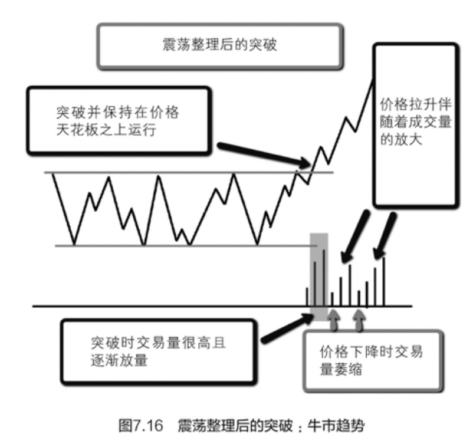
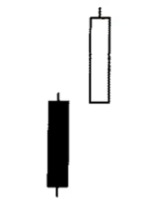
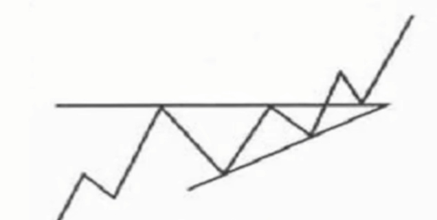

### 一，股票大作手操盘术

1. “集中注意力研究当日行情最突出的那些股票。**如果你不能从领头的活跃股票上赢得利润，也就不能在整个股票市场赢得利润**。” - [股票大作手操盘术 (豆瓣)](https://book.douban.com/subject/19952930/)

2. “**`只要这只股票的表现对头、市场对头，就不要急于实现利润。你知道你是正确的，因为如果不是，你根本就不会有利润。让利润奔跑吧，你驾驭它一起奔跑，也许它最终会扩大为一笔很可观的利润。只要市场的表现没有任何迹象引起你的担心，那就鼓起勇气，坚定自己的信念，坚持到底`**。”  - [股票大作手操盘术 (豆瓣)](https://book.douban.com/subject/19952930/)
3. “你必须完全抛弃自己对市场的个人意见，将注意力百分之百地转向市场变化本身。意见千错万错，**市场永远不错**。” - [股票大作手操盘术 (豆瓣)](https://book.douban.com/subject/19952930/)
4. “**利润总能自己照顾自己，而亏损永远不会自动了结**。投机者不得不对当初的小额亏损采取止损措施，以确保自己不会蒙受大额损失。这样一来，就能维持自己账户的生存，终有一日，当他心中形成了某种建设性想法时，还能重整旗鼓，开立新头寸，持有与过去犯错误时相同数额的股票。”  - [股票大作手操盘术 (豆瓣)](https://book.douban.com/subject/19952930/)
5. “投机者不得不对当初的小额亏损采取止损措施，以确保自己不会蒙受大额损失。这样一来，就能维持自己账户的生存，终有一日，当他心中形成了某种建设性想法时，还能重整旗鼓，开立新头寸，持有与过去犯错误时相同数额的股票。” - [股票大作手操盘术 (豆瓣)](https://m.douban.com/book/subject/19952930/)
6. “**绝不要因为某只股票看起来价格过高而卖出它**。你也许看着一只股票从10美元上涨到50美元，认定它的成交价已经高得太离谱了。这个时候，我们恰恰应当研究判断有没有任何因素可能阻止它在盈利状况良好、企业管理层优秀的条件下，从50美元开始，继续上涨到150美元。很多人看到某只股票已经经历了长期的上涨行情，认为它的价格“看上去太高了”，就抛空这只股票，结果赔光了本金。 反过来，绝不要因为某只股票从前一个最高点大幅下滑而买进它。很有可能这一轮大幅下跌是基于很扎实的理由才形成的。以公平的价格来看，也许该股票当前还是处在极端的高位——即使它的当前价位看上去似乎比较低。” - [股票大作手操盘术 (豆瓣)](https://m.douban.com/book/subject/19952930/)
7. “**在这只股票自然上升的全部过程中，你都该有足够的耐心持股不动。现在，一定要以敏锐的感觉向危险信号致以应有的敬意，勇敢地断然卖出，离场观望**。我并不是说这样的危险信号总是准确的，正如我在前面声明的那样，没有任何准则百分之百地准确。但是如果你始终一贯地注意这样的危险信号，从长远来看，将收获巨大。一位伟大的天才投机家有一次告诫我：“当看到市场向我发出危险信号时，我从不和它执拗。我离开！几天之后，如果各方面看来都没问题，我总是能够再度入市。如此一来，我为自己减少了很多焦虑，也省下了很多金钱。 **`我是这样算计的，假如我正沿着铁轨向前走，一列快车以60英里（约100公里）的时速向我冲来，我就会跳开轨道让火车过去，而不会愚蠢到站在那儿不动。等它过去了，只要我愿意，什么时候再回到轨道上都行`**。”这番话十分形象地揭示了一种投机智慧，我始终牢记不忘。”
8. “**`我的经验始终如一地表明，如果没有在行情开始后不久便入市，我就从来不会从这轮行情中获得太大的收益`**。原因可能是，如果没有及时入市，就丧失了一大段利润储备，而在后来的行情演变过程中，直至行情终了，这段利润储备都是勇气和耐心的可靠保障，因此是十分必要的——在行情演变过程中，直至行情结束，市场必定会不时出现各种各样的小规模回落行情或者小规模回升行情，这段利润储备正是我不为之所动、顺利通过的可靠保障。” 
9. “一只股票上市时可能以50、60或70美元每股的价格开盘，随后因为被抛售套现而下跌20点左右，此后在最高点和最低点之间维持了一年或两年。后来，如果有一天该股票的成交价向下跌破前期历史低点，则很可能形成一轮幅度巨大的下跌行情。为什么？这说明该公司内部必定在某个地方出了岔子” 
10. “**我失去了有史以来自己判断出的最有吸引力、把握最牢靠的交易机会之一。总结一下，这次的失败基本上有两个方面的原因。 首先，我没有耐心地等待价格行情的心理时刻的到来，没有等到时机成熟后再入市操作**。事先我知道，只有棉花的成交价上升到每磅12½美分，才说明它真正进入状态，将向高得多的价位进发。事与愿违，我不曾有那份自制力去等待。我的想法是，一定要在棉花市场到达买入点之前抢先额外多挣一点，因此在市场时机成熟之前就动手了。结果，我不仅损失了大约20万美元的真金白银，还丧失了100万美元的盈利机会。按照本来的计划，我想在市场超越关键点之后分批聚集10万包的筹码，这个计划早就刻在脑子里了。如果照计而行，就不会错失从这轮行情盈利200点左右的大机会了。 **其次，仅仅因为自己判断失误，就纵容自己动怒，对棉花市场深恶痛绝，这样的情绪和稳健的投机守则是不相适宜的**。我的损失完全是由于缺乏耐心造成的，没有耐心地等待恰当的时机来实施预先形成的看法和计划。”
11. “**如果你一定要等弄明白那个理由后才动手，就会错失良机，未能在适当时机采取适当行动！**投资者或投机者所需了解的惟一理由，从来都是仅在市场表现本身。无论何时，只要市场的动作不对头，或者没有按照应有的方式动作——这就是充分的理由，足以让你改变自己的意见，而且要立即改变。诚然，一只股票之所以有这样那样的动作，总是自有它的理由。然而，更值得铭记在心的是，情况往往是这样的，直到未来某个时点之后，你才能了解各种情由，而那时一切都已经太晚，再也不可能从中获利了。” - [股票大作手操盘术 (豆瓣)](https://book.douban.com/subject/19952930/)
12. “虽然他所谓的“投资”本来的确是打算长久持有的，但是这只股票的价值将来也许要重新受到新情势的考验，而这些新情势可能损害该股票的盈利能力。就在这位投资者弄清楚新情况之前，该股票的投资价值已经大大缩水了。因此，成功的投机者在其冒险生涯中总是如履薄冰地守护自己的资本账户，投资者对此也同样大意不得。如果能够做到这一点，那么那些喜欢别人称自己为“投资者”的朋友，将来就不会被逼上梁山，万般无奈地变成投机者了——当然，他们的信托基金账户也就不会如此大幅贬值了。 … 股市投机者也有赔钱的时候。但是我相信，下面这种说法是经得住推敲的，单单在投机活动中亏掉的金钱和那些撒手不管头寸的所谓投资者亏掉的巨额金钱比起来，不是更多，而是更少。以我的观点来看，这些投资者才是大赌徒。他们拍下赌注，一赌到底，如果赌错了，就输个精光。”
13. “**`不论何时，只要耐心等待市场到达我所说的“关键点”之后才动手，我的交易就总能获利`。为什么？因为在这种情况下，我选择的正是标志着行情启动的关键心理时机。我永远用不着为亏损而焦虑，原因很简单，我恰好在操作准则发出信号时果断行动，并根据准则发出的信号逐步积累头寸。**之后，唯一要做的就是静观其变，任由市场自行展开行情演变的过程，我知道，只需如此，市场自身就会在合适的时机发出信号，让我了结获利。” - [股票大作手操盘术 (豆瓣)](https://book.douban.com/subject/19952930/)
14. “**如果你对某只或某些股票形成了明确的看法，千万不要迫不及待地一头扎进去。要从市场出发，耐心观察它或它们的行情演变，伺机而动。一定要找到基本的判断依据。**比方说，某只股票当前成交价位于25.00美元，它已经在22.00美元到28.00美元的区间里维持相当长的时间了。假定你相信这只股票最终将攀升到50.00美元，也就是说，现在它的价格是25.00美元，而你认为它应当上涨到50.00美元。且慢！耐心！一定要等这只股票活跃起来，等它创新高，比如说上涨到30.00美元。只有到了这个时候，你才能“就市论市”地知道，你的想法已经被证实。这只股票必定已经进入了非常强势的状态，否则根本不可能达到30.00美元的高度。只有当这只股票已经出现了这些变化后，我们才能判断，这只股票很可能正处在大幅上涨过程中——行动已经开始。这才是你为自己的意见签字画押的时候。” - [股票大作手操盘术 (豆瓣)](https://book.douban.com/subject/19952930/)
15. “如果将来有人采用我的记录行情方法从市场上赢得比我更多的利润，我是不会惊讶的。这句话建立在以下前提之上：尽管我是在一段时间之前通过分析自己的行情记录、得出独立结论的，如果有同行现在开始应用这一方法，也完全可能从中轻易地发掘到被我遗漏的新的价值点。说得更清楚一点，我并没有进一步探究新的要点，因为从我过去相当长时间的应用经验来看，现有的这些已经完全满足了我个人的需求。无论如何，其他人或许可以从这里介绍的基本方法出发，发展出新的思路，并针对新目标应用新思路，从而提升这些基本方法的价值。毋庸置疑，如果有人做到这一点，我是不会嫉妒他们的成功的！ ” - [股票大作手操盘术 (豆瓣)](https://book.douban.com/subject/19952930/)

### 二、股票大作手回忆录

1. “**我是在自己的体系内交易，而不是去买卖一只喜爱的股票或者是支持什么观点**。” - [股票大作手回忆录 (豆瓣)](https://book.douban.com/subject/27601129/)
2. “这就是我，年纪轻轻，从来没有离开过家乡，现在彻底破产了；但是我知道自己本身没有什么问题，只是操作方法错了。我不知道是否讲清楚了自己的故事，但我从来不会对股市发脾气、不与大盘争论，对市场发脾气对你半点好处都没有。” - [股票大作手回忆录 (豆瓣)](https://book.douban.com/subject/27601129/)
3. “人们常说凡事都有两面，但股市只有一面，不是多头的一面或空头的一面，而是正确的一面。” - [股票大作手回忆录 (豆瓣)](https://book.douban.com/subject/27601129/)
4. “局部的胜利和失败一样，可以让你从中收获很多。比如，从牛市刚一开始时我就看多，而且通过买进股票支持自己的观点。与我的预测一样，行情开始上涨。直到此时，一切都完美无缺。但我还做了什么呢？我听从前辈的意见，抑制年轻躁动的心，我下定决心要保持理智，谨慎保守地操作。每一个人都知道，按照这种方式去做就要平仓获利，然后在市场回调时再买回你的股票。这正是我干的事情，或者说我正在尝试去做的事情，**`我经常平仓获利，等待永远也不会发生的市场回调`。****我眼睁睁地看着自己的股票飞涨了10个点******，而我却只能坐在那里将4个点的利润稳妥地收入囊中。人们说“落袋为安”永远不会让你变穷。是的，确实不会。但是在牛市中仅凭4个点的利润你也挣不到大钱。在应该挣20000美元的时候我挣了2000美元，这就是我保守操作的代价。当我发现自己是“捡了芝麻，丢了西瓜”的时候，我还发现了另外一件事情，那就是股民们根据个人经验的多少，也分为不同等级。” - [股票大作手回忆录 (豆瓣)](https://book.douban.com/subject/27601129/)
5. “在华尔街经过多年历练，赚过几百万美元，也赔过几百万美元，**`我想告诉你的是，我能挣到大钱从来不是因为我的思考，而是因为我的坚守`**。你明白吗？是我持之以恒的坚守！对市场判断正确不足为奇，在牛市中你总可以找到从一开始就做多的人，在熊市中也会找到从一开始就做空的人。我认识很多人，他们总能在恰当的时间做出准确无误的判断，在可以实现利润最大化的价位开始买入或卖出股票。他们的经历和我完全一样，也就是说，他们也没有因此真正挣到多少钱。既能正确判断市场走势又能坚守操作准则的人少之又少，我发现这是最难学到的事情之一。然而一个股票作手只有在掌握了这一点之后他才能挣到大钱，当一个人掌握了交易秘诀之后，挣几百万美元比无知蒙昧时挣几百美元还要容易。” - [股票大作手回忆录 (豆瓣)](https://book.douban.com/subject/27601129/)
6. “一个人能够学到的最有用的知识之一就是不要总是想着抓住最后一个或第一个0.125美元，这两个美元是世界上最昂贵的东西，它们让炒股者付出的代价可谓是成千上百万美元，足可以修建一条横贯美洲大陆的水泥高速公路” - [股票大作手回忆录 (豆瓣)](https://book.douban.com/subject/27601129/)
7. “**重点不在于尽可能以便宜的价格买进或是以最高的价格卖出，而在于在正确的时机买进或卖出**。当我看空而卖出股票时，每次卖出的价格都比上一次低，当我买进时正好相反。我一定是向上买进，我做多时不会以低于之前的价格，而是以高于之前的价格买进。” - [股票大作手回忆录 (豆瓣)](https://book.douban.com/subject/27601129/)
8. **“请记住，股价永远不会高到让你不能开始买进，或者低到让你不能开始卖出。但在初次交易之后，除非能够显示你可以盈利，否则不要进行第二次操作。耐心等待、认真观察。**那正是你读盘能力发挥作用的时候，让你能够决定何时才是开始操作的合适时机。很多事情成功与否，取决于开始的时机是否完全正确。我花了很多年才认识到这一点的重要性，也让我付出了数十万美元的代价” - [股票大作手回忆录 (豆瓣)](https://book.douban.com/subject/27601129/)
9. “1906年夏天，在萨拉托加发生的联合太平洋事件让我变得比任何时候都更加独立，不会去听信别人的小道消息和评论，也不会理会其他人的意见、推测和怀疑。**无论他们与我的私人交情有多深，无论他们的个人能力有多强，都不会影响到我的判断。**” - [股票大作手回忆录 (豆瓣)](https://book.douban.com/subject/27601129/)
10. “我开始意识到只有在大趋势中才能赚到大钱。无论是什么原因推动了大盘最初的上涨，事实是持续的大盘上涨既不是内线集团的炒作也不是金融家的诡计，而是市场的基本情况决定的。**大盘必然会根据推动力量所决定的幅度、速度和时间向前推进，无论是谁都无法阻挡**。” - [股票大作手回忆录 (豆瓣)](https://book.douban.com/subject/27601129/)
11. “当一个人犯错时，他唯一要做的事情就是停止继续犯错，回到正确的轨道上来。” - [股票大作手回忆录 (豆瓣)](https://book.douban.com/subject/27601129/)
12. “**如果你没有从股市中获得尽可能多的好处，那么仅仅是判断正确又有什么用呢**？” - [股票大作手回忆录 (豆瓣)](https://book.douban.com/subject/27601129/)
13. “价格和其他东西一样，沿着最小阻力方向运动。怎么走比较省力它们就怎么走，因此，如果上涨的阻力比下跌的小，那么它们就会往上走，反之亦然。 。。。  **永远不要因价格太高而不买，永远不要因价格太低而不愿抛出。从本质上来说，价位高低与我找到最小阻力线毫无关系。**” - [股票大作手回忆录 (豆瓣)](https://book.douban.com/subject/27601129/)
14. “我有自己的一套棉花操作理论，交易中我以它为准则。假设我决定建立一个四五万包的头寸，那么我会告诉你去研究行情走势，看看到底该买还是该抛。假设最小阻力线显示将出现上涨行情，我会先买入10000包。完成这笔买入交易后，**`如果市场在我的最初买入价的基础上上涨了10个点，我会再次买入10000包`。以此类推**，如果我能得到20点的利润或者一包赚1美元，我会再买20000包。这样我就满仓了，这就是我做交易的方法。但如果买了最开始的10000或20000包以后出现浮动亏损，那么我就立即平仓。这说明我犯了错，也许只是暂时错了，正如我之前所说的，凡事开头出错便绝不会有利可图。我一直坚持自己的交易体系，由此一次大行情也没错过，在逐步加码直至满仓的过程中，我总会先亏掉五六万美元去试探市场的反应。这看起来是个成本过于昂贵的测试，但其实并不是这样的，当真正的行情开始时，这点亏损立即就能赚回来。在正确的时间做正确的事，你一定能获得回报。” - [股票大作手回忆录 (豆瓣)](https://book.douban.com/subject/27601129/)
15. “**`我记得我之前还说过，这就是我所谓的交易体系。只在赚钱的时候才重仓操作，而在赔钱的时候只亏一点探测性的赌注而已`**。这种做法是非常明智的，通过简单的算术就能证明。如果按我说的方法去交易，就总可以持有盈利的头寸，赚得丰厚回报。” 
16. “多头市场让我的账户资金大大增加，空头市场对我也非常慷慨，所以在我收到需要退出市场的警示之后，我并没有充足的理由要求自己去片面地追求是多头还是空头。正确操作才是我应该关注的。 。。。 这些突发事件往往是沿着阻力最小的方向推进，这些正是我在股市的立身之本。还有一件事情需要牢记在心：绝对不要试图在最高点卖出。这种做法是不明智的，股票下跌之后没有再强势反弹就应当卖出了。1916年，通过牛市持续做多，之后在熊市开始做空，我净赚了大约300万美元。就像我前面说过的那样，一个人没有必要只“嫁给”市场的一面，并且至死不渝。” - [股票大作手回忆录 (豆瓣)](https://book.douban.com/subject/27601129/)
17. “**所有的股票不会一起沿着同一个方向波动，但同一板块的股票却会在牛市中一起上涨，在熊市中一起下跌**。 。。。 即使是在牛市，如果一只股票没有表现出在牛市中应有的走势，我也不会去买这只股票。**有时在确定无疑的多头市场中我买进了一只股票，结果发现同一板块中的其他股票表现并不强劲，我会卖掉这只股票。**为什么？因为经验告诉我，与我认为显而易见的板块趋势相悖是不明智的。我不能只依靠确定性交易，我必须依靠可能性去赚钱，必须预测各种可能性。 。。。 经验告诉我，不要去买那些没有追随板块领涨股的股票。” - [股票大作手回忆录 (豆瓣)](https://book.douban.com/subject/27601129/)
18. “一个人看待事物的方式决定了他在投机市场中是赚还是亏。一般公众对自己的操作的认识还非常浅薄，他们的思考总是掺杂着过多的自我因素，因此不可能深入彻底。而专业人士注重的是力求行事正确，而不只是赚钱，因为他们明白，水到渠成之日利润自然会来。一个交易商在玩这个游戏时应该像职业台球选手一样，懂得走位，不能只考虑眼下该打哪个球，必须培养在游戏中对位置的直觉” - [股票大作手回忆录 (豆瓣)](https://book.douban.com/subject/27601129/)
19. “基恩拥有一个成功的投机者无论何时何地都必须具备的最强大的心理素质。他从来不与大盘为敌，这一点非常明确。他也完全无所畏惧，却从不鲁莽行事。如果他发现自己犯了错误，他会立刻掉头转向正确的方向。 。。。 当操盘手无法让一只股票按照自己的意愿波动时，就应该终止操作了。当你操作的股票没有按照它应有表现波动时，要立刻出清离场。不要与大盘争辩，不要指望去挽回利润。该离场时就离场，这是最合适和划算的操作方法。” - [股票大作手回忆录 (豆瓣)](https://book.douban.com/subject/27601129/)
20. “股价长期下跌的真正原因绝对不是空头打压。当一只股票不断下跌时，你应该猜到其中必有问题，不是市场的问题就是公司自身的问题。如果是无厘头的下跌，股价很快就会跌到其真正价值之下，这就会带来买盘阻止跌势。 当一只股票价格上涨时，没有必要详细解释上涨的原因，持续的买盘会让价格不断上涨。只要股价保持上涨，偶尔出现自然的小幅回调，那么跟随涨势操作是非常安全的。然而，如果股价经过长期的稳定的涨势之后开始掉头下跌，只是偶尔有些反弹，那么显然阻力最小方向已经由上涨转为下跌了。情形就是这样，为什么要寻求解释呢？股价下跌可能有很好的理由，但这些理由只为少数人知悉，他们要么秘而不宣，要么告诉公众这只股票很便宜，建议赶紧入手。这个游戏的本质就是这样，公众应当认识到这一点，少数知道内情的人是不可能说出真相的。” - [股票大作手回忆录 (豆瓣)](https://book.douban.com/subject/27601129/)

### 三、海龟交易法则

1. “**重要的不是交易系统，而是交易者贯彻交易系统的能力。** 。。。 学习如何交易相对容易，但把学到的东西应用在实际交易中是非常难的。” - [海龟交易法则 (豆瓣)](https://book.douban.com/subject/24325274/)、
2. “以下是几种对交易行为有影响的认知偏差： **损失厌恶**（lossaversion）：对避免损失有一种强烈的偏好。也就是说，不赔钱远比赚钱更重要。 **沉没成本效应**（sunkcostseffect）：更重视已经花掉的钱，而不是未来可能要花的钱。 **处置效应**（dispositioneffect）：早早兑现利润，却让损失持续下去。 **结果偏好**（outcomebias）：只会根据一个决策的结果来判断它的好坏，而不去考虑决策本身的质量。 **近期偏好**（recencybias）：更重视近期的数据或经验，忽视早期的数据或经验。 锚定效应（anchoring）：**过于依赖**（或锚定）容易获得的信息。 潮流效应（bandwagoneffect）：盲目相信一件事，只因为其他许多人都相信它。 **小数定律**（thelawofsmallnumbers）：从太少的信息中得出没有依据的结论。” - [海龟交易法则 (豆瓣)](https://book.douban.com/subject/24325274/)
3. “海龟培训课的所有内容可以归结为以下4个要点： 1.掌握优势：找到一个期望值为正的交易策略，因为长期来看它能创造正的回报。 2.管理风险：控制风险，守住阵地，否则即使你有一个期望值为正的系统，你也等不到它创造成果的那一天。 3.**坚定不移：唯有坚定不移地执行你的策略，你才能真正获得系统的正期望值。** 4.**简单明了：海龟方法的精髓其实很简单——抓住每一个趋势。你的大部分利润可能就来自两三次成功的交易，所以不要错过任何趋势，否则你全年的努力可能都会化为泡影。这很简单，也很容易理解，只是不容易做到。**” - [海龟交易法则 (豆瓣)](https://book.douban.com/subject/24325274/)
4. “海龟思维： •以长远眼光看待交易。 •避免结果偏好。 •相信正期望值的威力。 海龟们正是以这样的方式看待损失的：损失只是做生意的成本，并不代表着一次错误交易或一个坏决策。要做到这一点，我们必须明白一件事：长期来看我们总会失而复得。海龟们相信，期望值为正的交易在长期内必能成功。”  - [海龟交易法则 (豆瓣)](https://book.douban.com/subject/24325274/)
5. “要了解一个优秀的交易者，你必须了解他或她的情感特征对交易行为有什么样的影响。如果你天生就具备那些素质，就会更容易学会正确的交易方式。如果你不是那种天赋异秉的人，你就必须培养这些素质。这是你的首要任务。那么，哪些是应该具备的素质呢？  避免结果偏好： 好的交易者考虑的是现在，而避免对未来考虑过多。新手则想预见到未来：如果他们赢了，他们会认为自己预测对了，感觉自己像个英雄；如果他们输了，他们会把自己当成傻瓜。这是错误的。海龟们不在乎是对还是错，他们只在乎赚钱不赚钱。海龟们不会扮演能预见未来的先知，他们从不会瞄一眼市场就大言不惭地说：“金价就要上涨”。  避免近期偏好： 大多数交易者不仅对未来考虑过多，对过去同样考虑过多。他们会念念不忘过去所做的事，过去所犯的错误，还有过去那些失败的交易。海龟们会从过去的经历中吸取经验教训，但不会为过去而烦恼。他们不会为过去所犯的错误而责备自己，也不会对过去的失败耿耿于怀。他们知道这只是游戏的一部分。  避免预测未来： 每一个人都想当然地认为，既然我是一个著名的培训小组的成员，而且已经在期货交易中赚了几百万美元，我肯定对未来有某种成竹在胸的判断。我的标准答案当然令他们大跌眼镜：“我不知道。”事实上，我确实不知道。当然，我可以瞎猜一通，但我对自己预测市场的能力可是没有半点信心。事实上，我一直在有意地克制自己，从不去试着预测市场的未来动向。 在这一点上，交易与保险非常相似。交易中充满了不确定性。你不知道一笔交易会不会赚钱。你充其量只能相信，从长期来看，你的回报将大于你的风险水平。  从概率角度考虑问题： 海龟们永远不会知道一笔交易最后会赚钱还是赔钱。我们只知道交易结果的大致分布形状——与上面几个图非常类似的形状。我们认为，每一笔交易都有可能赚钱，但可能性最大的结果是赔钱。我们也知道，有些交易会得到4R到5R的中等回报，有些则会是12R、20R甚至是30R的大捷。但最终看来，胜利的成果足以弥补失败的损失，我们总会赢利。因此，当我们进行一笔交易时，我们不会根据这笔交易的结果来评判自己的能力，因为我们知道最大的可能性是赔钱。我们从概率角度考虑问题，正因为如此，我们在面临巨大的风险和不确定性时依然信心十足。  像海龟一样思考： 重要的是现在：不要对过去念念不忘，也不要去预测未来。前者对你无益，后者是徒劳的。 从概率角度考虑问题，不要预测未来：不要试图作出正确的预测，唯有使用概率对你有利的方法，你才能在长期内获得成功。 对你自己的交易结果负责：不要把你的错误和失败归咎于其他人、市场、你的经纪人等。要对自己的错误负责，从错误中学习。  对自己的交易结果负责： 许多人喜欢把自己的失败归咎于其他人，或者归咎于不受自己控制的外部环境。他们会责怪每一个人，除了他们自己。不愿对自己的行为及其结果负责，也许就是他们最重要的败因。 交易是你进行的，你应该对结果负责。不要责怪任何人给了你坏的建议，也不要责怪任何人没有把秘诀告诉你。如果你做了愚蠢的事，要从错误中学习，不要装作没有犯错。然后去想办法避免再犯同样的错误。”
6. **“`当价格“冲破”前期的阻力位或支撑位水平时，突破就发生了`。**作为突破法交易者，我们在阻力位被突破时买入做多，在支撑位被突破的时候卖出做空。在市场短期突破支撑位时，我们卖出以退出多头交易；在市场短期突破阻力位时，我们买入以退出空头交易。 一旦支撑位或阻力位失守，价格会沿着突破方向继续前行，而且会前行相当长的一段距离。如果市场突破了一个已经很久没有出现过的新价位，那么一般来说已经不存在明显的后续支撑点或阻力点”
7. “不要整天去膜拜杂志上的那些梦幻工具，学会如何用好最基础的工具才是第一位的。重要的不是你的工具有多大的威力，而是你能不能用好这些工具” - [海龟交易法则 (豆瓣)](https://book.douban.com/subject/24325274/)
8. “任何一件不断重复的事情都有可能被市场参与者注意到。同样的，一种在近期表现得特别突出的策略也很有可能被诸多交易者注意到。但是，如果太多的交易者都开始尝试着利用同一种策略，这种策略将不再像从前那样有效” - [海龟交易法则 (豆瓣)](https://book.douban.com/subject/24325274/)
9. “有的基金管理得确实很出色，但运气一般；有的基金管理得很一般，但运气很好。如果只盯着历史记录，你是分不清实力与运气的。随机效应太大、太普遍，所以你不可能得出确凿无疑的结论。” - [海龟交易法则 (豆瓣)](https://book.douban.com/subject/24325274/)
10. “如果你的交易策略以未来不可知的前提假设为基础，那么未来的任何市场状态都已在你的预料之中，你不需要预测什么。相反，如果你的交易策略以某些特定的市场特征假设（实际上任何假设都一样）为基础，那么一旦这些假设未能成立，你的策略就失去了立足点。” - [海龟交易法则 (豆瓣)](https://book.douban.com/subject/24325274/)
11. “市场不会在乎你的感受。它既不会在你得意洋洋的时候吹捧你，也不会在你灰心丧气的时候安慰你。所以，交易世界并非适合每个人。如果你不愿意接受市场的现实，不愿意承认自己的缺陷、恐惧和失败，你就不会成功。” - [海龟交易法则 (豆瓣)](https://book.douban.com/subject/24325274/)
12. “**如果你想成为伟大的交易者，你必须克服自负心理，培养谦虚谨慎的品性**。谦虚能使你接受未来不可知的事实，谦虚能让你放弃预测未来的企图，谦虚能避免你从个人化的角度看待失败的交易，谦虚还能帮助你接纳简简单单的交易法则，因为你不会去寻找无人知晓的秘密来证明自己的与众不同。” 
13. “**里奇要求海龟们坚定不移地遵守入市信号，因为一整年的大部分利润很有可能就来自于两三次大的赢利交易。哪怕你只忽略或错过了一个信号，这一年的回报率也可能大打折扣**” - [海龟交易法则 (豆瓣)](https://book.douban.com/subject/24325274/)
14. “**交易行业里还有一句老话：“落袋为安的人永远也不会破产。”但海龟们不会同意这种论调。趋势跟踪者们最常犯的错误之一就是过早地退出赢利的头寸，也就是过早地“落袋为安”**。价格永远也不会直上直下，没有波动。因此，**`要想抓住一次趋势，你必须允许价格偶尔向不利的方向变动`**。在趋势的初期，这往往意味着10%~30%的利润在你眼前化为乌有，反而转为小小的损失。在趋势的中期，你或许会眼睁睁地看着80%~100%的利润跌去三四成。在这些情况下，放掉包袱、“锁定利润”的诱惑是很强大的。”  - [海龟交易法则 (豆瓣)](https://book.douban.com/subject/24325274/)
15. “我可以明明白白地告诉你：遵守系统法则的命令退出亏损的头寸是一个生死攸关的要点。不会甩掉损失的交易者在长期内都不会成功。包括巴林银行和长期资本管理基金的灾难在内，几乎所有失去控制的致命交易行为都与不能防微杜渐地及时控制损失有关。” - [海龟交易法则 (豆瓣)](https://book.douban.com/subject/24325274/)
16. 简略摘要了书里的海龟交易系统： 头寸规模： 海龟们所使用的头寸规模算法在那个时代非常先进，因为它会根据一个市场的绝对波动幅度来调整头寸的规模，等于将头寸的绝对波动幅度标准化了。这意味着，一个特定头寸在某一天的向上或向下变动幅度（以绝对美元金额来衡量）与其他市场上的头寸基本相同，无论这个特定市场的波动性是大还是小。其中的原理是：如果一个市场的合约价值波动性较强，那么这个市场中的合约持有量就少一些；相反，如果一个市场的波动性较弱，这个市场中的头寸就可以大一些。总之，市场的波动性与头寸的规模是相互抵消的。  入市策略： 海龟们使用的是一个以理查德·唐奇安的通道突破系统为基础的非常简单的入市系统。海龟们使用两个有所差异但也彼此相关的入市系统，我们称为系统1和系统2。我们可以自由决定如何在这两个系统之间分配资金。有的海龟只用系统2，有的在两个系统上各投入50%的资金，还有的采用其他组合。这两个系统分别是：系统1：以20日突破为基础的短期系统；系统2：以55日突破为基础的长期系统。  止损策略： 海龟们根据头寸风险来设定止损标准。任何一笔交易的风险程度都不得超过2%。  退出策略： 系统1采用10日突破退出法则：对多头头寸来说，在价格跌破过去10日最低点时退出；对空头头寸来说，在价格超过10日最高点时退出。总之，如果价格发生了不利于头寸的10日突破，所有头寸单位都要退出。 系统2则采用20日突破退出法则：对多头来说是20日向下突破，对空头来说是20日向上突破。只要价格发生了不利于头寸的20日突破，所有头寸单位都会退出。

### 四、笑傲股市

1. “对于CANSLIM的具体内容，我们还是先睹为快： C代表当季每股收益：越高越好。 A代表年度收益增长率：找出增长最为引人注目的股票。 N代表新公司、新产品、新管理层、股价新高：选择正确时机买入。 S代表供给与需求：兼顾考虑流通股份的供给数量加上大量需求。 L代表领军股或拖油瓶：孰优孰劣？ I代表机构认同度：关注主力机构动向。 M判断市场走势：如何判断大盘分析。” 
2. “在本章，你会看到100张图，涵盖了1880~2008年表现最为强劲的股票。它们在股价飙升之前总是有迹可循，仔细研究这些图后，你便会掌握如何洞察这些迹象的秘诀。 。。。 研究这些图的同时，你会发现，无论是在1900年还是在2000年，有几种图形是被反复应用的。它们可以告诉你某只股票是否处于价格形态的形成过程中。所以，一旦学会如何分辨这几种不同的图形，你绝对会受益匪浅。销售额、收益和股本回报率的增长，加上强有力的图形（表明有机构投资者的大量买入），两者相结合才能显著提高你选股和把握时机的能力。对于最优秀的专业人士来说，图是不可或缺的。 。。。 明显强有力的价格形态（在本章后半部分会涉及）往往预示着股价的大幅度上涨。而股票的跌势也总是可以从带有缺陷或是显而易见的形态中寻得痕迹。 。。。 个人投资者也需要学习股市图并从中获益。仅仅凭借强劲的收益或销售额这样的基本面分析来挑选股票是远远不够的。实际上，《投资者商业日报》的任何读者都不该仅仅依照它的独家“明智投资”排名来购买股票。投资者应该先查看备选股票的相关图，从而明确该公司股票价格是否处在买入的合适时点，还是虽然公司基本面优良，价格却早已经涨上了天，脱离了基本面的支撑，如果是这样，则应该暂时避免买入。 。。。  在股市中，历史总是一再重演。这是因为人的本性是不变的，供求规律也是如此。”
3. “最重要的价格形态之一看起来就像是一个带柄的茶杯，如图21所示。杯状形态可以持续7~56周不等，但多数为3~6个月。一般来说，这种价格形态从最高点（杯顶）到最低点（杯底）的回调幅度介于12%~15%之间，最高不会超过33%。对于一种强势的价格形态而言，在“基底”阶段开始形成之前，一般会有一个明确的股价上涨阶段，这个阶段的股价上涨幅度至少在30%以上，并且，这个价格上升阶段还伴随着相对其他股票的相对优势的出现，以及在部分时点成交量的显著增多。” - [笑傲股市（原书第4版·典藏版） (豆瓣)](https://m.douban.com/book/subject/30289854/)

4. "为了进一步确认选股是否正确，可以对比分析一下同一行业中的其他股票。**如果在该行业中无法找到另一只收益强劲的股票的话，那么，你很可能做出了错误的投资决定**。 。。。 要想在股票大军中出类拔萃，收益不仅要在过去几年间涨势良好，还要保证近几个季度能够表现强劲。同时具备这两个关键要素，才能成就一只超级牛股，或者至少能使其成功的几率大为提高。"
5. “在形势一片大好的牛市中，千万不要因为市盈率看似过高就轻视了某只股票。要知道，它很可能成为下一个股市王者。同样，也不要因为市盈率过低，从而使这只股票看上去很合算便将其买入。市盈率较低可以有很多原因，而且也没有什么黄金法则来保证股票的市盈率不会从8或10下降到4或5。 。。。 对某一行业内的股票进行评估，认为市盈率最低的股票就是被低估的，因此也最具吸引力。事实上，市盈率最低的公司可能有最糟糕的收益表现。 。。。 一般来说，最好的股票，其价格也更高。”
6. “一般来说，强势行业中的前三甲公司往往会涨势惊人，而其他股票会波澜不惊。 你应该选择实力真正强劲的公司—那些领跑其所在行业并且在专业领域里出类拔萃的公司。 我所说的佼佼者，并不一定是指规模最大或者是品牌最为知名。而是指季度和年度收益涨势最强，股权收益率和利润率最高，销售额增幅最大，股价上涨也最有活力。这一类公司通常会推出独树一帜、卓尔不群的产品或服务，而且能从那些老牌、缺乏创新的竞争者手中得到更多的市场份额。”
7. **“`如果你有一个股票组合，就必须学会先卖出表现最差的股票，表现最好的则可以先按兵不动`**。换言之，永远在损失尚小时卖出错误买入的股票，进而观察那些较好的选择，看它们是否会演变为你的超级牛股。由于人性的作用，大多数投资者本末倒置：持有“失败股”反而卖出“制胜股”，这一做法永远会导致更大的失败。” 
8. “从20世纪50年代早期到2008年，表现最好的股票在其股价大涨前的平均RS值为87。换句话说，最出众的股票在开始其最具爆炸性的股价上扬以前，就已经比其他近90%的股票更优秀了。所以，那些立志成为股市中大赢家的投资者一定要记住这一准则：寻找真正的领军股，避免滞后股以及跟随性投资行为。不要购入股价相对强度在40多、50多或60多的股票。”
9. “**一旦大盘下跌彻底结束，最先反弹到价格新高的股票基本上就是你要寻找的真正领军股**”
10. “这就是为什么我说不能在股价下跌时购买那些假设会上涨的股票，以及我们为什么推荐将所有的损失控制在7%或8%的原因。对于任何一只股票来说，万事皆有可能，你必须有一些准则来保护自己辛苦赚来的钱。我们都会犯错，但必须学会果断地改正错误。” 
11. “**了解近期哪家业绩良好的机构投资者持有或买进某只股票，要比知道有多少机构投资者持有这只股票更为重要**。此外，知道一只股票的机构持有者总数是在增加还是减少也同样重要。 。。。 机构投资者在最近一个季度报告期内新近购进的股票，通常要比他已持有多期的股票更具参考价值。 。。。 当某公司的业绩增长已到了几乎所有的机构投资者都去购买它的股票的时候，再买进它的股票可能为时已晚，因为它已经丧失了核心的增长潜力。 。。。 总而言之，投资者应当购买这样一种股票：至少被几家业绩水平优于行业平均水平的机构投资者持有，并且近几个季度内机构投资者数量有所增加。”
12. “绝大多数股票都会在熊市下跌，但不是所有的都能再次回复到原来的股价水平。即使你坚持持有的投资行为是发生在最轻微的一次熊市中，你也有可能赔到无法回复。你必须要学会，在大势改变的情况下，至少卖出一部分不再赚钱的股票，从而来保护你的资本。”
13. “导致股票投资失败最快的方法就是试图去证明你是对的而市场是错的，只有保持谦逊，多了解股市运作的常识，才能够拥有基本的胜算。”
14. “**唯一行之有效的方法就是让大盘指数来告诉你何时进入、何时退出，永远不要与市场作对，因为它远比你强大**”
15. “若想在股市中取得巨大的成功，秘诀并不在于要时刻做出正确的决定，而是在犯错时能将损失降低到最小。”
16. “即使并未将股票抛出，但股价下跌时就已经造成了损失。相反，如果将股票抛出，你就可以持有现金，并且可以以更为客观的态度去思考未来的事。 。。。 还有另外一个建议能帮你决定是否该将股票抛出：假装自己并没有买过股票，而是在银行存了2800美元。然后这样问自己：“我现在真的想买这只股票吗？”如果你的答案是否定的，为什么还要继续固执地持有它呢？”
17. “少许的损失就像廉价保险，也是能够为自己的投资所购买的唯一保险。在很多情况下，股票在卖出后会重新上涨，即使这样，你也已经实现了尽量降低所有损失这一重要目标，而且仍有资金去尝试别的股票，说不定还会发现一只牛股”
18. “假设两年前以每股30美元的价格买入了一只股票，而它现在价值34美元，大多数投资者会选择抛售，因为他们已经赚得了利润。但两年前的买入价同股票现在的价值又有什么关系呢？选择持有还是抛售为什么要受其影响呢？关键在于，同你现在或将来可能持有的股票相比，现在这只股票的相对表现如何。”
19. "只要你愿意研究曾犯下的错误并从中吸取教训，而且制定出能帮助自己改正错误的新规则，就可以学会如何明智地进行投资。" - [笑傲股市（原书第4版·典藏版） (豆瓣)](https://book.douban.com/subject/30289854/)
20. “**不能允许任何涨幅接近20%的股票产生亏损**。如果你以50美元的价格买进某一股票，而它之后涨到了60美元以上（涨幅超过20%），那么，即使你没能把握住这一时机将股票卖出，也没有任何理由眼睁睁看着它重新回落到50美元以下并给自己造成损失。以50美元的价格买入，随后坐等其涨至60美元后又跌回50美元或51美元，这会让你感到尴尬，并开始怀疑自己的智商。既然没能把握住最大利润，至少不要再犯第二次错误，给自己带来损失。记住，你的一个重要目标是，将损失降到最低点。” - [笑傲股市（原书第4版·典藏版） (豆瓣)](https://book.douban.com/subject/30289854/)
21. “**你的目标并不是做出正确的决定，而是能够凭借这一决定取得巨大的财富。利弗莫尔曾说过：“赚钱靠的不是臆想，而是耐心等待的过程。**”既能做出正确决策，又能坐得住板凳的投资者为数不多。要知道，股票大幅上涨是需要时间的。”
22. “通常情况下，超级牛股大部分源自领先的行业。研究表明，股价变动的37%与它所处行业组别的表现直接相关，另外的12%取决于它所在的整体行业实力。 。。。 如果在一段时间的成功业绩之后，某行业组中一两只重要的股票严重受挫，这个弱势早晚会波及行业中的其他股票”  - [笑傲股市（原书第4版·典藏版） (豆瓣)](https://m.douban.com/book/subject/30289854/)
23. “忘掉你的骄傲和自我主义吧，市场才不会关心你想什么或是你想要什么。**不管你觉得自己有多聪明，股市都会比你更聪明**。高智商和硕士学历都不能够保证股市中的成功，你的自负会使你赔一大笔钱。不要与市场作对，不要试图去证明你是对的，而市场是错误的。”
24. “人们错失大牛股买入时机的关键原因： 1. **不信任，恐惧和知识的匮乏 2. 偏好市盈率 3. 不理解真正的领军股，它们往往是在接近或位于新的股价高点之上时才开始大规模涨势的，而不是在接近新的低点或是从高点巨量跌落之后才转跌为升。 4. 卖出太快，要么是因为投资者有所动摇，要么是由于卖出太快而不能够获利。”**

### 五、笑傲牛熊

1. “你的投资哲学应该很简单： 1．**绝不要在没有查看图形的情况下买卖股票**。 2．**绝不要在好消息公布时买入股票，尤其是在图形显示消息公布前股价已有明显上涨的情况下**。 3．绝不要在股价暴跌时因为觉得股票便宜而买进。在持续的卖压下，你会发现股票会变得更便宜。 4．绝不要在下跌趋势中买进股票（接下来我会告诉你，如何明确地定义下跌趋势）。 5．绝不要持有处于下跌趋势中的个股，不论它的市盈率有多低。几个星期后，当更低的股价出现时，你会发现股价下跌的原因。 6．始终保持一致性。如果在完全相同的情况下，你有时买进，有时卖出，那么你的交易纪律就有严重问题。”

2. “相对强度指的是某只股票（或某个股票组合）的表现同整个市场的关系。例如，如果股票XYZ价格上涨了10%，同期整个市场指数上涨了20%，那么虽然XYZ的股价上涨了，但它相对强度弱。如果股票XYZ价格下跌了10%，同期市场指数下跌20%，那么尽管XYZ的股价下跌了，但它相对强度较好。计算相对强度的公式很简单，即用某只股票（或某个股票组合）的价格除以整个市场的平均价格（市场指数）。” 

3. “一条趋势线被触碰的次数越多（未被突破），则该趋势线越重要，而它最终被突破时所释放的信号越强。 。。。 阻力区域被触碰的次数越多（未被突破），最终的向上突破多头意味越浓。”

4. “记住一个最基本的事实：任何一只股票都必然处于如下四个阶段中的一个 （1）底部阶段； （2）上涨阶段； （3）顶部阶段； （4）下跌阶段。” 

   

   

5. “买入一只股票有两个合适的时机，这两个买入时机的中心位置都在股价向上突破点附近。**第一个买入点，就是股价初次突破第一阶段并进入第二阶段的时候**。**第二个，也是更安全的买入点，就是当推动首次突破的狂热的买方力量耗尽，股价回抽至突破点附近的时候**。”

   

6. “对于一次新的买入来说，还有另一个非常有利可图的买点，**如果第二阶段上涨过程进行顺利，当股价回落至移动平均线附近并横盘整理，接着重新向上突破其阻力区域顶部时，这个买点就出现了**”

   

7. “初学技术分析的人甚至一些不应犯错的专业人士经常犯的一个错误就是，在某只股票向上突破其底部区域，但其股价还低于下降的30周均线时就买入这只股票。”

8. “与什么时候买同样重要的是买什么。实际上，这是一个复杂得多的决定。一旦你消化了本节的知识，买什么就有章可循了。事实上这一方法分为三步，我称其为“**自上而下**”。 我的意思是你应该先看大的问题——整体市场表现如何；后看小的问题——什么股票看起来是最佳选择。处于这两个问题中间的问题是——哪一个行业（或类别）技术面最好。 因此，筛选过程是按照下面的步骤进行的： 

   ​	1**．市场趋势如何？如果市场趋势不好，即使你发现某些个股出现突破，也要十分谨慎。当大势不利于你，你成功的概率会相当低**。 

   ​	2．哪些行业的技术面最佳？这个问题的重要性怎么强调都不过分。因为我的研究不断证明：如果从图形上看两只股票都有很好的上涨潜力，但一只选自强势行业，而另一只选自弱势行业，最终这两只股票的表现会大相径庭。**选自强势行业的那只股票通常都能快速地上涨50%～75%，而选自弱势行业的那只股票可能只勉强上涨5%～10%**。 

   ​	3．一旦你确认整个市场趋势良好而且某一行业的股票在技术上表现最为抢眼，**最后一步就是瞄准并买入这个行业里面从图形上看最好的一到两只个股**。如果你遵循以上三个步骤，你会发现当市场强劲上涨时，你手里的大多是那些表现最好的股票，而当整个市场走熊时，你已经卖出股票，持有大量的现金。”

9. “无论公共电力行业里的某只股票表现如何抢眼，我也不会考虑买入它。这说明了另一个道理：**即使市场普遍上涨，但如果你选择了错误的行业，仍然很容易赔钱**。”

10. “在分析行业时，标准与分析股票相同。投资者应该主要买入突破第一阶段底部形态的行业，而交易员应该寻找第二阶段横盘后突破的行业。但行业分析与股票分析有一个不同点。如果一只股票处于已经成型的第二阶段上涨趋势中，并远远高于其支撑区域，投资者通常不应该急于买入。但对于已经处于第二阶段的某个行业来说，如果你从中发现了某只初次突破其第一阶段的股票，是应该买入的。同样，如果一名交易员发现了某只股票已经经历了第二阶段横盘，有进一步上涨迹象，而其所在的行业才刚进入第二阶段，这名交易员应该买入这只股票。研究行业时，最重要的因素就是看这个行业是不是健康的，也就是说，该行业不能处于第三或第四阶段。综上所述，对于投资者来说，最佳投资机会就是当某只股票初次突破后位于第二阶段初期，同时这只股票所在的行业也处于相同阶段时。对于交易员来说，理想的投资机会就是当某只股票在第二阶段再次向上突破，而其所在的板块也表现出类似形态时”

11. “另一种选择行业的办法是浏览行业中的个股图形。当你浏览图形的时候，**`如果发现某个行业里面的几只股票突然上涨`**（或者下跌），这就是明显的信号。根据行业划分，将形态最好的几个行业列入清单。如果你发现有六个行业的图形都具有上涨的趋势，而你挑选的最有潜力的个股来自其中的一到两个行业，这就透露出重要信息了。虽然六个行业都有可能上涨，但同时拥有几只最佳个股形态的行业将会是表现最好的。”

12. “不要低估行业分析的重要性。我见过无数的例子，虽然个股图形看上去很好，但最后表现平平。当我查看其所在行业图形时发现，其行业图形不好。另外，我也见过很多个股图形一般，最后却成为大牛股的例子，究其原因就是该股所在行业正在强劲地上涨。我还见过很多例子，尽管整个市场行情很好，但在弱势行业里的那些股票却惨不忍睹。因此千万不要认为在一个牛市里所有股票最终都会上涨。”

13. “你需要做的只是单纯地从A＋行业中选出A＋的股票，然后享受搭便车的愉悦以及丰厚的回报！”

14. “还有很多内容必须学习，但我们先停一停，复习一下现在我们已经知道要寻找的关键点。**`第一，整个市场趋势是向好的。第二，股票所在的行业也应该表现不错。第三，从表现良好的行业选出来的这只股票应该向上突破进入了第二阶段，并且上方阻力是相比之下最小的。第四，突破必须得到成交量的确认。`**看看我们有多少条选择的标准，想想你应该如何将牛股、一般的股票以及熊股进行区分。”

15. “千万不要相信成交量没有明显放大的向上突破。 。。。 理想的成交量：”

    

    
    
    16. “我们来看一个好用的指南，它能为你做两件事。
    
        第一，帮助你快速浏览我们前面学过的买入股票的重要步骤。
    
        第二，当你在寻找新的买入标的时，它可作为参考帮你确定正确的选股步骤。 
    
        ​	●检查整个市场的主要趋势。 
    
        ​	●挖掘在技术上表现不错的几个行业。 
    
        ​	●将这几个行业中有上涨潜力但目前仍处于交易区间的股票列入清单。记录下每只股票可能的向上突破的价位。
    
        ​	●缩小清单范围。剔除在上涨后不久就将遇到阻力区域的那些股票。
    
        ​	●通过检查相对强度进一步缩小清单范围。 
    
        ​	●对符合所有买入标准的几只股票下达撤销前有效的止损买单，买入拟持仓数量的一半。 
    
        ​	●**`如果向上突破时成交量放大，回抽时成交量萎缩，就在股价回落至首次突破点附近时买入拟持仓量的另一半。`** 
    
        ​	●如果成交量的变化不理想，也就是说在向上突破时成交量没有明显放大，就在股价第一次上涨后卖出。如果这只股票不仅没能上涨反而跌回到突破点以下，就立即卖出。”
    
    17. “下面是我总结的什么时候不能买入以及不能买入什么的戒律。尽管这个戒律不长，但它却是智慧的结晶。如果你能彻底学会它们，并且保证在未来绝不违反这些戒律中的任何一条，那么你会发现你在市场中的经历会更加有趣、更能获利。 ●当整体市场趋势走熊时，不能买进。 ●不能买入弱势板块中的股票。 ●不能买入股价位于30周均线以下的个股。 ●不能买入其30周均线呈下降趋势的个股，即使股价位于均线上方。 ●无论一只股票有多牛，也不要在其上涨后期买入，此时股价已经远远高于理想的买入点。 ●不能买入向上突破时成交量放大不明显的个股。如果你用止损买单买了它，赶快把它卖掉。 ●不能买入相对强度弱的个股。 ●不能买入上方有强阻力区的个股。 ●不能猜测底部。有些股票跌了一段后看起来很便宜，结果你买入后发现它正在经历第四阶段下跌，你其实买得很贵。与这样的做法不同，你应该在股票向上突破阻力区域之后才买入。”
    
    18. "三重标准确认的理想图形："
    
        1. 
    
    19. “卖出股票时的戒律  1．不要将“税”作为卖出决策的基础。 2．不要把卖出决策建立在对股息的考虑上。 3．不要因为市盈率低就持有某只股票。 4．不要因为市盈率高就卖掉某只股票。 5．不要在困境中向下买入摊薄成本。 6．不要因为整个市场走牛就拒绝卖出股票。 7．不要等到反弹再卖出。 8．不要仅仅因为觉得一只股票是优质股票就一直持有。”
    
    20. “投资者运用追踪止损法的方法： 股票XYZ在突破进入第二阶段之前一直在18．25～20．25元之间徘徊。你以20．375元的价格买入该股票，第一道止损位应该设在整数位之下，17．875元处。现在，你要做的事情就是坐下来等。如果小概率事件发生了，股价不是上涨而是下跌，跌到17．875元时，就会触发你的止损卖单，你就卖出离场。更可能的情况是你的股票价格开始上涨，下面我就介绍一下在这种情况下你该如何做。只要该股的价格高于30周均线，并且均线保持升势，股价处于第二阶段，那么你应该给它大一些回旋余地。我们会依照如下方式随着价格上涨调高止损点。在股价第一次真正的回调后（幅度在8%以上），我们就要准备提高止损点了。但实际上在价格调整结束、股价向前期高点（见图621中的A点）反弹之前，你不应调高止损点。如果它向下跌破调整低点（B点），同时跌破30周均线，这时投资者应该提高其止损点，设到向下突破的这点。本例当中，调整低点高于30周均线，那么投资者可把止损点定在移动平均线以下（C点）。当均线上升时，依次提高止损点（E、G、I点等）。在本例中，股价回落的低点是21元，对应的移动平均线价格是20元，那么止损点应该设在C点：19．875元（低于整数价格20）。最后需要注意的一点是，一定要在股价从B点回升接近A点的时候才提高止损点。 接下来，该股在第一次回调之后，像正常的第二阶段股票那样迅速上涨。在涨到35元的高点（D点）后又再次回调到28元左右。此时，均线已经上升到26元。那么现在，你应该将止损点提高到25．875元（E点）。股价上涨至前期高点附近的F点之前不要再次调高止损点。下一次回调的低点（G点）正好落在均线上，价格为32．125元。当股价再次上升接近F点时，再将止损点提高到31．875元（低于整数价位）。同理，当股价回调到40元后再次反弹时，止损点应调升到I点38．875元。这时，均线已经升到39．25元。请注意，现在我们的策略要发生重要改变了！经过I点之后，均线不再上升而逐渐走平。一旦这样的情况出现，股票形成第三阶段顶部的可能性就变得很大，下一步支撑位和移动平均线顶不住的话就会进入第四阶段。因此，一旦股票进入高风险区域，你就应该更积极地进行止损操作。在股票XYZ的例子中，尽管K点在移动平均线以上，但你仍应该把止损卖点提高到K点。由于K点是46元，因此止损卖点应该为45．875元。在接下来的几个星期里，该股票形成了以46元为颈线的“头肩顶”形态。M点的价格是46．5元，仅略高于46元，因此没有必要再次提高止损卖点。最终，该股票向下跌破46元，你在第四阶段来临之前以较好的价格卖掉了该股，保住了大部分收益。”
    
        - 
    
    21. “趋势线的运用： 将趋势线融入你的交易计划时，可依照图630的方式开始。如果以20．375元在突破点买入，初始的止损点应该为19．375元（A点）。然后当股价回落后再次涨回G点水平时将止损点调高至B点。一条明显的趋势线需要连接至少三个点。如果有明显的趋势线形成，它可以帮助你分析在什么地方设置止损点。当XYZ经过了C点向上反弹后，止损点应该低于C点。这里就是趋势线能帮你的地方了。这条趋势线在几个月的时间内才形成，而且至少经过三个低点，因此你可以将止损点提高到略低于趋势线的地方。首先，你要将止损点调高到D点，几个星期之后再调高到E点和F点。因为这条趋势线是上升的，你可以在股价震荡（如I点以后）的情况下，提高一半仓位的止损点。现在，一半仓位的止损点在C点，另一半仓位的止损点则持续调升到D、E，最后到F点。当股价急速下跌时，止损单在F点被执行。即使股价不是急速下跌，而是在一定区间内横盘，对于交易员也不是好事，因此首先锁定一半的收益是很好的。当股价真正开始下跌，另一张止损单在第二个止损价上被执行时，交易员又获得另一半丰厚收益。”
    
        - 
    
    22. “卖空的戒律 ●不要因为股票的市盈率过高而卖空。 ●不要因为股价涨得太高而卖空。 ●不要对每个人都认定会下跌的股票卖空。 ●不要对成交量太小的股票卖空。 ●不要对处于第二阶段的股票卖空。 ●不要对强势行业中的股票卖空。 ●不要在没有止损买单保护的情况下卖空。”
    
    23. “我们已经知道不可以做什么，现在让我们开始学习如何有纪律地、不带情绪地、成功地卖空。首先要做的就是要找到一只在过去一年中涨幅很大的股票。但不仅仅如此，因为许多业余投资者也是这么做的。你还要保证你选的这只股票已处于第三阶段，它的均线已经走平，如果均线已经开始向下就更好了。同时它横盘整理长达数周，这显示头部正在形成。最后，要选准一个好的时机介入，例如跌破移动平均线时，因为这标志着该股已进入第四阶段。图712说明了以上观点。只要XYZ这只股票价格上升、移动平均线上升，你就不应该考虑对它进行卖空。但是当移动平均线开始下跌，头部形成时（A点），股价下跌的可能性就非常大了。
    
        - 
    
    24. “如同买进时采取有纪律的步骤一样，卖空时也有一系列步骤。 1．市场。首先需要关注的就是市场的整体趋势。。。一旦我们发现市场中大部分股票都低于30周均线、处于第四阶段，并且大部分长期指标（将在本书第8章中介绍）也都是负值时，就是我们寻找适合的卖空对象的时机了。 2．板块。下一步就是要挑出那些表现得明显弱势的板块。我们通过看图形来发现那些走势不好的板块。要寻找的板块应该已经跌破30周均线。另外一个关键点是相对强度线已经开始向下。最后，十分重要的一点是该板块内的若干只个股技术上都走得很弱。 3．个股形态。现在让我们进一步提炼一下卖空的过程。一只可以卖空的好股票需要具备几个要素。要卖空，我们就不仅仅要找到一只“还行”的股票，而是要找到最适合的股票。这里有一些方法可以帮你从沙子中挑出金子。首先要确定在头部形成以前，这只股票已经疯涨过。如果这只股票在第二阶段只是正常上涨，那么它很可能只会小幅回调，然后止于先前的支撑位。但是如果在第三阶段头部形成以前，它疯涨过，那么暴跌的可能性将非常大。第二点要特别注意的是这只股票在向下突破点附近有没有支撑。 4．相对强度。绝不要卖空一只相对强度正值很高的股票，尤其是它的相对强度还在走高时。如果它下跌而你持有它，你当然应该卖出它，但不要卖空它。  5．成交量。成交量不是决定卖空成败的必要因素，如果成交量显著放大，确认了下跌，这非常好。但成交量没有放大，股价依然可能下跌。上升需要动力，下跌靠自重就可以。 6．支撑。最后一个要考虑的因素是股价下方最近的支撑位有多远。理想的适合卖空的股票应该经历了第二阶段连续的疯涨，并且在上涨过程中没有明显的盘整。如果股价上涨速度慢，并且在向下突破不远处有一个大的成交区域支撑股价，这样的股票会很抗跌。”
    
    25. “头肩顶形态（尤其是在暴涨之后形成的头肩顶）往往给出最可盈利的卖空信号。虽然头肩顶走势不常见，但比头肩底要常见一些，在它出现时进行卖空很可能获得丰厚回报。实际上，当你看到好多股票出现这种形态时，市场的顶部也就到来了。形成有效的头肩顶形态的第一个要素是这只股票已经强烈、持续、大幅上扬。这种形态之美在于它能甄别趋势的反转。如果在反转之前该股票价格没有大幅上扬，那么忘了它吧，它的下跌也不会令人兴奋。那些晚到的买家在上涨末期蜂拥而至地追涨，使得成交量大幅高于平均水平。紧接着的回调中，利润回吐（见图725中B—C段）。股价跌到C点后就会反弹，达到新高（D点）。在这次上涨中，成交量不再增大，常常还比第一次上涨时缩小。这是趋势反转的第一个信号。成交量的萎缩反映出：在此价格水平上，市场买入意愿已经减小。” 
    
        - 
    
    26. “当你卖空了某只股票，而且也设定了保护性止损买单之后，很重要的一点是要知道在接下来的几周内如何逐步降低止损点以锁定收益。我们来仔细研究一下这个过程。当你设定保护性止损买单时，前一个反弹的高点和30周均线是你应该关注的两个重要指标。当你设定最初的止损买点时，要多关注前一个反弹高点而不用太在意30周均线。例如，在图733中，股票XYZ在经历过第二阶段股价的飙升后，在60～70元高位横盘整理，最终跌破支撑价位60元（C点），继而跌破走平的30周均线。这是进入第四阶段的信号。卖空的价位是59．875元。最初的止损买点应在前一个高点（65元，B点）之上。因此这个撤销前有效的止损买单应该设在65．125元。如果前一个高点是64．625元或者64．75元，你也应该把止损价定在65．125元。这和我之前说的设止损卖点的道理是相同的（但是要反过来）。与买入者一样，卖出者也会受到整数心理的影响。大量的卖单会累积在65元，而不是64．625元或者64．75元。因此，如果算出来的止损价接近一个整数，止损买点一定要高于那个整数。 下一步要做的就是放松，等待市场自身的变化。如果小概率事件发生，市场并未下跌而是反弹，你的止损买单会使你的损失最小化，你以后还能把这点亏损补回来。更可能的是股价下跌，你的盈利开始累积。下面就告诉你如何在股价下跌的过程中锁定卖空利润。只要你卖空的股票价格低于下降的30周均线，那么就随它震荡去吧。然后按照以下程序追踪止损。卖空后第一个低点在D点，然后由于超卖而引起的反弹让价格回升了至少8%，这便可以降低止损买单的价格了。在股价反弹到E点又跌回到D点的价位之前，都不用采取什么行动。如果反弹站上了E点，并同时站上了30周均线，那么投资者应调低止损买点。但如果像例子中这样，反弹的高点低于移动平均线，投资者应该把止损买点定在移动平均线以上（F点）。在之后的循环里，当股价的短期反弹高点高于移动平均线时，应该将止损买点定在略高于反弹高点的地方。接下来，像我们通常在第四阶段看到的那样，股价开始猛跌到达G点。在迅速反弹到H点以后，股价再次下跌。当股价略高于均线时，不必太担心，只有当它远高于均线时才需要注意它。反弹结束，股价又开始朝之前的低点G点下跌时，止损买点应该调低到略高于前期反弹高点H点附近整数价位的水平。在接下来的几个月内，止损买点依次调低至J、K、L、M等点，最终股价来到25．125元时买入股票。注意，一旦股票来到第一阶段的底部区域，移动平均线不再继续下降，策略就必须做些调整。保护性止损买点应该调低至明显的阻力区上方的M点，虽然该止损买点位于30周均线下方。”
    
        - 
    
    27. “图736说明了交易员如何参与卖空。首先，股票XYZ进入高位横盘的第三阶段，支撑位为60元，阻力位是70元。最后跌破60元，在59．875元（A点）出现了强烈的卖出信号，应该在这一点上卖空。在这个例子中，交易员最初止损买点的设定与投资者不同。与做多时一样，交易员最重要的就是要确保损失最小，因此保护性止损买单应该按照以下方法设定：如果前期高点与向下突破点靠得很近，那么就将前期高点设为止损买点。但是如果前期高点离向下突破点很远，那么止损买点就应该高于卖空价10%～15%，也就是高于向下突破点A点4%～6%的B点。确保止损买点略高于一个整数。例如，如果向下突破点是59．875元，高于它5%的价格应该是62．875元。因此，应将止损买点设定为高于整数63元的63．125元。 在接下来的几周内，XYZ这只股票在初次下跌没有反弹的情况下跌到了C点。然后股价反弹到D点，又继续下跌，当股价再次跌落到C点以下时，就应该将止损买点调低到D点。同理，当此股票反弹至F点，又继续下跌低于E点时，止损买点需调低到F点。以此类推，止损买点依次调低到H、J点。最后，XYZ形成了一个双重底形态，止损买单在36．125元处被执行，锁定了相当丰厚的收益。永远不要忘记：当股价接近一个整数价位时，一定要将止损买点设定在略高于这个整数的水平上（例如，如果J点的价位是35．75元，那么应该将止损买点设定为36．125元）。最后还有一点非常重要：和做多时一样，不用在意那些幅度在7%以内的超卖后的反弹（对投资者来说，这个数应该是8%～10%）。3%～4%的小幅震荡不足以影响投资策略。你只需时刻牢记：交易员绝不会在股价高于30周均线的情况下持有空头头寸，即使只是瞬间。”
    
        1. 
    
    28. “图738显示了如何在熊市的卖空操作中利用趋势线。最初，止损买入点应该设在53．125元（A点）。这点是这样得出的：高于49．875元6%的价格等于52．875元，止损买点要高于整数价格，即要高于53元，所以止损买点设为53．125元。当股票进入第四阶段后，止损买点应该逐渐降低，首先降到C点，然后降到D点。连接反弹高点B、C、D点形成了一条有效的下跌趋势线。你应该注意到这一点，并把它融入你的操作。在接下来的几个星期里，XYZ像自由落体一样下跌，你应该逐步降低你的止损买点至E、F、G等点，以此类推。一半头寸由趋势线保护。只要趋势线下降，哪怕股票开始震荡（如K点后的走势），你仍可以继续降低止损点。另一半仓位由设置在H点上方的止损买点保护，紧贴在J点上方。最后，股价震荡上升，站上趋势线，触发在J点的止损买单，获得了丰厚收益。即使站上趋势线并不意味着上升反转，但至少是进入了一个中立的交易区间。对交易员来说，这是至少获取一半利润的好机会。当真正有力的反弹出现，股价触及第二个止损买点H，另一半丰厚利润也被锁定，所有仓位都被了结。”
    
        1. 

### 六、股票魔法师

1. “有潜力的公司是不会在打折区里出现的，伟大的公司看起来永远很贵，而这正是很多投资者无法伟大的原因。”
2. “**`不论公司基本面看起来有多好，只要它不符合技术标准，我就不会把它当作候选股`**。”
3. “我以股价的表现为基础，找到了如下的四个阶段： 第一阶段 — 忽略时期：巩固 第二阶段 — 突围时期：加速 第三阶段 — 到顶时期：分配利润 第四阶段 — 衰败时期：投降”
   - 

4. “第一阶段特点： ·　在第一阶段，股票价格因缺少让其上涨或下跌的动力而不起眼地波动着。 ·　股价会围绕200日均线上下波动。在波动中，它没有实质性的向上或向下的趋势。这种死水一般的时
   1. 

5. “第二阶段特点： ·　股票价格在200日均线以上。 ·　200日均线已呈现上涨趋势。 ·　150日均线在200日均线以上。 ·　股票价格有明显上涨趋势，价格曲线如台阶状上涨。 ·　短期移动平均线在长期移动平均线以上。 ·　相较于价格萎靡不振时，价格勐增的日子里股票交易量同样增长明显。 ·　**`交易量较大的几周中，上涨的交易周数量高于下跌的`**。”
   - 

6. “第三阶段特点： ·　波动性上升，股票涨跌幅不断增大。尽管价格总的走势与第二阶段相似，股价仍旧在走强，但价格波动会越来越剧烈。 ·　通常会有一次交易量很大时出现价格勐跌的情况。这一般是第二阶段开始后出现的最大单日跌幅。在每周价格表中，股票可能也创下最大单周跌幅。这种价格变化通常都伴随着很大的交易量。 ·　股价可能处于200日均线以下。价格在到顶时通常围绕着200日均线上下波动。 ·　200日均线开始失去上升动力，慢慢扁平，然后进入下跌趋势。” 
   - 

7. "第四阶段特点： ·　股价主要处在200日均线下方。 ·　200日均线处在明显的下跌信道。 ·　股价处在最近一年的最低点附近。 ·　股价不断打破新的低点，呈现下台阶的节奏。 ·　短期移动平均数低于长期移动平均数。 ·　交易量放大的日子或者星期里，股价下跌剧烈。 ·　交易量较大的交易日和交易周中下跌的日子多于上涨的日子。"
   - 

8. “把股票走势的四个阶段想象成一座山的轮廓——从平地到山顶，再回到平地。随着从山左侧逐步向上爬（第二阶段），我们会看到一些小平地（基地）。这些基地是登山者可以搭建帐篷、休息的地方，从而能准备好下一段的攀登。股票也是一样的道理。在一段上涨之后，都会有一小段让人拿走利润的时期，这会导致暂时的股价下跌。如果股票真的是在半山腰，长期上涨的趋势会很快恢复。短期的停顿让股票有时间消化之前的强烈上涨，这样它才可以在后面向更高的价格发起冲击。 在某些时候，上涨的动力会消失，股票也没有了继续上升的生气。这就像到达了顶峰，已经没有坡可以让你继续向上爬了。在此之后迎来的就是漫长的下坡。**`一般来讲，这种情况会在阶段二经历3～5个“休息区”后到来。随着后面休息点的到来，股票已经因为其成长性吸引并榨干了大型机构投资者的需求`**。”
   - 

9. “如何精确地找到第二阶段：只有符合了模板中所有的8个条件，我们才能确定股票已经进入第二阶段的上涨趋势中。 趋势模板： 
   - 1、当前股价处在150日和200日均线上方 
   - 2、150日均线处在200日均线上方 
   - 3、200日均线至少上涨了1个月（大多数情况下，上涨4～5个月更好） 
   - 4、50日移动平均值高于150日及200日移动平均值 
   - 5、当前价格高于50日移动平均值 
   - 6、当前股价比最近一年最低股价至少高30% 
   - 7、**`当前价格至少处在最近一年最高价的75％以内（距离最高价越近越好）`** 
   - 8、相对动力排名（《每日投资者报》公布的排名）不低于70，最好在80、90左右”

10. “**`当股价经过顶峰的信号出现后，就该是你将投资获利变现并率先离开的时候了`**。公司会公布更高的净利润，企图重新让股票振作起来。要仔细关注股价的波动，找到机构投资者们行动的线索。不要尝试对抗大趋势。 。。。 当股票显示出已经无法上涨的信号，或者已经进入了第四阶段的下跌时，你应该相信自己的眼睛看到的，而不是耳朵中听到的。 。。。 机构投资者对每一只表现强劲的股票都保持着高度的警觉，他们可以突然选择卖出，并把股价明显拉低。发生这种事情时，一定要注意。在公司基本面发生变化前，股票价格通常伴随着交易量的增大出现明显的下跌。如果你的股票出现了自进入第二阶段以来最大的单日或单周下跌，即使公司报表依然好看，在大多数情况下这都是卖出的信号。别理会公司或者媒体的话，要服从股票的表现。我曾看到过公司公布比预期仅高出几美分的净利润而让股价一飞冲天的事情，我也看到过公司公布了比预期高出很多的净利润和营业收入，但股价依旧下跌并从此萎靡不振的情况。 。。。 很多案例中，在基本面问题发生前，公司股价都会有明显的异常波动。即使你确定市场的情绪没有改变，这种变化也应该时刻被关注。 。。。 净利润可能依旧很好，故事还依旧完整。但是，在大多情况下，与其坐在那里寻找波动的原因，不如快速抽身离开。当一只刚刚还在第二阶段的股票突然进入触顶阶段并马上过渡至下跌阶段时，不要无动于衷。股价出现逆向波动一定有其原因，只是你还不知道罢了。不论做些什么，都别认为现在还是购买的好时机。很多投资者都钻进过这个圈套：自己购买的股票突然剧烈下跌，但他们相信市场一定错了，那只股票依旧强劲，然后决定趁此机会增加仓位、再买一些。他们没意识到股价下跌是因为大的玩家知道（至少是怀疑）有什么不对劲。当你看到股价的这类波动时，不管基本面怎么优质，马上撤退。”
11. “**`我最喜欢投资并确实投入巨资的股票类型就是市场领头羊`**。这些公司有最快的利润增长。一个行业中最有实力的一方通常是行业中收入与利润的佼佼者，占有巨大的市场份额。市场领头羊一般都处在聚光灯下，但大多数投资者对于购买它们都有一些心理障碍。在市场发展的初期，领头羊的股价会出现最大的涨幅。它们会先到达新的高点，这种高得不可思议的价格会让投资者认为股价已经跑得太快；这时，大多数投资者就会不敢买入这些非常有潜力成为明星的股票。 几乎所有处在高速增长时期的市场领头羊股票看起来都很昂贵。高速成长的公司价值本来就要高于成长较慢的公司。这就是超高速成长公司的美丽之处：这些公司成长得太快，以至于华尔街没法准确地为其估值。这会让股票定价并不充分，从而留给我们巨大的投资机会。只要公司能保持扩张势头明显的销售额和利润，股价就会随之上涨——可能不是马上有所反应，但股价确实会随着时间推移为之变动。公司净利润增加得越快，股价跟从的可能性会越大。 不要被误导！高速成长的股票风险是巨大的。华尔街可能会因为公司一点点低于预期的净利润增速而做出强烈的反应。高增长公司因为净利润的预期或生或死。这些公司必须持续击败大家的预测才能存活。如果公司报告中净利润高于预期，价格柱会向上升高，并希望公司下一次报告中能再次创造惊喜。最终，价格会升得太高，公司会达不到预期。但是，只要公司有强劲的净利润和管理结构，股价仍能继续升值，同时市盈率开始升高。我们的目标是找到并在增长初期投资于市场领头羊。”
12. “一个顶级的竞争对手不一定是行业中更优秀的公司或者提供更好商品的公司。它只是在正确的时间出现在了正确的地点。尽管他可能有与市场领头羊同样处在高速发展的行业中，公司的商品或店面可能比领头羊知名度差一些或者在某方面具有劣势，这些“竞争者”公司也可能出现高速的利润增长并享受股价的上涨，只是可能比领头羊差一点。即使如此，行业中第二的公司有可能最终从领头羊手中夺过市场份额，甚至在某些情况下取而代之。顶级竞争对手的股价可以反映出这种现象：上涨势头明显，并不断蚕食之前领头羊的股票地位。 Netflix公司上市15个交易日内，Blockbuster Video公司股价就开始下跌。这种事情是合理的，竞争者超过了它，提供了一个更便捷的电影租赁解决方案。Blockbuster公司的股票在Netflix公司上市时价格到达了峰值，之后的下跌就如同金钱直接从Blockbuster滚进了竞争者Netflix的账上。我其实能看到这个现象的现实版：我居住的街区里面的录像带出租店一个接着一个地倒闭了。之后，这个区域的连锁店开始关门。传统的录像带租赁业务正在走向灭亡。 渡过了2009年的市场底部后，Blockbuster公司被下降的销售额所困扰，股价已经低至0.13美元。这可是从当初18美元的高点跌下来的！同时，2009年3月18日，仅仅在纳斯达克综合指数达到熊市的低点7天后，在道琼斯指数触及6469的低点10天后，Netflix股价又突破了历史新高。17天之后，Netflix公司股价又上涨了20%。销售形势一片大好，之前的三个季度中分别增加了11%，16％和19%。净利润更是可观，分别上涨了36%、38％和58%。2009年10月，我买入了Netflix公司的股票。公司的净利润、销售额、每股回报和债务水平全面优于Blockbuster公司。Netflix公司的市盈率已经达到了32倍，而Blockbuster仅仅是2倍。哪一个是真正低价的股票？从Netflix上市开始，股价上涨了超过3400%。同期，Blockbuster价格则跌去了99%。”
    - 

13. “**`我喜欢追踪那些在最近一年中价格达到新高的股票。那些触及新高的个股数目可观的类别最有可能是牛市的带领者。`**你的投资组合中应该包括前4或5个类别中最好的公司的股票。 在大牛市到来之前就购买那些领头羊的股票可以让你获得很大的资本增值。有些在上次牛市中反应缓慢的群体可能就是下次牛市的风向标。研究那些在下跌中保持坚挺并在后面市场复苏初期就屡创新高的股票，是非常重要的。 那些顶级的领导者一般在自己的分组内就是上涨最快的公司。当你看到某个行业中价格达到最近一年新高的公司数量逐渐增加时，这很可能暗示该群体的牛市就要到来了。 我倾向于让个股引导着我进入某一个行业或群体，这更像是采用自下而上的选股方法。我发现，通常牛市风向标中最好的股票在该行业炙手可热之前就已经大幅上涨。因此，我只关注个股，让个股把我带到某个行业中去。”
14. “就如领头羊股票可以提前告诉你群体的整体上涨一样，对行业群体内顶端的两到三家公司仍要保留注意力，因为它也会提前告诉你行业群体可能面对的麻烦。通常，你会看到群体中重要的股票表现失常，然后整个行业都随之遭殃。如果行业中一只或更多的股票都有这样的表现，这可能预示着整个行业类别很快就要遇到麻烦。即使股票处在该类群体之外，例如供应商，也可能因此遭遇危机。对行业中顶级的股票保持关注可以让你对整个行业的潜在健康状况有更真实的认识。如果领头羊在上涨后突然下跌，一定要保持警惕，这很可能是整个行业生病的前兆。”
15. “在房地产市场，咒语总是“位置，位置，位置”。在股市中，我们关注的咒语则是“净利润、净利润、净利润”。 。。。 当公司实现了若干季度健康强劲的净利润后，分析师会不断向上调高预测，经纪商会提高购买等级，很多投资机构也会指定自己的分析师追踪公司的最新情况。有更多分析师关注的股票可以带来更大的购买力。之前还不受关注的股票已经开始吸引公众的注意力并慢慢走向聚光灯了。 如果连续几个季度净利润增速稳步提高，每股收益（EPS）会推动股价到更高的位置。随着每股收益的增长——增长10%，然后30%、50%——以净利润为指标的投资者也会跳上船。伴随着每股收益增长和对未来的乐观预期，股价已经开始乘风起航。 “随着股价迅速上涨、公司基本面不断变好和机构的购买，其他数量模型家们开始进场，他们购买股票的根据仅仅是强劲的上涨趋势和价格惯性。这类投资者中的部分人仅仅因为股价具有上涨的动力就买入，而不管公司的基本面情况。他们相信处在上升中的股票会因为惯性而继续在短期甚至中期保持上升。 在某个时点，公司的成长会变得非常明显，并且几乎每个人都已经知道了这一点。股票会被官方冠以成长股的名字。早期入场的聪明的资金会在这时退出收割收益，而天真的投资者会在此时购买他们在金融刊物上或电视节目中听到的这只股票。接下来，指标开始停滞不前，然后就是净利润未达到预期，EPS下降，股票被降级。所有这些都在给股票不断施压。这种利润的周期不断重复着。你需要做的就是判断目前处在哪个周期，该如何利用当前的位置。”
    - 

16. “公司可能在好的时期中增速达到40%～50%，之后就下降到10%。可能与一个增长20%～30％就已经是很大的进步的公司比，这还不错。但对于一个之前增速还有50%、60％甚至更高的公司来说，20%～30％的增速其实公司已经暗示公司情况出现了明显的恶化。想想戴尔电脑（Dell）遇到的问题吧。1995到1997年，戴尔每股净利润增长了80%，但之后在1998年增幅下跌至65％左右，并在1999年进一步下跌至28%。尽管净利润仍在增长，但公司情况的明显变化为飙升的股价划上了句号。股票在2000年价格达到最高点。10年后，戴尔的股价仍然较其高点跌去了80%。”
    - 

17. “**`我希望的净利润应该来自于公司核心业务，而不是这种一次性的收入`**。大多数时候经营性收入和非经营性收入区别明显。考虑一个卖咖啡的公司，它的部分店面处在公司自己拥有的房产中。管理层认为目前商业地产价格较高，希望此时卖掉部分地产。这类交易产生的利润明显与销售咖啡获得的收入不同。因此，诸如卖出地产等非经营的收入应该从公司净利润中剥离掉，才能真正显示出公司在核心业务的表现。 。。。 当明白三种驱动净利润上涨的动力（高销量、高价格、低成本）后，我们要对单独靠削减成本提高盈利的情况格外小心。一个公司可以依靠裁员、关闭工厂或者卖掉亏损业务提高盈利。但是，这些方式只能持续一小段时间。最终，公司必须依靠其他某种方法扩大业务才能让盈利持续下去。一定要确定目前公司的盈利并非是一次性事件，并非因为一次偶然的收益或由削减成本带来的。”
18. “股价具有增长潜力的公司会显示出可持续的净利润增长。最完美的情况就是公司销量不断升高，已有的及新的产品市场份额不断升高，同时商品价格也在升高，成本不断降低。这是一个必胜的组合。 总之，最好的候选者具有拓宽市场、不断推出新产品或服务，或打入新市场的能力。他们有能力提高产品价格、改进生产效率并减少生产成本。收入加速增长和利润率上升的组合能显著推高股票价格。” 
19. “**每个牛市都是由一些领头羊带来的。之前牛市的领头羊很少能成为下次牛市的先锋，`所以要准备好看到不熟悉的名字`。不到25%的领先公司能继续成为下次牛市的领头羊**。”
20. “**领头羊们的股票一般都看上去昂贵或估值较高，这让投资者更加望而却步。`领头羊的股票在市场刚刚开始扭转向上的时候就已经率先打破最近一年的价格记录了`**。没有几个投资者敢于在股票价格仍处在高位时买入。大多数人都只关注市场总体情况而不是对市场中某个领头羊进行具体分析。所以，他们总是在较晚的时候买入股票，持有那些“次领头羊”或者对市场反应迟钝的股票。同时，新闻媒体的误导也会让他们更加分心。在市场处在底部时，他们认为世界末日就在前方；在市场到达顶峰时，他们又会认为此时买入任何股票都可以赚到大钱。如果你只是听取人们的意见而不去研究个股，会对未来越来越疑惑。超过90%的明星股票都从熊市和市场自我纠正过程中开始出现。你要做的就是在市场下降时持续关注股票，随时做好准备在市场回暖的时候赚取超额利润。”
    1. 

21. “真正的市场领头羊在上涨前会显示出强劲的相对价格优势。**`这类股票一般与整个市场的走势相关度较低，它们就像独狼一样自顾自地进入上涨阶段。`**搜寻这类股票时需要使用与传统的从宏观经济形势开始分析到行业再到某个公司的那种自上而下的分析完全相反的方法。正如我在本章展示的例子中说的一样，很多领头羊股票会在其行业中率先开始上涨，然后由行业带动整个市场进入上涨周期。尽管市场中的很多大赢家都属于某个行业，但以我的经验，他们的股价都在该行业变得热门之前就已经明显上涨。 在领头羊出现相对优势并出现上升趋势的早期，其行业整体可能并没有太多的价格变化。这是很正常的。通常，该行业或行业组中只有一两家公司股票价格会出现上涨趋势。因此，我们需要额外的技巧才能在早期准确地找到这些股票。随着率先上涨的股票价格持续升高，最终整个行业都会显示出强劲的势头。这时，率先上涨的先锋股票大概会有如下两种行为：它的价格可能会继续上升，并不断推高整个行业；或者，它会慢慢退出中央舞台，退到聚光灯后面消化之前所得，该群组会由新的公司带领上升。但是，因为它仍处在热门行业中，其股价上涨的势头仍不会结束。这类股票一般会具有高Alpha的特征。在找到明显信号之前，你不能妄下“上涨已经停止”的结论。” 
    - 

22. “在股市上涨的最后阶段，相同的领头羊会警示你它们所在的行业群和整个市场已经开始走弱。你的投资组合是你最好的测量仪器。你的股票候选观察名单会在市场步入牛市时带领你进入股市。但早晚，随着股票一只只进入衰退期，或陆续暴露出各种问题，或进入市场衰退前的最后疯狂，你会慢慢卖掉股票从而被迫退出市场。领头羊股票一般会在市场进入分配期的同时到达价格顶峰 。。。 牛市有时候会慢慢形成，但市场底部通常在一次突然下跌中结束，继而开始强劲上涨。当市场指数开始上涨到某个时刻时，领头羊可能会放慢脚步，并逐渐从视野中淡出。新的领导者会冲出重围。随着领头羊表现的转变，指数有时可能会继续上升或者开始剧烈波动，因为在市场中的资金开始慢慢流动到落后的股票中。指数可能因为这些资金的流动成功保持在原有位置甚至能继续上升，但你已经需要非常小心了。当这种情形发生时，真正的投资机会已经过去，盛宴就要结束了。”
23. “好的股票会让纠正期的下跌维持在较小的幅度。之后，股票会继续休息并在之后结合着长期的上涨趋继续上升。大多数时候这种情况或多或少都有迹可循。依据个股最近3日甚至多至60周的价格历史走势，你会看到很多细微的变化，从而让你有充分根据做出买入或卖出的决策。”
    - 

24. “如果我将自己的投资圣经一一列出的话，里面一定有这个词：**`波动收缩`**。这是一个我在每一次交易中都在寻找的特质。几乎所有处在积累期的股票都有一个共同的特点，那就是在稳固期其价格波动不断收窄，同时伴随着交易量明显的收缩。我将这种现象称为“波动收缩规律”（VCP）。 VCP的此处部分显示了市场的供给和需求。它扮演的主要角色是找到精确的进入点。几乎在所有我使用的图表中，我都在寻找波动从左至右的收缩。我想要看到股票的波动性从图表的左侧开始随着时间推移向右不断变小。”
    - 

25. 一旦你已经买入了从VCP中成长出来的股票，就要寻找如下迹象： 
    - ·　**在开始的价格移动中，交易量应该在若干天内较大。** 
    - ·　价格通常会快速上涨并且不会有太大阻力。 
    - ·　一个正常的反作用力会发生：交易量变小，价格呈现出与之前上涨相逆的势头。 
    - **·　几天内或者长至2周内，反弹开始，交易量重新放大，价格恢复上涨趋势。”**
    - 

26. “在每个交易期过后，当你检查自己的投资组合时，记得问自己：我看好今天的仓位吗？如果答案是否定的，为什么我要持有它们呢？你一开始买入它的理由还是有效的吗？**`每天交易结束后，记得要坦诚地评估一下自己的仓位`**。 我并不是建议你对价格回撤抱有零容忍的态度。你应该允许股票在某个范围内波动，但这部分回旋的空间不应该与你的收益有关。通过对比你持有的股票的预期收益与其带来的风险来评估你的股票。每天，你持有的都应该是自己认为能在未来给你带来更大收益的股票。”

27. “**`在股价波动与你的想法相逆时，不应该假设它能恢复。这时你永远应该先保护自己，砍仓止损`**。**`但是，如果股票把你踢出去，你一定不能自动把它从购买候选名单中剔除。如果股票依旧显示了赢家的特征，你就应该开始寻找重新入场的时机。`****`你之前的入场点可能有误。有时你需要尝试两到三次才能抓住最好的时机。业余的投资者会被一次两次的强迫斩仓吓到，但职业投资者则更加客观与冷静。他们会用风险与收益评估每次交易；他们会将每次交易都看成新的机会。有些人相信卖出股票并在后期重新进入是新手才做的事情`**。使用止损管理风险，特别是在市场不利时期，可能会让交易员觉得自己在追赶别人的尾巴。提醒自己不要让自负凌驾于风险管理之上。长期的投资结果才能算数。我有些成功的股票在上涨之前把我剔除出去很多次。”

### 七、股票魔法师Ⅱ

1. “我想说的是，要想在投资交易中取得成功，你就需要花费一些时间在上面。而且从收益上看，这也是非常值得的。无论有什么可能伴随出生的天赋或能力，股市里面的成功均来自充足的努力和沿着学习曲线展开的意愿，无论这将花费多长时间。并不是毫无意义地堆砌时间就能让你成功，而要坚持不懈地通过反思结果、调整方法并推进进度才能让你走向成功。丹尼尔·科伊尔（DanielCoyle）在他的《[人才密码](https://wx.zsxq.com/mweb/views/weread/search.html?keyword=人才密码)》（TheTalentCode）一书中指出，这个过程是“深层次的实践”——不只是反复做同样的事情，而是用反馈来进行调整，使之前的实践更有意义。 。。。 通过平庸的努力无法掌握技能，你需要倾尽所能，当然，并不需要一直这样。只是在一开始，当你把自己投入到像股票交易这样具有挑战性的事情上时，就必须全身心地投入并保持深度聚焦。如果你想要在股票市场中大有作为，就必须把股票投资列为头等优先事项。”
2. “你要关注的是第二阶段的股票。我避免在除第二阶段之外的任何阶段长期持有股票，在其他三个阶段（1、3和4），你要么亏钱，要么耗费时间。”
   - 

3. “**`如果你的目标是拥有下一只拥有超额收益的股票，长期上涨趋势作为你的第一个门槛或限定因素就变得很重要了，因为你希望购买已经展现上涨势头的股票。上升趋势为你提供的证据表明，真正推动股价更高的大型机构正在积极买入股票。`**”
4. “积极的价格结构（正在蓄能的股票）所共有的最常见特征是波动收窄，并在区域内伴随着交易量的明显下降。确定正确的VCP是确定精确时机并帮助你择时购买的关键，在几乎所有我依赖的形态模式中，我都在寻找从左到右波动变小的情况。我想看到股价在基底左侧的波动较大，右侧的波动较小。 在VCP期间，你通常会看到2～6次价格的一系列收缩。在这个过程中，价格波动逐渐降低，并总是伴随着特定点的交易量的减少，这意味着底部已经筑完。例如，股价最初将从其绝对高位降低至25%左右，然后股价涨了一点，然后再下挫15%。这时买家回来了，价格在基底之内涨了一点点，最后，它下降了8%。作为经验法则，每个连续的收缩通常幅度为前期回撤或收缩的一半（上下可以有合理的波动）。当卖家急于获利时，从高点到低点的波动幅度最大。随着卖家变得越来越少，价格调整不会如此剧烈。并且随着价格走向基底的右侧，波动性将会下降。通常，大多数VCP将由2～4个收缩组成，虽然有时可能多达5～6个，这种行为将产生一种形态，这也揭示了正在形成的收缩的对称性。我将每一个收缩称为“T”。”
5. “以下是VCP形态在现实生活中的运作方式：2010年9月，Bitauto控股有限公司（BITA）形成了一个明确的VCP形态。巩固期持续8周，修正幅度为28%，之后是16%，最终在右端只有6%。在图65中，可以注意到过程中最紧实的部分和基底最右侧价格最紧的时期，交易量也急剧收缩。 随着股票走过每股17美元的区间，你可以看到它在几乎没有阻力的情况下上升得有多快。原因就是市场上几乎没有供给，由于供应量少，即使少量需求也能使股价上升。如果你的长期工作是准确的，而大型机构确实在那里积累了股票，那么天空才是股价的极限，这是成功择时买入的重要概念。”
   - 

6. “市场领头羊经常在整体市场刚刚摆脱熊市下跌或回调修正时出现。有时它会提早一点，有时候是1～2个月，到达低点。很多时候，我们会看到领头羊出现的第一次上涨当天正是整体市场达到最低点触底的日子。亚马逊就是这样，然后它在短短12个月里又上涨了240%，之后又继续上涨了38倍。”
   - 

7. “要想表现出强力拉升，必须满足如下条件。
   -  ·**首先，爆炸性的价格大幅上涨并伴随天量交易，推动股价在8周内上涨100%以上**。已经走完后期阶段基底并获得巨额利润的股票通常不符合此条件，最好的强力拉升股票通常都是处在第一阶段的安静股票，然后突然爆发。 
   - ·**其次，随着爆涨，股价在相对较窄的范围内横盘修整，在3～6周的时间里（有些只要10天或12天），修正幅度不超过20%**（一些价格较低的股票修正幅度可能达到25%）。 
   - **·再次，如果在基底的回调高度不超过10%，则不需要一定看到以波动收缩的形式出现的价格收紧，因为价格已经够紧了**。”
   - 

8. “你的止损线或你的仓位大小都可以变化，但两者之一必须根据另外的因素的变化来调整，才能得到正确的风险。具体来看，如果你想非常激进地投资，并将你50%的账户持有一只股票，那你就需要使用5%的止损来将风险占权益的百分比控制在2.50%。但是，你的止损线设置得越紧，你越有可能被清除出局。关键是在可接受的头寸大小和可以让股价正常波动且不被剔除出局的止损线之间找到一个平衡，这被称为“风险再考量”。”
9. “头寸规模指导原则 ·风险占总投资组合的1.25%～2.50%。 ·最大止损设置为10%。 ·控制平均亏损不超过5%～6%。 ·头寸永远不要大于50%。 ·最好股票的最佳仓位应在20%～25%之间。 ·持有公司的个数不超过10～12个（较大的专业投资组合数量为16～20个）。”
10. “有两种基本的卖出场景。**`第一种是在股票向你预期的交易方向发展的同时强势卖出`**，此时买家是充足的。如果你有一只股票表现很好，就可以借助买家的力量将股票强势卖出。这就是专业投资者的卖出方法，特别是在他们有较大仓位需要卖出的时候。 **`第二种场景是弱势卖出。你的股票首先取得了不错的上涨，但现在价格上升势头正在减弱`**，此时你需要在股票转向下跌的时候保护自己的收益。”
11. “许多领先的股票都会在加速上涨或通常被描述为达到“巅峰”或“爆炸的顶点”后股价触顶，大的股价涨幅将要像这样走到终点的原因是大型机构需要买家吸收他们持有的大量股票。结果就是，随着股价从强势的专业投资者向弱势的散户转移，价格上涨。当买家较多的时候，清算就开始发生了。最终，大型机构的交易量压倒了散户的胃口，股价下滑。如果你等到这种情况发生就已经晚了，这时你可能就需要回吐一部分利润了”
    - 

12. "考虑这种情况：基底数已经让你确认股票进入了后期阶段，在11天内上涨了10天。当你寻找特定的卖出信号时，**`请特别注意涨幅最大的一天，同时需要寻找交易量最大的一天。当天的价格行为是什么？交易量放大的时候股价收跌了吗`**？如果确实是这样，那么你看到的是大的投资者正在清算头寸。从这一点上说，如果你还没有出售，那么你应该尽快动手了。"
    - 

13. “你必须学会如何完成以下两件事：**`第一，当你正确的时候赚大钱；第二，当你错误的时候避免大亏损`**。”
14. “时间价值和复利的力量： 2个40%的回报=［（1+40%）^2］×100%=96% 4个20%的回报=［（1+20%）^4］×100%≈107% 12个10%的回报=［（1+10%）^12］×100%≈214% 这些数字让新手们大开眼界，他们之前只希望获得回报超群的股票，一只股价可以“登月”的股票。但是8笔产生10%收益的交易就会让你的资本翻番。12笔（平均每个月一次）产生10%回报的交易将会让你的钱超过原来的3倍。所以问问你自己，比起找到3或4只可以有40%回报的股票或是找到一只可以翻番的股票，**`找出12只收益10%的股票是多么容易的事情？这就是机会成本在起作用`**。”
15. “当你进入一笔交易时，你的止损线设置在入场点下方。但随着交易变得越来越有利可图，你不想再保持原来的止损点。为了保护你的盈亏平衡，你需要把它移动到你的买入价格上。重要的是，你要等到价格上升到合理的水平后再调整止损线，否则你就不会有足够的空间来进行正常的波动，你会扼杀掉交易。”
16. “当我不再关注金钱去哪里了之后，我的个人业绩从平庸转向卓越，我之前是把注意力集中在记分牌上了。我专注于成为最好的交易者，专注于让每一个决策都是高质量的选择。然后结果出现了，赚钱是有效实施周密计划的结果或副产品。把注意力集中在金钱或结果上只会分散你的注意力，使你无法专心完成所需的工作。**`钱只有在你执行你的计划之后才会来，所以这就是我所关注的。`**”

### 八、金融怪杰

1. “在遇到史蒂芬·乔纳威兹前，我一直对技术分析抱有极大的怀疑，看技术图表是那么简单的事，能有什么价值呢？在我看来技术分析毫无价值可言。然而当我和史蒂芬并肩工作一段时间后，我发生了转变，开始确信自己对技术分析最初的评价是错误的。我意识到，至少对我来讲，光靠基本面分析（即纯粹采用基本面分析）是无法在交易中取得成功的（在之前棉花期货交易中，我就是纯粹采用基本面分析），我也需要吸收、采用技术分析的方法，用来确定交易的时机。”
1. “迈克尔·马库斯：最好的交易应该是以下三方面的情况都对你有利，也就是**基本面、技术面，以及市场的情况、基调**。首先在基本面上，供给和需求应处于不平衡状态，这样才会导致市场价格的显著波动。其次，技术图表上所示市场价格的运动方向要与基本面所指示的价格运动方向一致。最后，当有消息、新闻传出时，市场价格所做出的反应要与该市况下的市场心理一致。例如，在牛市中会忽略利空的消息，而对利多的消息反应会非常强烈。如果你能精挑细选，只做全部符合这三方面要求的交易，那你在任何环境下、任何市场中赚钱都是肯定的。”
1. “迈克尔·马库斯：**采用他人的方法进行交易，或是跟从他人进行交易，所面临的问题是，你对这些交易会信心不足，而采用自己的方法，自行决策交易，你才会信心十足，是这样吗？确实如此**。在进行最终分析的时候，你需要有持仓的勇气，需要有承担风险的勇气。如果到时候你的持仓底气和依据是“我持有某某头寸是因为布鲁斯·科夫纳也持有它”，那么你将不会有坚定持仓的勇气，你最好一开始就不要持有该头寸。”
1. “迈克尔·马库斯：**一个优秀的交易者不能僵化刻板。如果你发现某人确实能以开放包容的心态看待任何事情，那此人是做交易的好料，有成为杰出交易者的潜质**。”
1. “布鲁斯·科夫纳：**因为市场上有人比你知道得多（知道得早），会先你一步，所以市场价格通常会提前做出反应**。”
1. “布鲁斯·科夫纳：必须乐于经常犯错。犯错其实并不可怕，并不是一种错。做出你最佳的判断，如果错了，再做下一次最佳的判断，如果再错了，那就做出第三次最佳的判断。”
1. “布鲁斯·科夫纳：无论我在何时进场建仓，我都会有事先设好的止损价。这是我可以高枕无忧的唯一方法。在进场前，我就知道我该在哪里离场。交易头寸的规模由止损设置来决定，而止损的设置以技术分析为基础。例如，如果市场价格正处于盘整区间，你把止损位设在盘整区间内，那是毫无意义的，因为你很可能因为价格的上下震荡而被震出场。我总是把我的止损位设在某些技术关卡的外面，即设在盘整区间外（如果做空，把止损位设在盘整区间的上方，即高过阻力位的地方；如果做多，把止损位设在盘整区间的下方，即低于支撑位的地方）。”
1. “布鲁斯·科夫纳：技术走势图上的变化会让我再做思考，三思而行。比如，如果我看空美元，但在技术走势上，价格已向上突破重要的中期高点，我就不得不重新审视和评估自己原来的观点。”
1. “理查德·丹尼斯：**要避免急于翻本的心理，不要为尽快扭亏而投入资金甚至投入加倍的资金来进行交易**。我也认识到，损失达到一定金额就会影响你接下来的判断，所以你在发生损失和下一次交易间要腾出一段休息时间，这样就可以平复心情，恢复冷静。”
1. “理查德·丹尼斯：你可以预期到的就是“你无法预期”；你可以预期市场会出现极端的情况，但你无法预测市场波动的极限，即你无法预测最高价和最低价在哪里。我在交易这行已有近20年，在这20年里我得到的最宝贵的经验就是：在交易这行，你无法预期到的事和你认为不可能发生的事常常都会发生。”
1. “理查德·丹尼斯：我对单个股票的研究表明，与商品期货市场上的价格波动相比，个股价格的波动更近乎随机。**`商品期货的价格运动具有明确的趋势性，而股票价格的运动可能是随机的`**。”
1. “作者：你对交易新手有什么最为重要的建议？ 理查德·丹尼斯：投入交易的资金要少，因为此时你要做好最坏的打算。从你所犯的错误中汲取教训。不要被交易账户净值的逐日波动所左右、误导。要**`关注你正在进行的交易操作是否正确，而不是关注任意单笔交易结果所具有的随机性质`**。”
1. “作者：丹尼斯认为，“错失巨大的盈利机会”是交易者所犯最严重的错误。根据他自己的估算，**`他交易盈利中的95%来自5%的交易`**。如果错失“数量虽少，盈利机会却巨大”的交易，会对交易业绩产生很大的负面作用。由此可以做出如下推导：在金融市场上，你不能固守某一观点，不能死抱某一看法，要戒除故步自封和刻板僵化，因为你固守死抱的观点和看法可能会让你错过重大的趋势行情，会令你错失巨大的盈利机会。”
1. “保罗·都铎·琼斯：**`不要摊平亏损。交易糟糕、亏损的时候，减少交易量；交易顺手、盈利的时候，增加交易量`**。在你心中无底、缺乏方向的时候，永远不要交易。比如，我不会在重要报告发布前就在交易中投入大量资金，因为这样做的话，不是在交易，而是在赌博。如果你持有的头寸发生了亏损，令你忧心忡忡、心神不安，解决的方法很简单，就是斩仓离场，因为只要你有资金，总有重新进场交易的机会。重新开始新的一笔交易比其他所有一切都要好。”
1. "保罗·都铎·琼斯：我们测试世上每一种交易系统，惊喜激动地找到了一套实际运行良好的交易系统。 作者：该交易系统可归于哪种类型，逆向交易，还是趋势跟踪？ 保罗·都铎·琼斯：属于趋势跟踪。交易系统能发挥作用的基本前提是，市场价格大幅运动时，交易系统能及时发出指示信号。如果市场在窄幅波动后突然扩大价格波动的范围，朝某一方向大幅运动，若不采用交易系统，只凭交易者的主观判断，以人的天性，可能会忽视、错过这样的价格异动。如果你采用趋势跟踪交易系统，当市场价格开始大幅运动时，交易系统就会向你发出非常明确、清晰的指示信号，让你知道市场价格已准备向大幅运动的方向做趋势性运动。"
1. “作者：如果琼斯的**`交易状况开始变糟，他就会不断降低持仓头寸的规模和交易的规模，直到交易状态恢复，重返交易的正道`**。以这种方式来进行资金、仓位的管理，琼斯交易状况最糟糕的时候，必定是他交易规模最小的时候。在任何一个交易净亏损的月份，琼斯会自动降低持仓头寸的风险暴露（即降低持仓头寸的规模，从而降低承担的风险），这样就能确保不会在单个月份遭受两位数（指百分数的两位）的亏损。”
1. “盖瑞·贝弗德：在交易中最重要的一件事就是**坚定持有盈利的交易品种，迅速清空亏损的交易品种**，也就是要“持盈止损。”
1.  “盖瑞·贝弗德：我在很年轻的时候就学会了怎样玩扑克。我父亲教给我按概率玩牌的理念：你们每一把牌都玩，也不能每一把牌都一跟到底，因为如果你这么玩的话，输钱的概率会很大。你应当在手捏好牌的时候玩下去，跟注或加注，而手拿差牌时应该弃牌，输掉已下的赌注。当发牌已经过了几轮，桌上的明牌已多，此时你如果手持好牌，换句话说，你觉得此时胜率极高，可以在这手牌上加注，并且玩到最后开牌。”“作者：如果你选择在某个看起来不错的价位入场建仓，但其后价格却向不利于你的方向运动，你会马上清仓离场，然后等待另一合适价位出现再重新进场建仓？ 盖瑞·贝弗德：是的，你说得不错。”
1. “作者：在设计最初的交易系统前，你学习过哪些东西？ 艾迪·塞柯塔：《[股票作手回忆录](https://wx.zsxq.com/mweb/views/weread/search.html?keyword=股票作手回忆录)》以及唐奇安的交易系统（5天移动平均线与10天移动平均线交叉以及周交易规则），这些对我都影响巨大，令我深受启发。我视理查德·唐奇安为系统交易、技术分析方面的指路明灯。 作者：你初始的交易系统是怎样的？ 艾迪·塞柯塔：**`我最初的交易系统是脱胎于唐奇安的移动平均线交易系统，在其基础上进行改变。我采用指数（平滑移动）平均（exponentialaverage）的方法，这种方法易于计算，而且随着时间的推移，计算中的偏差会被消除`**。这在当时属于一种全新的方法，当时人们口口相传称它为“暂时适用的交易系统”。 。。。 最终，我对采用趋势跟踪系统进行交易越来越相信，而且对新闻消息更能做到无视，不受其干扰，不做主观臆测。我与系统交易间的关系更为融洽，相互适应。此外，我不断吸收更多的“杰出交易者的交易法则”，融入自己的交易系统，我的交易系统与我交易方式、交易风格间的关系变得更为融洽相符。”
1. "艾迪·塞柯塔：我觉得我的成功来源于对交易市场的挚爱。我不是临时、非正式的交易者。交易就是我的生命。我对交易充满热情。交易对我来说，并不仅仅是个人爱好或职业选择。毫无疑问，交易是我生活的全部。" 
1. “拉里·海特：对于我严格遵照机械交易系统进行交易，他无法理解。某天我们在一起打网球时，他问我：“拉里，你用那种方式（即遵循交易系统进行交易）进行交易，不觉得枯燥乏味吗？”我告诉他：“我不是为了刺激、兴奋而交易，我交易是为了赚钱盈利。”
1. “拉里·海特：**`我们不去寻找交易系统最优化的方法，不求交易系统的尽善尽美，我们要寻找最切实可靠、最持久适用、最严密确定的交易系统`**。其实任何人都能坐下来，依据过去的交易数据，设计出所谓“完美”的交易系统。但是这种“完美”只是针对过去的交易而言，将来用此交易系统未必能取得最佳绩效，而明特公司的交易系统并不追求过去交易数据上体现出来的完美无缺。”
1. “作者：海特按照如下四条基本准则来严格控制风险。 （1）海特的交易系统绝不会进行逆势交易，一定顺应市场趋势进行交易。海特始终遵循交易系统进行交易，绝不会有例外。 （2）每笔交易所承担的最大风险为交易账户净资产的1%，如果损失超过这一百分比就进行止损，从而控制风险。 （3）明特投资管理公司充分运用分散交易。首先，他们的交易系统真正融合汇聚了多种不同的交易系统。对交易系统进行选择时，不仅要看交易系统单独使用时绩效的好坏，还要看该交易系统和其他所选系统间“缺乏关联性的程度”，即选择与其他所选系统关联性小并且单独使用时交易绩效高的系统，只有这样才能起到分散交易的作用（如果各交易系统高度关联，则形同于一个交易系统）。其次，明特公司交易的范围、品种极广，遍布全球（总共将近有60个交易市场），穿梭于美国和其他五个国家的交易所，从事股指期货、利率期货、外汇期货、工业品期货以及农产品期货等多种交易。 （4）持续跟踪各个市场的波动率，当风险回报比已低于明确规定的水平时，他们所跟踪的市场波动率会向他们发出清仓或暂停交易的信号。”
1. “作者：我发现许多杰出的交易者都具有这样一个特点：当他们觉察到胜算很大的交易机会时，他们愿意并且能够下重注**，敢于重仓出击**。在正确的时候，是否具有下重注的胆量和所需的技能，能否抓住大行情的机会加快盈利的步伐，这是区分交易者属于一流还是超一流的方法之一。”
1. “威廉·欧奈尔：不要在股价接近低点的时候买入股票。当股价脱离宽阔的底部整理区域，并且开始创出相对之前底部区域而言的新高，此刻才是买入股票的时候。”
1. “威廉·欧奈尔：表现最佳的500只股票的股价在真正展开主升段前，其相对强弱指数的均值为87。所以，择股的另一基本法则就是挑选领涨的龙头股，即相对强弱指数高的股票，回避滞涨的弱势股。我倾向限定自己只买入相对强弱指数高于80的股票。”
1. “威廉·欧奈尔：你必须看着技术图表来做决断。关键不在于相对强弱指数是如何的高，是否高过了头，而在于股价距离最近底部的涨幅已有多大。如果股价刚开始爆发，才脱离充分筑底的阶段，而该股的相对强弱指数又是高的，那么就可买入该股。”
1. “威廉·欧奈尔：市场平均价格指数构筑顶部有以下两种方式，两者必居其一。第一种构筑顶部的方式是：市场平均价格指数创新高，但市场总的成交量却未放出，仍处低位。这就是告诉你，当前市场对股票的需求依然不旺，当前股价的上涨非常脆弱，并不牢固。如果是下跌以后的回升，即便能创新高，也只是反弹而已。第二种构筑顶部的方式是：市场总的成交量在几天里突然增加，但市场平均价格指数的涨幅（以每日收盘价计算）却非常小，放量而滞胀。在后一种方式中，当市场平均价格指数开始构筑头部时，成交量可能已不能加速放大，因为成交量在价格上涨的途中已消耗殆尽，此时市场平均价格指数已无继续上涨的动力。另有一种确定总体市场方向的方法，那就是关注市场领涨品种的表现。如果牛市中的领头羊开始转涨为跌，这是市场见顶的重要信号。另一个需要密切关注的重要因素就是美联储的贴现率。通常，美联储提高贴现率两三次，市场就会开始有麻烦了，可能会转涨为跌。”
1. “威廉·欧奈尔：我的交易哲学是，所有的股票都是坏的（充满风险）。除非股价能够上涨，否则就不是好股票。如果股价下跌，你必须尽快止损。在股市，制胜的秘密不在于“你在所有的时候都要正确”。实际上，即使你只在一半的时间里保持正确，你也能取得成功，这其中的关键在于“你在出错的时候要尽可能少输钱”。我所买进的任何股票，即便发生亏损，我也绝不让最大亏损超过7%，这是我订立的交易规则。如果股票购入后**，股价下跌超过买入价的7%**。我会自觉抛出止损，决不猜测，决不犹豫。”
1. “威廉·欧奈尔：如果你遭受一系列的亏损，并且不是因为你交易犯错造成的，那就表明这是整个市况不佳所致。如果你在交易中连续亏损五六次，你需要从市场中撤退出来，看看此时是否应该开始持币。” 
1. “威廉·欧奈尔：在关键价位的放量是极具价值的提示，它预示该股已做好创新高、上台阶、继续涨的准备。个股成交量的放大具有提示作用，反之，成交量的缩小也具有提示作用。当股价在上涨一段后步入盘整，成交量应该快速大幅萎缩。换句话讲，股价步入盘整后，市场的抛售应该变得极轻。**在盘整期间，萎缩的成交量通常代表股价的整固，能为再一次上涨打好基础**。” 
1. “作者：不过就我看来，每一只股票在其股价见顶之时，其相对强弱指数一定是高的，这是显而易见的事。那么如果你只挑选、买入相对强弱指数高的股票，有时你就会买在股价的高位，买入后可能会被套，你是怎样避免这种情况发生的？ 大卫·瑞安：我通常能避免这种情况的发生，因为我选股的第一步就是通过技术走势图来进行筛选：相较底部价格，涨幅已经巨大的股票，我通常会排除，以免买在高位。相对强弱指数最高（或接近最高）的股票经常会在几个月内继续跑赢大盘。例如微软公司的股价在50美元时，其相对强弱指数已达97，已接近最高，但其股价最终还是涨到了161美元。 作者：你的意思是，相对强弱指数越高越好？ 大卫·瑞安：是的，相对强弱指数是99的股票和相对强弱指数是95的股票，我会选前者而非后者。然而某股的相对强弱指数一旦从高处开始回落，我通常会抛掉该股。 作者：由此可见，你不仅关注相对强弱指数本身数值的高低，而且也关注相对强弱指数变动的趋势。 大卫·瑞安：你说得很对。如果相对强弱指数开始跌破上升趋势，即使此时相对强弱指数仍在80以上（从数值上看，还算良好），对此我仍会异常警惕，保持高度的警觉。”
1. “作者：参照技术走势图初选股票后，你是先根据每股收益排名，然后根据相对强弱指数来做进一步筛选，我这样排序对吗？ 大卫·瑞安：我可能把相对强弱指数排在每股收益排名之前。因为在某股的财报公布前，在投资者知道其每股收益良好以前，该股的股价会提前做出表现，从而使相对强弱指数率先上涨，所以我也要先根据相对强弱指数进行筛选。 作者：筛选股票时，你也采用“行业/板块的相对强弱指数”吗？ 大卫·瑞安：是的，我用的。《投资者日报》上会列出各行业/板块的相对强弱指数，其数值从0到200。我通常会选排名在前50名的行业/板块。” 
1. “作者：因为你的选股过程极为严格，所以你选中牛股的概率一定很高吧？ 大卫·瑞安：**`选中牛股的概率并不高，只是五五开吧，错对各一半，因为我止损速度非常快。我能承受的最大损失是7%`**。通常我清空亏损股票的速度非常快。我通过少数在一年内股价翻两三倍的股票来赚钱，在这些股票上赚的大钱能完全弥补所有止损的小亏，而且补亏后还能有赚。”
1. “作者：对于买入的股票，你会设定获利了结的目标价吗？ 大卫·瑞安：**`我不会设定目标价。在股价上升的途中，我会一路持有，直到股价停止上涨，开始构筑上升途中的整理平台（盘整区间），当股价无力向上突破反而向下突破整理平台，此时就是我清仓卖出的时候`**。 作者：所以当股票处于盘整阶段，其成交量减少是一件好事。但如果股票处于高位盘整阶段，其成交量仍然很大，未见缩减，股价是否有构筑头部的可能，此时你会产生这种想法吗？ 大卫·瑞安：我会产生这种想法，因为某股处于高位盘整阶段，其成交量依然很大，表明有许多人正在卖出该股。当股价突破时，我希望看到成交量的放大，但当股票处于盘整阶段，股价在进行整固的时候，我希望看到成交量的减少。”
1. “作者：听完你的讲述，我觉得你在选股时所用的筛选方法基本就是欧奈尔的“CANSLIM”选股法。你是以他的方法为基础，然后再加入你自己的元素，是这样吗？ 大卫·瑞安：是你说的这样，我确实加入了自己的东西，比如我认为，大多数超级大牛股最初买入的价格水平最好在30倍市盈率以下，但欧奈尔认为市盈率无关紧要。我的观点是，如果你买入低市盈率的股票（同时符合其他选股条件，将来可能成为大牛股的），你成功盈利的概率将会高很多。” 
1. “作者：怎样才能及时确认熊市的到来，而不会为时过晚？你是怎样做的？ 大卫·瑞安：通过观察我手中个股的表现来确认熊市。如果牛市里的领头羊，龙头股开始倒下，由涨转跌，这是熊市将要形成的信号。如果我持有的股票中，有五六只股票相继下跌并导致我止损离场，那么对我而言，熊市的警告标志已经显现。”
1. “作者：你从输家变为赢家，是在什么时候？ 马丁·舒华兹：当我能将交易盈利和自我需求（比如自我期许、自我肯定等需求）完全分开，对自己犯的错能够承认的时候，我就从输家变为了赢家。在转变之前，对我来说，承认犯错比交易输钱更令我不快。转变之前，我总是试图做到心想事成，一切都如我所料。这个交易决策是我思考后做出的，所以就不可能出错，这就是我转变之前的思路。当我转变之后，成了赢家，这时我会这么说：“这个交易决策是我思考后做出的，但是如果我错了，那我就尽快离场，因为我要保住老本，以进行下一笔交易。”凭借这样的生存哲学，研判正确的话，盈利总是唾手可得；研判错误的话，止损认错、遭受小亏也毫不痛苦，因为交易时认错出场对我而言是很正常的事，是不足挂齿的小事！”
1. “马丁·舒华兹：“**`让自尊心见鬼去吧，赚钱才是最重要的”，我能说出这种话的时刻就是我成为成功交易者的时刻`**。”
1. “马丁·舒华兹：要学会接受亏损。要想赚钱，最重要的一件事就是不要让亏损扩大并失控。另外，直到你的资金规模扩大两三倍，你才能加大交易头寸的规模。大多数人所犯的错误是，只要开始赚钱就立刻加大下注的规模。这种错误的做法是输光离场的“捷径”。”
1. "作者：马丁·舒华兹在长达十年的时间里始终不成功，尽管他那时的工资一直很高，但交易始终亏损，使他几度在破产的边缘挣扎。然而，舒华兹最终能扭转乾坤、转败为胜，成为世界上最好的交易者之一。他是怎样做到的呢？有两大关键因素。第一，**他找到了适合自己，能为己所用的一套交易方法**。在交易失败的岁月中，舒华兹一直使用基本面分析来指导他的交易。直到他专注于技术分析，完全采用技术分析来进行交易，他才开始走向成功。说这些的目的并不是说技术分析要优于基本面分析，而是表明技术分析是适合马丁·舒华兹的方法。本书中访问的某些交易者，例如吉姆·罗杰斯，他就是非常成功地运用基本面分析来进行交易的，并且罗杰斯完全排斥技术分析。由此得出的重要启示是，每个交易者必须找到适合他自己的最佳方法。舒华兹取得交易成功的第二个因素就是交易态度的改变。正如他自己所述，**当“通过交易来盈利”的渴望超过“通过交易来证明自己观点正确”的渴望，他的交易才开始走向成功。"**
1. “吉姆·罗杰斯：**你可以把钱先放入货币市场基金，然后耐心等待交易时机的出现，你知道只有在这样的时机进场，才具有高胜算，才是正确的交易，接着当交易机会出现时，你从货币市场基金中取出钱，进场交易，在交易获利后，你把钱放回货币市场基金，然后再次等待新的交易机会**。如果你采用这种交易方法，在所有市场参与者中，你将能脱颖而出、遥遥领先。”
1. “马克·温斯坦：只有当万无一失、必胜无疑的时候，猎豹才会出击。也就是说，当有病或腿瘸的幼小羚羊出现时，这才是出击的最好时机，此时的胜算最高。”
1. “布莱恩·吉尔伯：对市场具有一个观点并不很重要，聆听市场的声音、观察市场的动态才更为重要。我已变成“对市场变化随时做出反应和调整”的交易者，而不是“死抱观点、固守己见”的交易者。”
1. “布莱恩·吉尔伯：**我领悟到当你不忧虑牵挂、不急于求成时，你反而能交易好；当你特别在意、特别投入时，反而交易不好**。”
1. “作者：吉尔伯对于交易**`遭受连续亏损的应对方法是被许多交易者借鉴、引用的。他建议“忘记过去所有的不好，一切重新开始，从此越做越好”。全部清仓能让交易者头脑更为清楚`**。”
1. “汤姆·鲍德温：最好的交易者没有自我意识。要成为杰出的交易者，只有在树立自信心的时候才需要有足够强烈的自我意识，才要有点“自大”。自我意识对交易形成阻碍，那是输家所为，你要力图避免，你必须戒除自傲，消除强烈的自我意识。”
1. “作者：鲍德温强调“不要从金钱角度去考虑交易”。对他来说，金钱只是交易业绩的计分工具。而与鲍德温做法相反的是，大多数交易者会先把盈亏的数字转换为有形的实物，然后再去考虑交易的盈亏和操作，此时这些交易者的错误心态是他们做出正确交易决策的唯一阻碍。”
1. “作者：成为我的访谈对象，并且收入本书的杰出交易者，他们多数不是一夜间取得成功的，他们能有今天的成就都非一蹴而就，认识到这点很重要。萨利巴最初交易时，曾遭受惨重损失，几乎令他产生自杀的念头。然而这些杰出交易者具有的共同特点是，具备超强的自信和坚持不懈、百折不挠的精神。尽管在交易生涯的早期遭受失败，但上述两个特点足以使他们取得最终的成功。” 
1. “范K.撒普博士：失败交易者的大体特征综合了以下各方面：失败的交易者，他们内心的压力巨大，而且不具有抗压的能力，对**`人生的看法消极、悲观，总是预期出现最糟糕的情况`**。对于交易输家，在他的人格上存在严重冲突，当出错时总是责怪他人。这样的人没有指导自己行为的一套准则，而且更可能沦为随波逐流者，成为乌合之众中的一个。另外，交易输家没有规划，做事杂乱无章，并且在交易中缺乏耐心。他们总想立刻就交易，现在就交易。大多数交易输家并不是具有上述所有的特征，没有糟糕到极点。他们只是具有交易输家的部分特征。”
1. “范K.撒普博士：出众的交易者，能在交易业绩上胜过他人，是凭借更高超的分析能力，还是凭借更良好的情绪控制能力？是**`凭借更良好的情绪控制能力`**，但我认为两者都要特别强调，都要重点关注。 一般来说，我发现顶尖交易者所具有的信念是： ·钱并不重要（正确的交易操作才是重要的）。 ·能够坦然接受交易的亏损。 ·交易就是一场游戏。 ·要取得交易的成功，心理上的演练和准备很重要。 ·交易尚未开始，他们已经赢得了胜利，早已胜券在握。”
1. “作者：你在心理咨询中，最难解决的问题是什么？ 范K.撒普博士：我认为只有两大问题很难解决。第一种难以解决的问题是，对交易的投入没有达到全力以赴、尽心尽力的程度。第二种难以解决的问题是，如果交易出错，交易者找不出自身的问题。”
1. “如果你视交易为一种游戏，那么“止损”和“持盈”就是游戏的规则，玩游戏而不遵循游戏规则，那就是错误的。你要是这样去想，遵循“止损”和“持盈”这两条法则就会变得很容易。”
1. “范K.撒普博士：你可能在发生亏损的头寸上投入大量的精力，积极抵抗，拒绝止损离场。结果你会遭受更大的亏损，所有投入的精力都付之东流。”
1. “范K.撒普博士：查明为什么会出错”倒不是要你为了已犯的错误进行自责，而是要你及时总结这次犯错的经验教训，一旦以后遇到类似的情况，你就能正确选择，不会重蹈覆辙。” 
1. “作者：虽然这些交易者的交易风格千差万别，各有不同，但具有许多共同的特点，这是显而易见的，具体如下所示。 （1）所有受访者都有成为成功交易者的强烈欲望和内在驱动力。他们中的许多人为实现这一目标克服了重重艰难险阻。 （2）对于长期持续地盈利，这些受访者都充满自信。他们几乎无一例外地把自己的交易作为自有资金最好和最安全的投资方式。 （3）每一个受访的交易者都找到了适用于自己的一套方法，并且能坚持使用。“纪律”是他们提及频率最高的词，这个词对他们而言最为重要。 （4）这些顶尖交易者对待交易极为认真、严肃。除去睡眠时间，大多数顶尖交易者把大部分的时间都用于分析市场和制定交易策略。 （5）“严格的风险控制”是所有受访者的交易策略中最关键的要素。 （6）采用的交易方法虽然各不相同，但大多数受访者都强调耐心等待交易机会的重要性。 （7）交易时必须保持独立，不随波逐流，这也是受访者常常强调的一点。 （8）所有顶尖交易者都懂得“损失就是交易游戏的一部分”。 （9）所有受访者都热爱他们所从事的交易事业。”
1. “作者：交易者有一个常见的错误，即根据交易的结果来判定交易决策的对错。一笔亏损的交易，如果**`其交易决策是正确的，遵循的是有利可图的交易策略，那么该笔交易虽然亏损，但对你而言，仍然是一笔好的交易，因为依照该笔交易的决策，反复操作，从长期的平均结果来看，你将是盈利的`**。另一方面，一笔盈利的交易，其交易决策可能是错误的、糟糕的。”
1. “作者：交易是与概率有关的博弈。任何一种交易策略，无论其有效性怎样，在一部分时间里总会出错，总会导致交易的亏损，不会任何时候都是正确的。“盈利或亏损的交易”和“好的或坏的交易”，交易者通常会混淆两者的概念。好的交易，即交易决策正确的交易，也可能亏钱：而坏的交易，即交易决策错误的交易，也可能赚钱。好的交易，其过程和其遵循的交易决策是能够盈利的（在某一可接受的风险水平下），虽然在任意单笔交易中可能亏钱，但重复不断操作，终将盈利；坏的交易，其过程和其遵循的交易决策是会亏钱的，虽然在任意单笔交易中可能盈利，但重复不断操作，终将亏损。比如，你玩老虎机，即便赢了一次，但这仍是坏的赌局、是对你不利的赌局，如果你不断玩下去，输钱的概率会很高。”
1. “作者：你对市场的研判虽然正确，但未必能赚到钱：许多交易者亏损累累并非由于他们交易时对市场的研判有误，而是由于他们对市场的研判虽然正确，但在实际操作中却出现了错误，没有把交易做好。交易者对市场的研判正确，但却在建仓、加仓、清仓等具体操作环节出错，导致整个交易的失败，从而无法通过正确的市场研判来盈利，这是交易者中相当常见的情况。要想取得交易的成功，光是研判的正确是不够的，你必须确保在研判正确的情况下能通过正确的操作来赚到钱。”
1. “作者：交易者基本上只关注进场建仓的位置。实际上，进场建仓的规模通常比建仓的价位更为重要。其中的原因在于，如果交易者建仓规模过大，一旦市场价格向不利于建仓头寸的方向运动，即便这种价格运动并不具有指导意义（可能是受市场情绪影响，并不表明交易者的研判有误），但由于仓位过重，交易者很可能无力承受，从而止损出场，放弃决策正确的好交易。”
1. “作者：这些金融怪杰有一个特点：当他们察觉有很好的交易机会时（比如交易的胜算高，相较承担的风险，该交易可能得到的回报高，即交易的回报/风险比高），他们敢于重仓出击，其建立的头寸规模会大于通常所建的头寸规模。”
1. “作者：市场价格朝不利于持仓头寸的方向运动，是交易者经常遇到的困境。**`你深知不控制的风险，不及时止损的风险，但你对自己的持仓头寸和交易研判也充满信心，担心止损认输后，市场马上发生转向`**。此时你进退维谷，难以抉择。你应当认识到，你不必做非有即无、全进全出的交易决策，你可以清掉部分头寸，不必全留，也不必全清。对部分头寸进行止损要比全部清仓止损容易，它让交易者对风险采取行动，而不是坐等拖延。如果部分清仓后，市场价格继续朝不利于持仓头寸的方向运动，那么你重复同样的操作，继续逐步清仓”
1. “作者：许多金融怪杰对于单笔交易建仓后采取动态调整的方法，而不是采取静止不动的方法，即不是采用“一次性建仓，然后保持不变，直到一次性全部清仓”。他们会根据市场的动态来调整所建头寸的规模，比如当价格运动有利于持仓头寸时，他们会了结部分头寸，兑现部分账面利润，然后等价格回调时，他们再回补清掉的头寸。围绕持仓头寸反复进行加仓和减仓，可以提高交易的绩效，并且更加容易做到持盈。有个简单的例子，假定你在50美元做多某只股票，对于该股，你的长期目标位是76美元，预计近期在62美元附近存在压力。基于这些推测和假设，你可以在股价上涨到61～63美元的区域对多头头寸进行减磅，等到股价回调时再回补清掉的头寸，重新加回到最初的仓位。这种方法可能存在的缺陷是，价格没有回调或价格回调没有达到再次进场回补的价位，在这种情况下你会部分踏空，最终盈利头寸的规模就会小一点，所赚的利润也就会少一点。但这种方法积极有利的一面是，如果能够再次进场回补，那么清掉的头寸就能以更有利的价格回补，那么该笔交易的总体盈利就会提高（这部分清掉的头寸相当于做了一次差价），可能更为重要的是，总体盈利的提高相当于持仓成本的降低，所以坚定持有盈利头寸的能力也会得到提高。围绕持仓头寸反复进行交易，这种方法到底是有益还是有害，完全因人而异，取决于交易者个人。这种操作方法并不适合所有交易者。”
1. “作者：**具有灵活性、保持弹性是成功交易的基本要素，是交易赢家的特征之一。`不要固守想法，切勿死抱观点`**，如果市场价格的走势与你所做的交易假设和预想并不一致，一定要主动认错离场，这点很重要。我最近采访的一位基金经理，他对此有这样的阐述：真正优秀的交易者也具有瞬间改变想法的能力。他们坚守自己的观点，不随波逐流，而一旦出错或形势有变，他们又能立即改变原有的观点。”
1. “作者：**几乎所有的交易者都曾遭遇过连续亏损，在那段时期他们无法踏准市场的节拍，屡战屡败。当你遭遇连续亏损时，`你绝不能加倍努力试图挽回败局、扭转形势`**。当你交易越做越糟时，最好的解决方法通常是全部清仓（或者通过设置止损来保护持仓头寸，设置止损位后就无须进行交易决策，一切按止损位的得失操作），然后停止交易，休息几天或休息更长的时间。清空头寸能使你重新保持客观。”
1. “一些金融怪杰寻求高度不对称的策略，即交易中最大的风险是能很好确定和限制的，而且与此同时收益可能的上升空间是非常大的。例如买入看涨期权（或看跌期权）的策略，期权购买者潜在的损失是有限的（仅限于所支付的期权费），而潜在的利润是无限的。”
1. “作者：通常，人们会把“直觉”和“凭运气猜测”混为一谈。然而事实是，直觉是基于过往的经验，并且对于许多交易者而言，直觉正是他们交易成功的核心要素。直觉并没有魔幻般的力量，它完全是基于过往经验的、潜意识里的活动。一个具有强烈看多或看空感觉、观点的交易者，他不用知道看多或看空的具体理由，就会在潜意识里把当前市场和过去多头或空头市场的相似处联系起来，形成自己看多或看空的交易直觉。如果你发现自己的直觉正确的时候要多于错误的时候，那么请相信你的直觉。”"作者：不要依据自己做多或做空股票及期货合约的价位来做交易的决策。你在什么价位建立头寸，市场并无所谓，市场不会因你而改变自身的运行。具有意义的、你应该考虑的问题是，如果你没有建仓，仍然置身场外，你会怎样研判市场，你会采取怎样的交易操作？交易者常见的一个错误就是，已经意识到自己在某笔交易上的研判有误，该笔交易终将以失败离场告终，但仍然心存侥幸，想等市场价格重新回到进场建仓时的价位，然后再清仓离场，也就是人们常常挂在嘴边的那句话：“等到打平保本的时候，我就会清仓离场。”微小的亏损最终酿成巨大的亏损，其主要原因之一就是“把清仓离场和进场价位联系在一起”。为什么打平保本离场那么重要？这和交易者的自尊心有关。如果你能打平保本离场，你就能说：“我没有错。我没有犯错。”但具有讽刺意味的是，想做到“没有错”正是大多数人在市场中亏钱的原因所在。"
1. "作者：不要依据自己做多或做空股票及期货合约的价位来做交易的决策。你在什么价位建立头寸，市场并无所谓，市场不会因你而改变自身的运行。具有意义的、你应该考虑的问题是，如果你没有建仓，仍然置身场外，你会怎样研判市场，你会采取怎样的交易操作？交易者常见的一个错误就是，已经意识到自己在某笔交易上的研判有误，该笔交易终将以失败离场告终，但仍然心存侥幸，想等市场价格重新回到进场建仓时的价位，然后再清仓离场，也就是人们常常挂在嘴边的那句话：“等到打平保本的时候，我就会清仓离场。”微小的亏损最终酿成巨大的亏损，其主要原因之一就是“把清仓离场和进场价位联系在一起”。为什么打平保本离场那么重要？这和交易者的自尊心有关。如果你能打平保本离场，你就能说：“我没有错。我没有犯错。”但具有讽刺意味的是，想做到“没有错”正是大多数人在市场中亏钱的原因所在。"
1. “作者：要避免设定每年的回报目标。交易每年的盈利目标应该根据交易机会的大小来确定，而不是由交易者人为来设定。设定每年的盈利目标、回报预期的害处是，当交易盈利机会特别大的时候，交易者根据预设的盈利目标来交易，其交易的规模就显得太小，面对良机而不愿重拳出击；当交易盈利机会匮乏时，交易者根据预设的盈利目标来交易，其交易的规模又显得太大，为完成盈利目标而盲目、勉强地交易。”
1. “作者：**`我们并非寻找破解交易成功之谜的方法，而是要寻找适合自己个性、特点的方法`**。所有金融怪杰的交易方法对他们自己而言，都是有效的，因为这些方法都是适合他们个性和特点的。某人之佳肴，或是他人之毒药。任意一个交s易者的交易方法，对于其他交易风格迥异、个性特点不同的交易者而言，可能会是极其糟糕的交易方法。”

### 九、专业投机原理

1. “如果我在交易生涯中学到了什么，那便是：知识本身绝对不是成功的保证。除了知识，你还需要**`一套执行知识的管理计划以及严格遵守计划的心理素质，这样才可以免除情绪的干扰`**。”
2. “任何市场同时都存在三种价格趋势：短期趋势，它可能持续数天至数个星期；中期趋势，它可能持续数个星期至数个月；长期趋势，它可能持续数个月至数年。在市场中，也就存在三种基本类型的参与者：交易者、投机者与投资者。”
3. “我在预测行情时，并不是采用单一的分析方法。我永远都会结合技术分析、统计方法以及经济基本面等因素，评估任何投机头寸的风险。唯有这三个因素相互配合时，我才会在市场中建立重要头寸。”
4. “了解政府当局对市场的既定或潜在干预程度，对投机的成败来说也有绝对的重要性。美国国会、总统、美国联邦储备委员会（简称美联储）、外国政府以及外国中央银行，它们的货币政策与财政政策可能产生的影响，你也必须能够了解。你不仅需要了解政府政策的影响，还需要掌握主管当局负责人的个性与心态，并预期他们可能采取的政策。”
5. “我有一个交易法则被称为鳄鱼原则（alligatorprinciple）。这来源于鳄鱼的吞噬方式：猎物越试图挣扎，鳄鱼的收获便越多。假定一只鳄鱼咬住你的脚，它会咬着你的脚并等待你的挣扎。如果你用手臂试图挣脱你的脚，则它的嘴巴一张一合，便同时咬住你的脚与手臂。你越挣扎，便陷得越深。所以，万一鳄鱼咬住你的脚，务必记住：**`你唯一的机会便是牺牲一只脚`**。若用市场的语言表达，这项原则便是：当你知道自己犯错时，立即了结出场！不可再找借口、期待、祷告或采取其他任何动作，赶紧离场……不可试图调整头寸、避险或其他无谓的措施，赶紧认赔出场！”
6. “让我们从经营事业的角度考虑，我的哲学基于三个原则，按重要性排列如下：`保障资本`、`一致性的获利能力以及追求卓越的回报`。这三者是我的基本原则，因为它们是所有市场决策的最高指导原则。在我的投机策略中，每一个原则都有不同的分量，而且彼此之间有衔接的关系。换言之，资本保障将造就一致性的获利能力，后者又使我可以追求卓越的回报。”
7. “我有没有赚钱？”这是投资者唯一的问题。为了确保这个问题有一个肯定的答案，你唯有在掌握明确的胜算——换言之，保持最低的风险时，才可以投机或投资。例如，如果所有指标都显示，股票市场（或大豆、原油……）的长期趋势已经接近顶部，至少中期的发展是如此，那么你的投资组合为什么要百分之百地站在多方呢？”
8. "如果我是一位年轻的投机者，并拥有5万美元的资金交易商品期货，**`我最初的头寸不会超过总资本的10%`**（5000美元）并设定止损而将潜在的损失限制在10%～20%，即500～1000美元的损失。换言之，根据这项设计，我的亏损绝对不会超过总风险资本的1%～2%。如果第一笔交易发生1000美元的损失，则次笔交易的头寸将减至4000美元，并将潜在损失设定在400～800美元，依此类推。 从另一方面来说，如果我第一笔交易获利2000美元，我将存入银行1000美元，并将次笔交易的头寸增至6000美元，这将增加我的起始风险资本（5000美元）的20%，而实际风险资本也增加相同的金额。依此方式，即使我下一笔交易发生亏损，就整个期间来说还是有获利的。如果我对行情的判断有50%的正确机会，则这种交易策略将可以创造相当可观的回报。假设我最多只接受1：3的风险/回报比率，即使我每3笔交易仅有一次获利，我的收入仍然相当可观。换言之，如果你每一笔交易可能的回报至少是客观可衡量之潜在损失的3倍，长期下来，你便可以维持一致性的获利能力。"
9. “股票指数与任何市场都有三种趋势：短期趋势，持续数天至数个星期；中期趋势，持续数个星期至数个月；长期趋势，持续数个月至数年。在任何市场中，这三种趋势必然同时存在，彼此的方向可能相反。 长期趋势最为重要，也最容易被辨认、归类与了解。它是投资者主要的考虑因素，对投机者来说较为次要。中期与短期趋势都附属于长期趋势之中，唯有明白它们在长期趋势中的位置，才可以充分了解它们，并从中获利。 中期趋势对投资者来说较为次要，但却是投机者的主要考虑因素。它与长期趋势的方向可能相同，也可能相反。如果中期趋势严重背离长期趋势，则被视为次级折返走势或修正。次级折返走势必须谨慎评估，不可将其误认为是长期趋势的改变。 短期趋势最难预测，唯有交易者才会随时考虑它。投机者与投资者仅在少数情况下才会关心短期趋势：在短期趋势中寻找适当的买进或卖” 
10. “我认为长期投资的买进并持有策略可能有必要进行调整。对我来说，在修正走势中持有多头头寸，并看着多年来的获利逐渐消失，似乎是一种无谓的浪费与折磨。当然，在大多数情况下，经过数月或数年以后，这些获利还是会再度出现。然而，如果你专注于中期趋势，这些损失大体上都是可以避免的。因此，我认为，对金融市场的参与者而言，以中期趋势作为准则应该是较为明智的选择。”
11. “在空头行情末期，市场对进一步的利空消息与悲观论调已经产生了免疫力。然而，在严重挫跌之后，股价也似乎丧失了反弹的能力，各种征兆都显示，市场已经达到均衡的状态，投机活动不活跃，卖出行为也不会再压低股价，但买盘的力道显然不足以推升价格……市场被笼罩在悲观的气氛中。股息被取消，某些大型企业通常会出现财务困难。基于上述原因，股价会呈现窄幅盘整的走势。一旦这种窄幅走势明确向上突破……市场指数将会出现一波比一波高的上升走势，其中夹杂的跌势都未跌破前一波跌势的低点。这时……明确显示应该建立多头的投机性头寸。” 
12. “技术分析可以提供重要的信息，但需要以合理的态度来看待它：技术分析是归纳重复发生之价格模式的一种方法。这些价格模式之所以产生，主要是因为市场参与者在拟定决策时，都具备类似的心理结构。在整个历史上，市场对类似情况通常都会产生特定的反应，而技术分析的最大贡献便是提供一种方法，以衡量这种反应的趋势。”
13. “`金融市场中最迅速而安全的赚钱方法，就是尽早察觉趋势的改变，建立头寸（多头或空头），顺着趋势前进，并在趋势反转之前或之后不久，了结你的头寸`。”
14. “你绝对不可仅因为某只股票的价格较低而买进它，股价偏低往往都有一定的理由。你买进股票是希望它有所表现，换言之，它的上涨速度快于一般的股票。相对强度便是衡量这类表现的。在所有条件都相同的情况下，如果你希望买进一只股票，你应该根据相对强度指标来买进一只最强劲的股票。”
15. “在从事交易时，你没有必要知道每一种可以被知道的知识。事实上，你不可能知道所有相关知识。如果你根据特定市场的知识交易，则你很可能会因一件你不知道或未曾考虑的事件而失败。换言之，失败可能来自分析报告未提供的资料。”
16. "`当我看到道琼斯工业指数创新高时，我会寻找在同一天或稍早也创新高的股票。这些便是最强劲的股票——市场领导股`。如果市场处于上升趋势中，这些股票便是你应该买进的对象（假定所有条件都相同），但不是在创新高的时候买进。你必须等待回档，在跌势中买进，因为它们迅速回升的机会较高。相对强度较高的股票，它们的上涨速度会快于其他股票。"
17. “交易准则： 准则1：根据计划进行交易，并严格遵守计划。 准则2：顺势交易，“趋势是你的朋友”。 准则3：在许可的范围内，尽可能采用止损单。 准则4：一旦心存怀疑，立即出场！ 准则5：务必要有耐心，不可过度扩张交易。 准则6：迅速认赔，让获利头寸持续发展。 准则7：不可让获利头寸演变为亏损（或者，尽可能持有必然获利的头寸）。 准则8：在弱势中买进，在强势中卖出。应该以买进的意愿来同等对待卖出。 准则9：在多头市场的初期阶段，应该扮演投资者的角色。在多头市场的后期与空头市场中，应该扮演投机者的角色。 准则10：不可摊平亏损——亏损头寸不可加码。 准则11：不可仅因价格偏低而买进，不可仅因价格偏高而卖出。 准则12：只在流动性高的市场中交易。 准则13：在价格变动迅速时，不可建立头寸。 准则14：不可根据特殊情报交易。换言之，“顺势交易，而不是顺着朋友的意见”。另外，不论你对某只股票或某个市场有多么强烈的感觉，也不可以提供免费的消息或意见。 准则15：永远要分析自己的错误。 准则16：务必提防“错误的并购消息”。 准则17：如果一笔交易的成功与否必须取决于交易指令的正确执行，则不该从事该笔交易。 准则18：必须保有自己的交易记录。 准则19：了解并遵守法则！”
18. "对每一个领域内的每一个人来说，成功都不是来自某个具体的成就——它是一种生活的境界。犹如某位市场交易员所说：“成功的生命是由成功的年份构成的，后者是由成功的月份构成的，它们又是由成功的星期、天、小时以及短暂的时刻累积而成的。成功是由一组目标构成的。所以，如果你希望成功，则不仅必须有长期的目标，还要有短暂时刻的目标；每一个目标都应该相互关联，并结合为一个生命的宗旨——快乐而充实的生活。"
19. “如果想获得理想的交易业绩，你必须： 1.建立目标。 2.获得市场的相关知识。 3.界定有效的交易准则。 4.严格遵循交易准则而执行上述三者。 前三点相对容易，但付诸执行却非常困难。如果对自身与市场都具备完整的知识，执行便很容易。” 
20. “**`将情绪的纪律视为一种持续的程序而不断练习，你便可以控制自己的心智，并培养决断力，同时也可以降低情绪冲突的程度与频率，这不仅对交易很重要，也是一种积极的生活方式。这是我知道的唯一的方法，可以促使身心具有一致性并持续滋生自我的尊严。`**”
21. “在1969年出版的著作中，戈登·霍姆斯很巧妙地说明：“某股票价格趋势的斜率在时间上几乎总是领先盈余趋势在斜率上的对应或对等变化。领先的时间大约为3个月。”[1]换言之，股票价格的变化会按比例预先反映盈余增长的变化。很少分析家会否认这种现象。”
22. “在进一步分析以前，此处先界定几个相关术语： 趋势：任何市场与大盘指数中都存在三种趋势：短期趋势，涵盖期间为数天至数周；中期趋势，涵盖期间为数个星期至数个月；长期趋势，涵盖期间为数个月至数年。这三种趋势同时存在于市场中，方向也可能相反。 多头市场：这是一种长期（数个月至数年）的价格向上走势，中间夹杂着一系列中期走势（数个星期至数个月），其高点与低点都不断垫高。 空头市场：这是一种长期的价格向下走势，中间夹杂着一系列中期走势，其高点与低点都不断走低。 主要波段：与长期趋势相同方向的中期走势（数个星期至数个月）。例如，在多头市场中的中期上升走势被称为多头市场的主要上升波段。 次级折返（修正）走势：与长期趋势相反方向的中期走势，折返的幅度通常是前一主要波段的33%～67%。修正走势经常被误以为主要趋势发生变化，尤其是当指数在空头市场中向上突破先前中期走势的高点，或是当指数在多头市场中向下突破先前中期走势的低点。然而，根据道氏理论，只有两种指数（道琼斯工业指数与道琼斯运输指数）都突破先前的中期高点或低点时，才能确认主要趋势已经发生变化。”
23. “如果没有界定明确的风险与回报概念，必然会妨碍金融专业者的市场交易。例如，假定你尝试管理一个股票的多头投资组合。在最初的阶段，你的问题并不是拥有哪些股票，而应该为：当时的行情是否适合做多？应该做多至何种程度？为了回答这些问题，你不仅需要了解市场的整体趋势（上升或下降），而且还应该评估当时趋势持续发展的可能性。如果你判断它将持续发展，你还需要以某种方法衡量，在当时趋势反转以前，它可能会有多少幅度的发展。换言之，在做多的时候，你必须了解潜在的风险与潜在的回报。” 
24. “虽然了解长期趋势的方向较简单，却非常重要。如果你不了解长期趋势的方向，除了做短期的交易以外，你便很难做其他明智的判断。即使仅从事短期的交易，你也需要把短期趋势放在中期趋势与长期趋势的前后关联中来判断，这样才可以增加胜算。例如，如果你在多头市场的主升段中从事短期交易，你碰到的上涨行情将远多于下跌行情。”
25. “判定趋势变动的准则 1.趋势线必须被突破——价格必须穿越绘制的趋势线。 2.上升趋势不再创新高，或下降趋势不再创新低。例如，在上升趋势的回档走势之后，虽然价格回升，但未能突破先前的高点，或仅稍做突破而又回档。类似的情况也会发生在下降趋势中。这通常被称为试探（test）高点或低点。这种情况通常（但不是必然）发生在趋势变动的过程中。若非如此，则价格走势几乎总是受到重大消息的影响，而向上或向下跳空，并造成异于“常态”的激烈价格走势。 3.在下降趋势中，价格向上穿越先前的短期反弹高点；或在上升趋势中，价格向下穿越先前的短期回档低点。 当这三个条件同时成立时，相当于道氏理论对趋势变动的确认。当前两个条件仅发生一个时，则代表趋势可能发生变动。当三个条件发生两个时，这就增加了趋势发生变动的可能性。当所有三个条件都发生时，就是趋势变动的定义。”
26. “如果价格穿越趋势线，在穿越的位置标示1，如图273所示。如果价格测试先前的高点或低点——换言之，如果价格接近、接触或稍微穿越该条对应目前高价或低价的水平直线而未能突破，则在该点标示2。如果价格向下突破该条对应前一个折返高点或低点的水平直线，则在该点标示3。如果这三种情况出现两者，趋势很可能会发生变化。如果这三种情况全部出现，则趋势已经发生变化，并最可能朝新的方向继续发展。”
    1. 

27. “在某些情况下，当价格测试先前的高点（低点）时，可能实际穿越先前的高点（低点），但稍后却又折返。这是一种特殊形式的测试（称为2B），也是一种很重要的测试：它代表趋势即将发生变动的信号。在评估可能发生的趋势变动时，这是我最重视的一个准则。[5]2B准则在上升趋势中，如果价格已经创新高而未能持续上升，稍后又跌破先前的高点，则趋势很可能会发生反转。下降趋势也是如此。 该准则适用于所有时间的趋势，如图274所示。如果2B准则在短期趋势（3～5天）中得以成立，则价格创新高（新低）之后，通常会发生在一两天以内便又向下跌破先前的高价（向上穿越先前的低价）。在中期趋势中，2B准则经常代表修正走势的开始，并发生于价格创新高或新低之后的3～5天之内。在市场的主要（长期）转折点上，价格创新高或新低之后，如果2B准则得以成立，则它通常会发生在7～10天之内。”
    1. 

### 十、澄明之境

1. “**`成功的投机者在交易中都能严格限制损失，及时砍掉亏损部位；相反，对盈利头寸则做到了尽可能地扩大战果。这样一年下来，盈亏表上几次大的盈利足可以抵消很多次小的亏损，结果仍可达到良好的盈利水平。`**”
2. “**`什么是交易高手？就是能够从表面上看来不确定、随机的市场波动中找到某种相对确定、可以把握的机会。知道什么时候成功交易的概率最大、风险和回报关系对投机者最有利、什么时候应该退避三舍、静观其变等等。`**”
3. “**`提高业绩的路径不在于发现机会的次数多少，而是在个别好的机会上争取获得大利润`**”
4. “一种商品从月线图看，处于上涨，应该做多；从周线图看，震荡行情，应该观望；从日线图看，有阶段性下跌的迹象，应该做空；从半小时图看，短线企稳，可以买进。用多个时间尺度观察市场，对市场的走势可以得出完全不同的判断，投资者随时随地都会遇到这种尴尬的状况。明确自己的操作时间周期，用同一个时间尺度观察、理解市场，是投资者摆脱这种困境的唯一出路，否则，面对市场的变化，一定会陷入茫然，无所适从。”
5. “按照我的定义，结构通常是指市场趋势在演化过程中间出现的停顿、反向运动的中间状态。表现特征是市场价格在一定的区间内随机、无序运动，行情缺乏持续性，经常出现冲高回落和急跌反弹的情况。 在金融投资市场的趋势演化过程中，我把市场价格运动分为结构内、结构外、结构临界状态三种情况。结构内，价格运动非常随机、无序，结构临界状态，价格运动非常不稳定，结构外，价格运动有很大的有序性、必然性。这个“趋势+结构”理论，是我制定操作策略的基本依据。”
6. “**`所谓的交易境界，指的是投机者在洞悉了技术层面的局限性以后，有了自己的投资哲学和思想体系，通过构建相对合理的交易策略和风险管理方法，在交易世界放弃完美，进退有序，淡定从容的心境。所以，交易绩效的稳定，并不是技术的问题，而是放弃的学问`**。”
7. “只有确定了一套相对稳定的，有优势、有胜算的交易模式，投机者才能明确知道自己在市场中关注什么，寻找什么，哪些变化是非常重要的，哪些变化对自己是没有意义的，以及什么时候应该采取行动等等。”
8. “我在多年的操盘生涯中也形成了一个自己的交易习惯：**`每天收盘以前，仔细审查一遍自己保留的仓位。凡是感觉可疑的、有问题的单子，一律清除`**。而只持有自己认为有前途、有信心，而且最好是有浮动赢利的交易。”
9. “期货市场是一个以金钱的输赢论英雄的游戏，而不是投资者之间谁掌握的知识多，谁的投资技巧高，谁就是赢家。”
10. “在我带团队训练交易员的过程中，我发现我的投资哲学、理论、策略只要一周就能讲清楚，这些相对客观、具有逻辑的知识，他们很快就明白。但是，在后来的模拟和实战操作中，从交易动作到交易结果，每个人的表现差异巨大。背后的主要原因是人的性格、悟性、敏感度、创造性、努力程度等主观方面的因素。比如，有人能感受、体会到市场的脉动、韵律和节奏，把握交易进出场中的微妙之处，有人则反应迟钝、动作粗糙。人和人之间的这种毫厘之差，往往对交易员的最终业绩起着决定性的作用。”
11. “有一次，一群交易员凑在一起玩德州扑克，在我看来，这是一个纯粹的游戏，只是酒后的放松娱乐而已。让我非常惊讶的是，我心中很敬佩的一位投资家，对这么一个小小的游戏玩得也很认真。在整个游戏过程中，一些很有名的交易员在打牌时非常随意，输光筹码后再重新买入。只有他一直很严谨地对待牌局，该下码的时候下码，也敢于下注，该放弃的时候放弃，很有耐心，成了这场游戏中最后的三个赢家之一。这件事让我非常感慨，本来我们认为投资是投资，人生是人生，两者之间似乎没有什么关系，但是，我从他的行为上看到了什么是知行合一境界。从日常小事上的严谨，到交易上的严谨，这是一种生活态度和人生哲学。**`他能取得这么大的成就，充分印证了一个道理——投资成功先从做人开始`**。”
12. “所谓的修行，就是修习戒、定、慧，培育品德、平静和智慧。在我看来，投资水平的提升，也要走戒、定、慧三步。
    -  所谓交易中的戒，指的是**`投资者要有所为有所不为`**。首先，交易市场有各种各样的理论体系、操作方法，有技术派、基本面派、价值投资派；有顺势交易法、逆向交易法、震荡交易法；有长线交易、中线交易、短线交易等等。在这么多交易理论、模型中，必须要有取舍，要明白什么才是适合我的，找到属于我自己的方法，我只要这个，其他都不要。这就是“戒”。其次，在选择、确定了自己的交易理论体系以后，运用不同的交易模型，背后的入场、加仓、止损等等往往有不同的要求，也需要作出取舍和抉择。这也是“戒”。再次，交易者面对大大小小的市场波动，不是所有机会都要去抓，也不是所有机会都能抓得住。**`短线、中线、长线，我到底要的是什么利润？我要做减法而不是加法。这更是“戒”`**。  
    - 所谓交易中的定，我把它分为两个方面：**`一是你选择了自己的交易体系、交易模型后，就不要三心二意，而是应该一心一意地按照自己的体系操作，有机会就做，没有机会就等，完全信任体系的信号。不管什么样的体系模型，都会有适应市场的时候，也会有不适应市场的时候，不能因为我的交易模型短期不适应市场，我就轻易放弃，被其他的交易理论诱惑，跑去选择别人的方法`**。赚我该赚的，亏我该亏的。这就是“定”。二是控制自己的心态、情绪。不因为大幅盈利而骄傲，也不因为局部亏损而沮丧，平心静气地看待交易成败，让内心处于平静、安宁、专一的状态。这也是“定”。 
    - 所谓交易中的慧，体现在两个方面：第一个方面是**`交易技术上的精进`**。选择的交易模式在长期运用的过程中，熟能生巧，越来越能够体会这套交易手法、交易技巧的微妙之处，庖丁解牛，唯手熟尔，对市场机会的把握越来越精准，也越来越有信心。**`第二个方面是随着交易经验的积累，对市场、对自我的认知和领悟更加深刻，驾驭市场交易的整体能力逐渐提高，投资由术至道`**，这也是“慧”。这就是我理解的投资中的戒、定、慧的含义。之所以有这个想法，也是当初和学生探讨中不经意产生的灵感。佛教智慧博大精深，我不知道自己这样的解读是否合适，一家之言，姑妄言之，姑妄听之，但愿不要对交易者有所误导。”

13. “信仰是绝对的、无条件的、纯粹的、神圣的。 **`处于“信仰”阶段的投资者完全不认为自己的交易体系是最好的，当然知道其他的方法也能从市场中挣钱，但这和我们有关系吗？`**投资者不会在各种方法之间摇摆、犹豫，而是内心干净，纯粹地只用自己的这套方法去观察市场、理解市场，并毫不动摇地据此行动，把投资当做一种信仰。这种状态是我心目中成功交易员应该追求的理想心态和精神境界——进入**`澄明之境`**。”
14. “投机者要在市场交易中取得成功，一个基本原则必须遵守，那就是亏的时候尽量少亏一些，赚的时候力求多赚一些，在成功率难以大幅提高的情况下，追求较好的盈亏比是取得良好业绩的保证。巴菲特说：“如果你把我们15个最好的决策剔除，我们的业绩将会非常平庸。**`你需要的不是大量的行动，而是极大的耐心。你必须坚持原则，等到机会来临，你就用力去抓住它们。`**”我提出的幅度取胜和仓位取胜策略，无非是想给大家提供一个方案，如何在交易中做到赢多亏少。 所谓的幅度取胜，就是指相对于你的止损幅度，你的盈利平仓目标大致应该在哪里，事先根据合理的风险回报比例，有一个心理预期。这有两方面的好处：一是应该放弃风报比不合理的机会；二是避免出现浮动利润时患得患失，过早平仓。 所谓仓位取胜，道理也和上面类似。投资者应该采用这样的操作策略：在判断正确，盈利的时候你仓位很大，判断失误，亏损的时候你仓位较小。通过试探、加码，投资者是可以做到这一点的。”
15. "从投机的角度看，我觉得有两种风格是成功交易员中比较常见的：一是顺势、轻仓、止损、长线；二是顺势、重仓、相对短的止损、中短线。在市场中，这两种风格各自都有极为成功的例子。"
16. ““人间正道是沧桑”，一言以蔽之，只有经过一次又一次痛苦的磨炼，最终能够形成一套完整的投资体系的投资者，才可能有稳定良好的投资心态。“我命我造”，投资者只有依靠自己，才能完成精神升华的心路历程。”

### 十一、交易心里分析

1. “专业的交易者与一般交易人士的差别在于，他们可以**`无畏无惧、不犹疑、不后悔、无保留，并且对自己的决定毫不怀疑地买进与卖出`**。”
2. “交易圈中大部分失败者也是社会上最聪明和最有成就的人，他们的成员绝大部分是医生、律师、工程师、科学家、首席执行官、富有的退休人士和企业家；此外，交易圈中最高明的市场分析师大多也是最糟糕的交易者。智力和高明的市场分析的确对成功可能有帮助，但这却不是造成长期赢家与众不同的决定性因素。”
3. “长期赢家和他人有一个不同的决定性特质，就是他们建立了一种独一无二的心态，**`能够维持纪律与专注，最重要的是能够在逆境中保持信心`**。”
4. “进行交易时，除了你自己，没有人会强迫你事前决定要冒多少风险。事实上，我们面对的是没有限制的环境。任何时候，几乎都可能发生任何状况，只有长期赢家事前会决定要冒多少风险。”
5. “交易错误会使你的钞票从眼前蒸发，但是95%的交易错误起源于态度。即起源于你对错误、亏损、错过机会和赚不到钱的态度，这四种态度是我所说的四大交易恐惧。”
6. “我们交易时，如果没有明确的计划，又要面对无数变量，很容易会把满意的交易看成是自己的功劳（因为其中有若干方法存在）；**`同时，我们很容易逃避责任，不为结果不满意的交易负责（因为其中总是有一些我们不知道的变量，所以没有事先考虑）`**。”
7. “**`然而消除恐惧只是成功公式的一半，另一半是必须培养出自制`**。杰出的交易者知道内部纪律或心智机制很重要，可以对抗伴随着一连串交易获利后，欣喜若狂或过度自信形成的不利影响。如果交易者没有学会怎么检视和控制自己，获利会变成极为危险的事情。”
8. “我们在社会上，可以预期别人以合理而负责的方式行动。如果别人不是这样做，因而伤害我们时，社会会提供补救之道，矫正失衡，使我们的自我完全复原。 然而交易市场却不会负责提供或做出对我们有利的事情，市场可能不会这样自我宣传，而且绝对不希望投射这种印象。实际上，每位交易者进行交易时都希望获得利益。交易者要得到好处唯一的方式是其他交易者损失，无论是期货交易中的实际亏损，还是在股票交易中丧失机会。”
9. “如果你发现你把责任归咎于市场，或认为遭到市场背叛，就代表你没有充分考虑零和游戏的意义。不管你的希望和想法是什么，不管你花多少精力从事交易，如果你对市场有任何程度的怪罪，都表示你没有接受市场对你毫无亏欠的现实。”
10. “你之所以会认为市场与你作对，完全是因为你预期市场会替你做什么事情，或是你认为市场对你有什么亏欠。如果有人或有什么事情跟你作对，造成你的痛苦，你可能会有什么反应？ 你会有一种必须起而奋战的感觉，但是你到底跟谁奋战？市场的确没有跟你作对。不错，市场希望拿走你的钱。但是市场也提供你机会，让你尽量赚钱。”
11. “负责表示在你内心的最深处承认和接受你要为你的交易成败负全责，而不是市场该负责。”
12. “**`如果你下定决心，从此以后一切都要靠自己，市场就不再是你的对手。`**如果你不再跟市场对抗——其实是不再跟自己对抗，**`你会惊讶地发现自己会很快地看出你还要学些什么和要多久时间学会，承担责任是赢家态度的基石。`**”
13. “要创造长期成就，你不能依赖市场；同样要长期体验到快乐，你也不能依赖外在世界。**真正快乐的人不必做什么事情就会快乐，他们原本就是快乐的人**。  **交易者能够创造持续获利，其实是持续并自然地表现本性。他们不必设法维持持续性，他们本身就具有持续性。”**
14. “最高明的交易都是不费工夫的轻松交易，你不必努力把交易变得比较轻松。**交易本身就很轻松**，其中没有努力奋斗。你正确看出你需要看出的事情，根据你看到的东西采取行动  。。。 如果要努力，那就表示其中有某种程度的抗拒或阻力；否则的话，你应该去做就行了，而不必努力尝试。”
15. “如果你像赢家一样接受风险，你看任何市场行为时就不会觉得受到威胁；如果没有东西威胁你，你就没有应该害怕的东西；如果你不害怕，你就不需要勇气；如果你没有承受压力，你为什么需要钢铁般的意志？如果你已经建立了适当的检视机制，不怕自己可能变得鲁莽，那么你就不需要自我纪律。”
16. “赌场老板、经验丰富的赌客和最高明的交易者都了解，如果你可以利用概率，样本数又够大，那么具有随机结果的事件就可能产生持续一贯的结果，这点是一般交易者难以了解的事情。最高明的交易者把交易当成数字游戏，类似赌场和专业赌客处理赌博的方式。 。。。 他们学会并完全接受自己不知道下一手牌是什么样子的事实，更重要的是他们不需要知道，因为长期就能持续一贯地赢钱。 。。。 **他们不会受不切实际的期待妨碍，不会期望下一步的变化**。也没有投入自尊心，不必非对不可。因此比较容易努力注意占据概率的优势并完美地执行，进而相对不容易犯代价高昂的错误。”
17. “为了避免痛苦，我们会缩小注意力。即只注意能够让我们不痛苦的信息，不管这种信息多么没有意义或多么不重要；同时，清楚显示趋势和顺势交易机会存在的信息会消失。**`实际上趋势并没有消失，消失的是我们看出趋势的能力。`**逃避痛苦的机制压制我们的能力，让我们无法界定和解读市场展现趋势的行为。”
18. “在我主持的研讨会上总是要求学员解决下面这个与交易有关的主要矛盾，交易者要用什么方法才能同时学会坚持与弹性？**`答案是我们在规则上必须坚持，在期望上必须有弹性。`**我们必须坚持自己的规则，这样才能得到信任自己的感觉，在没有什么限制的环境中保护自己。 我们的期望必须有弹性，这样我们才能最清楚且最客观地看出从市场本身的角度要传达给我们的信息。但是一般交易者的做法很可能正好相反，即在规则上有弹性，却坚持自己的期望。有趣的是，交易者越坚持期望，越可能扭曲、违反或打破自己的规则。因为为了满足自己的期望，就要放弃市场所提供的一切。”
19. “**如果你真的相信交易是概率或数字游戏，那么一次交易亏损，甚至一系列的亏损，怎么可能产生典型的负面效果？**如果你的优势使概率对你有利，那么每次亏损都会使你更接近交易获利。当你真正相信这一点时，你对交易亏损的反应就不会再具有负面情感的特性。”
20. “**`请记住，所有信念天生都有力量，会抗拒改变信念现状`**。但是前面我说过，正确的方法是不要尝试改变信念，而是把信念中的能量抽出来转移到更适合我们目标的另一个信念中。”
21. “请记住，每一种想法、语言和行为都会强化一些与我们自己有关的信念。如果我们一再用负面的说法批判自己，我们会学到“我总是把事情搞砸”的信念。这种信念会设法表现在我们的思想中，使我们分心把事情搞砸；**这种信念会设法表现在我们的谈话中，促使我们说出反映我们的信念、与自己或与别人有关的话（如果我们注意到别人也有同样的特性）**；这种信念也会表现在我们的行动上，促使我们做出公开伤害自己的行为。 如果你希望变成长期赢家，你不能像大部分人一样让错误以具有负面能量的形式存在**，你多少必须具有自我检视的能力。**”
22. “事先界定风险是“长期获利”过程中的一环。如果你必须花费精神事先界定风险；**如果你必须刻意提醒自己这样做**；如果你碰到任何对立的思想（基本上是设法说服你不要这样做的思想），或是你发现自己进行的交易没有事先界定风险，那么这个原则就不是你认同中具有主导力量且又能实际发挥作用的一环，不是你身份的表征。如果是的话，你根本不会事先不界定风险。 如果所有对立的力量都消除掉了，你就不可能“变成”别的样子。原来的冲突会变得几乎无足轻重，这时别人可能认为你极有纪律（因为你可以做到他们很难做到，甚至不可能做到的事情）。但是实际上你根本不是有纪律，只是根据另一套不同的信念发挥作用，这套信念会迫使你用符合愿望、目标和目的的方式行动。”

    “写下5大基本事实和长期获利的7大原则，在你进行交易时将它们随时都放在你面前，经常信心十足地自行记诵。  
    5种基本事实构成： 

    **`（1）任何事情都可能发生。`** 

    **`（2）要赚钱不必知道下一步会有什么变化。`** 

    **`（3）定义优势的任何一组变量产生的盈亏都是随机分布的。`** 

    **`（4）优势只不过是显示一件事情发生的概率高于另一件事情。`** 

    **`（5）市场中的每一刻都具有独一无二的性质。`** 

    长期获利的7大原则： 

    **`（1）我客观地看出自己的优势。`** 

    **`（2）我事先界定每一笔交易的风险。`** 

    **`（3）我完全接受风险，并愿意放弃交易。`** 

    **`（4）我根据自己的优势行动，毫无保留或犹豫。`**

    **`（5）市场让我赚钱时，我会酬谢自己。`** 

    **`（6）我不断检视自己犯错的可能性。`** 

    **`（7）我了解这些长期成功原则绝对必要，因此从来没有违反过。”`**

### 十二、量价分析

1. “威科夫的三个基本定律：
   - 1. **供求定律**：当需求大于供给时，为了满足这样的需求价格将会上升；相反地，当供给大于需求时价格将会下跌，结果，超额的供给会被吸收。 2. **因果定律**：小规模的成交量变化将引起小范围的价格波动。这条规律用在多条价格柱状图的时候，往往可以预示未来的趋势。如果拥有重大的起因，那么往往也拥有重大的结果。如果起因较为轻微，那么也将产生轻微的结果。 3. **投入产出定律**：任何一个行为都有力度相等方向相反的作用力。换言之，图表上价格的变动将反映下方成交量的变动。两者之间应当保持着一种和谐统一的状态，如果不成立，这就是一种异常现象。市场不会轻易地上涨或者下跌，因此在遇到价格产生较大变化时，我们应该能看到高于平均水平的成交量加以确认。”

2. “成交量是推动市场的燃油动力，成交量可以揭示主要操作者的进入与退出。如果没有成交量，市场就无法运作，当成交量的变动与价格变动不相匹配时，我们就得保持警惕，因为一定是出了什么问题！”
3. “对于投资者和投机者而言，研究成交量的原因是为了洞察内部人士，或者说专业人士的举动。简单而言无论他们正在做什么**，我们都尝试跟随**！这是因为我们假设，他们对于市场的未来走向拥有更精准的判断。这并非一个不合理的假设。 所以，在熊市中当市场以大角度向下运行而价格如瀑布般暴跌，伴随着巨大的成交量时，这就是一个买入高峰。因为散户因恐慌而大量抛售，与此同时主力正在低价买入。买入高峰对于我们而言是一个机会。同样的，在牛市的顶点，我们发现成交量急剧放大，那么这就是一个抛售高峰。主力向散户派发手中的股票而散户却预期价格将一步登天！”
4. “吸筹阶段是指局内人在发起重要市场行动卖出股票前将仓库填满的一个阶段。因此，吸筹也就是局内人买入的过程，根据不同的市场和不同的交易品种，**这一过程可以持续数周或数月**。”
   - 

5. “派筹阶段的标准模式是怎样的呢？首先，市场脱离了吸筹阶段，平稳上涨，成交量平均。由于局内人以批发价格买入，因此他们并不匆忙，他们希望通过缓慢建立牛市势头以达到利润最大化，主要的派筹阶段是在趋势的顶部和价格的顶部。同样，如果我们有这样的机会，我们也会这样做。脱离吸筹阶段的这一过程往往伴随着许多“利好”消息，转变了下跌中“利空”消息所带来的市场情绪。市场持续上涨，刚开始较为缓慢，伴随着小幅回落，但波澜不惊。随后市场逐渐加速，随着牛市势头开始积聚，价格到达目标价位区间。此时派筹阶段正式开始，局内人开始清空仓库，迫切的投资者进入市场，唯恐错失良机。利好源源不断，且都预示着价格将持续攀升。局内人现在乐于向受骗者们售出股票，同时受骗者的人数也在增加，但是他们时刻注意不能卖出得太过分。因此交易价格处于一个狭窄的区间内，每一次下跌都有更多的买方进入。最终，仓库空了，行动到此为止。”
   - 

6. "图5.18就是一个完整的市场周期，我更喜欢称它为——局内人“办公室中的又一天”，这并不稀奇。 第一个行动是吸筹阶段。在经历了一段快速的下跌后，局内人开始以批发价格填充他们的仓库。 一旦仓库即将被填满，买入高峰就将到来，往往是通过波动的价格来吸入更多的股票，但是这一阶段一旦完成，价格将脱离现有价格区间，并且进行供给测试。如果所有的卖盘都已被吸收，局内人就可以开始逐步提高市场定价，让那些因受惊吓而缩回壳中且仍处于恢复阶段的投资者和投机者恢复信心。 随着信心的恢复，趋势的动量开始积聚，深受吸引的买方相信市场将“一步登天”。甚至最谨慎的投资者也屈服了，当价格到达既定的零售价格时他们开始买入。 现在市场处于零售价格水平，更多的买方被吸引进来，派筹阶段开始，价格被调高，从而吸引更多买方，然后价格被调低，使买方处于弱势位置中。最后抛售高峰来临，随着价格波动性增加，仓库中剩余的存货也被清空。一旦售空，市场便向下突破当前价格区域，测试被再一次执行，但这次测试的是需求。如果经由测试确认买单已经全部被吸收，那么行动完成，市场将以更快的速度下跌。 周期结束后，局内人所需做的就是清点利润，然后一次又一次地重复这一过程……我相信你已经明白了其中的奥秘。"
   - 

7. “市场仍处于熊市，局内人通过利空消息使得市场下跌，然后他们大量买入以装填仓库，造成市场价格上涨，上涨对他们不利。**他们结束行动，市场暂时处于震荡区间**。随后，更多的利空迫使价格进一步下跌，局内人再次大量买入，使市场价格上升。这一过程将被重复直至仓库被填满。”
   - 

8. "图5.19展示出了这样一个过程：局内人通过大量的卖盘，满足了买家的需求，迫使价格再一次下跌。我们可以将这一过程同现实中的例子结合。产品的稀缺性将提升它的价值。想象一下设计师产品、名牌产品以及奢侈品。如果我们希望提升某种商品的价值，我们就做“限量版”。由于可获得的数量有限，这将使得它们更为抢手因此能以更高的价格售卖。相比之下，大量生产的产品由于其数量巨大，因此消费者难以接受其价格的上涨。"
   - 

9. “**`为何它是弱势的信号呢？答案非常简单。市场经历了一段价格和成交量的平稳上涨后，在上涨趋势中的某一价位，突然遭遇了大量卖空，在这一阶段价格迅速下跌，只是在收盘时才恢复至阶段高点或其附近，产生了我们熟悉的“锤头线`**”。但我们现在将这根K线图称之为吊人线，因为现在它处于一段上涨趋势的顶部。 之所以这根K线图被认为透露出下跌情绪是因为这是市场中卖压出现的第一个信号。局内人进行了测试，而买方支撑了市场，但是这根K线图仍然向我们表明市场正朝着超卖区域运行。这根K线图可以是阳线或者阴线，但是收盘价应当收于或接近开盘价。 这一价格行为确认了持续卖压的出现，但在这种情况下市场受到了买方的支持，但这仍是潜在变盘的一个早期信号。这是一个先兆，现在我们需要认真地从图表中寻找确认的信号。 局内人也能看到这种弱势的显现，他们将开始准备下一步计划。 如果后续几根K线图中出现了射击十字星，那么吊人线将被验证，尤其是射击十字星伴随着高于平均水平或者较高的成交量时。此处的重点在于验证。单凭它本身并不能作为一个强烈的信号，但是它仍能为潜在的变盘提供预警。”
   - 

10. “在图6.17中，我们处于一段强势下跌的趋势中，价格暴跌，市场快速向下运行。然而，局内人此时希望减缓下跌的速度，因此进入市场并开始买入。这些买入行为可以从后续拥有长下影线的K线图被识破，不过大体上这些K线图都拥有较高的实体。然而，为了增加这一信号的有效性，K线图应当收于的上半部分。这并不是一条硬性规定，但是从大体上看应当呈现出图6.17中的图像。 。。 放量止跌信号就是这样。从成交量方面来看，它向我们表明局内人和专业投资者正在进入市场，阻止进一步的下跌。**`这一信号代表了后续市场的强势`**，同时也预示着市场从熊市到牛市的潜在反转。这个信号预示着买入高峰的到来，市场中最后的卖压被吸收，这就是买入高峰仓库被装满，而局内人也已经准备行动。你也应该如此！”
    - 

11. “**`就像成交量见底信号阻止市场进一步下跌一样，成交量见顶信号就是市场在一段上涨趋势后力竭的信号`**。 同样，市场不会直接停止然后反转，无论是在上涨趋势还是下跌趋势中，它都具有动能。在市场加速下跌过程中的下行压力总是更为扣人心弦。然而，在上涨趋势中，由局内人创造的需求也能积聚一定的动能。受到贪婪以及生怕错失挣钱机会的驱使，交易者和投资者涌入市场。成交量较高并保持持续增长，局内人满足了这些需求，将存货卖出，推高市场，卖压也在逐渐显现。这一价格行为从后续K线图的长上影线中得以体现。 由于局内人的持续卖出，此时对他们而言要保持市场的动能已经越来越难，随着K线图实体的变低以及价格涨速的下降，K线图逐渐形成“弧线模式”。成交量大幅高于平均水平或者呈现出高或者极高的态势。”
    - 

12. “我们可以看到图7.16中开始突破时伴随着很强的交易量的放大。就像要把一个人从流沙或者沼泽中救出来要用很大力气一样，推高市场也需要很大的努力。这一点会反映在成交量上，即接下来几个柱体所对应的成交量是否有增加。如果你没有看到放量，那你就会明白这其实是局内人设置的陷阱，或者市场参与者在当前还没有兴趣把市场拉高。如果这是一个真正的突破，那么开始突破时所对应的成交量会高于平均水平并且会不断放大，因为市场终于摆脱了桎梏，要开始形成趋势了。在这个阶段，市场可能会回探一下夯实底部（即回踩之前的价格天花板），之后再开始向上拉升，所以对此不要感到害怕，但是这种回探要伴随着很低或是减少的成交量，因为现在要形成一个牛市趋势，所以如果这是一个真正的突破，那么我们就会看到上涨的价格伴随着放大的交易量。一旦趋势明确并且没有改变，我们就可以像之前那样，完全使用量价分析来分析K线图的变化。”
    - 

13. “对于突破后进入熊市趋势（图7.17），以上原则也完全适用。和之前一样，这个突破是之前熊市的继续还是从牛市变为熊市都不重要。唯一和前面不同的地方就是这次价格突破的是地板，而不是天花板。 类似地，这个突破也必须是明确且完整确立的，同时伴随着高于之前平均水平的成交量来反映市场离开价格区间所需要的力量。同样，对于价格回升来测试地板（即上探之前的价格地板）不要感到吃惊，但这种上探伴随着低成交量，并且市场向下运行时会看到成交量的放大。要注意，下跌的市场同样要看到放大的成交量来确定这是真正的突破。”\
    - 

14. “如果真的是我们所预料的那样，出现了一系列的价格上下限，那么我们就可以确定一个趋势正在形成，如果成交量印证我们的分析，我们就可以放心地持有头寸。 让我们接着向前看一下，按照相同的原则我们在图形中加入两个类似的波浪。接着刚才分析的位置，我们希望市场价格在离开低位支点之后进一步推高，之后我们的下一个目标就是一个高位支点，只要这个高位支点比上一个要高，我们就进入了上升趋势的通道中。一旦第二个高位支点形成，我们就会预期市场回调，但是希望这只是一个小的回踩，伴随着较小的成交量，然后我们就要寻找第二个低位支点。 这个点如期出现了，只要它比上一个低位支点高，我们就可以继续持有头寸，因为我们预期价格会在这个低位支点反弹，延续上升趋势。 市场继续按照预期向上运行，接下来我们就会期望第三个高位支点，这个支点要比上一个更高，有了这个支点之后我们就可以画出趋势的上边界。如果这和我们的预期一致，那么我相信你就知道了价格运行的模式了，市场会离开高位支点向下回调一段路程，接着形成第三个低位支点。如果这个低位支点仍然比之前的要高的话，那么我们仍然可以继续持有头寸，根据第三个低位支点，我们可以画出趋势的下边界。 这就是我们动态地画出趋势线的过程，同时根据量价分析以及横盘突破时量价分析的基本原则，我们在这期间一直持有头寸，如图8.14所示。”
    - 

15. “**`不要寄希望于每次突破都是完美的`**。每一个突破都会在动量势头的级别和持续时间上有所区别。我们能做的就是利用量价分析寻找信号，随着价格走势等待支点的出现。如果价格走势不符合趋势中的合理形态，那么这个市场可能是较弱的，很可能进入一个价格稍高水平的盘整阶段。横盘整理后向下趋势的价格行为和支点以同样的方式形成，不过这次我们是先看到一个低位支点，然后是一个高位支点，如图8.15所展示的那样。”
    - 

### 十三、短线操盘实战技法

1. "在选择强势股时，短线投资者要考虑到股票价格上涨通道的稳定性，同时注意走势的流畅度，在此基础之上，选择走势更加凌厉一些的个股，这样才能保证短期内快速获利。那种慢腾腾地上涨的股票，虽然也不错，但获利需要较长的时间，属于中线持股的范畴。而涨势凌厉的个股，往往会有直线拉升的习惯。"
2. “一只股票出现了上涨的信号，可以买入它，同时你知道价格还有可能出现震荡，甚至可能会下跌，于是在买入之前你就会思考：价格上涨之后怎么做？价格出现震荡怎么做？价格出现下跌怎么做？ 。。。 能不能理解概率，不能只是嘴巴上说，还要看具体是如何做事的。一个人做事时有整套的计划，可以应对随时出现的各种情况。每当事情出现变化，都有替代方案。这是真的理解概率的人。”
3. “选择强势股不需要收盘后翻看大量个股，可以通过公告结合市场热点锁定相关个股。至于做下跌股的反弹，则选择近期热门强势股。具体的操作原则是借势。  第一，借大盘的势：选择合适的出击时间，必须把握住大盘强势时间。短线高手通常会选择在大盘强势时买入，而在大盘跌势时减少操作，甚至不操作。有人说大盘趋势对短线客不重要，这是没有经历过“千股跌停”的岁月。 第二，借板块的势：必须认清热点板块，这样接力棒才能传得久、传得远，才能赚到钱。短线客就应该到最热的板块去选择股票，这样才能保证买盘力量的强劲。 第三，借形态的势：选择技术形态良好的个股。关于技术形态方面的知识和策略，我们会在后文一一涉及。总而言之，只做强势股，才能保证高胜率。无论是短线追涨，还是短线博反弹，都应选择强势股进行操作。这不仅有利于资金安全，还有利于良好心态的培养。”
4. 

### k线技术

1. 锤子线：多头尝试底部信号
2. 倒垂线：多头尝试
   - 
3. 大阳线：放量上涨，前期大幅下跌，大阳线
4. 缩量整理后得第一根大阳线：类似于多方炮，盘整幅度越长，涨幅越大
   - 一般回踩压力位或者是回踩趋势线
   - 
5. 碎阳之后的第一根大阳线：配合利好就是大牛股（板块助力），如果实在重要压力位大阳线突破，更强，比如M60或者是前高
6. 大跌后得十字星：可以看作是短期得市场底部，可以和锤子线等配合使用
7. 第一个向上突破得缺口：
   - 
8. 极限形态：一字板，利好等消息
9. 止跌信号，看涨吞没，放量阳包阴
10. 趋势反转、启明星
11. **趋势看涨，上升三法：多方炮**
12. 底部反转，曙光初现：阳包阴，低开高走
13. 底部反转，旭日东升
14. 低位反弹，友好反攻
15. 长阴孕阳：后市看涨
16. **看涨信号，多方开炮：多方炮**
17. 地位反转，塔形看涨：下跌趋势中得反转，短期底部信号
    - 
18. **`多头启动，士兵出击：三连阳`**：三根小阳线
19. 涨跌分歧，分手形态：高开，中大阳
    - 
20. **主力操作，低位揉搓：强分歧走势**。**`变盘信号`**
    - 
21. 强弱反转，舍子看涨：
    - 
22. 形态概论：
23. 加速探底，V形反转：
24. 缓慢筑底：
25. 三重底
26. 头肩底
27. 多重第
28. 上升三角形：
    - 
29. 下降三角形：
30. 收拢三角形，扩展三角形

### 日本蜡烛图技术技术

#### 一、反转形态

1. 锤子线和上吊线（**`短期见顶或见底`**）（**`后一天验证，低开于上吊线线实体下方`**）（价格区间上部，实体颜色无所谓，下影线是实体长度两倍，上影线极短）
   - 
2. 吞没线（**`典型的反转形态，之前是清晰的趋势形态`**）（第一天实体小，第二天大实体，第二天放量反转，）
   - 
3. 乌云盖顶形态（**`放量高开低走，多方上冲无力，需要后一天验证，低开低走`**）（高开低走股价进入前一天实体内部，越低空方越强，）
   - 
4. 刺透形态（**`乌云盖顶的反信号，后一天验证`**）
   - 

#### 二、星线(实体没有重叠，与前一日实体不重叠)

1. 启明星（底部反转）与黄昏星形态（见顶与见底）
   - 
   - 
2. 十字星启明星和十字星黄昏星（**`强信号`**）
   - 
   - 

3. 流星形态与倒锤子形态（**`后一天验证`**）
   - 

#### 三、其他反转形态

1. 十字孕线形态（**`较小实体，上下影线不重要，均在前一日内，看跌，但是得后一日验证`**）---不如锤子线和上吊线重要

   1. 

2. 平头顶部形态和平头底部形态

   - 
   - 

3. 捉腰带线

   - 

4. 向上跳空两只乌鸦

   - 

5. 反击线形态

   - 

6. 三山形态和三川形态

   - 

7. 圆形顶部形态和平底锅底部形态

   - 

   

#### 三、持续形态

1. 窗口（跳空缺口）
   - 
2. 高价位和低价位跳空缺口
   - 
3. 跳空并列阳线
   - 
4. 上升三法和下降三法（多方炮）
   - 
5. 前进三连阳（红三兵）
   1. 
6. 分手线（大阳跳空修复）
   - 

#### 四、神奇的十字星

1. 市场顶部的十字星
2. 长腿十字线
   - 
3. 墓碑十字线（长上影线，无下影线）
4. 三星十字线
   1. 

#### 五、蜡纸图技术汇总
