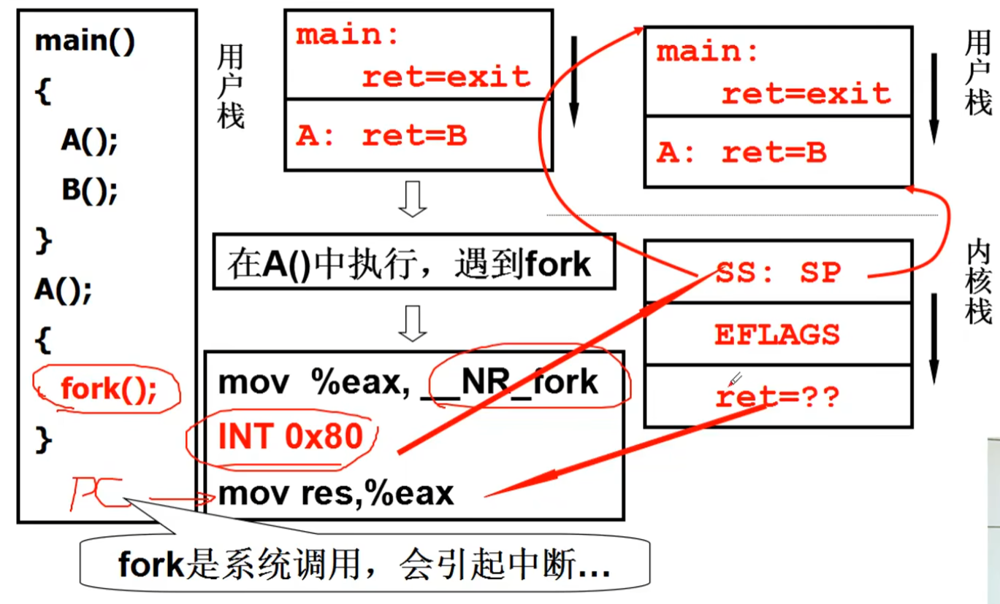
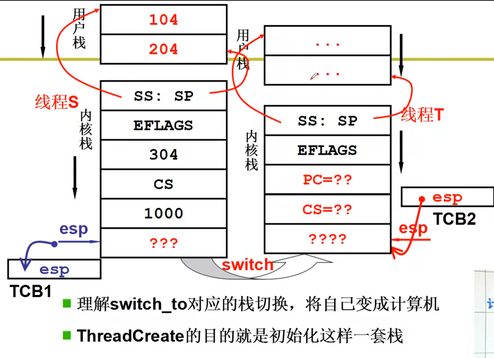

1. 什么是操作系统
2. 操作系统概述
   - 
   - 操作系统上电从0xFFFF0000执行引导程序，然后指针指向0x7c000000，512字节的引导程序，cs：ip
   - bois的9和10号中断，
3. 操作系统启动：
   - bootsect.s，
   - setup.s，
     - int 15  15号中断，获取内存大小，
     - 将os搬运到从0开始的地址处，（linux 0.11内核刨析）
     - 最后进入保护模式：jmpi 0、8 
     - cro寄存器：16或者32位
     - gdt：全局描述符表，初始化表，
   - system：
     - boot setup （system）head main
     - makefile：
     - 第一部分：head.s ，
     - 
     - }相当于是函数的return，操作系统最后回fork，永远不会退出，开始运行各种桌面和app
     - 第一项mem_init:
       - 4k内存一片，页表，进行初始化，最前面的使用过的是os，后面未使用的初始化未0，
4. 操作系统接口：interface，一般表现为函数调用，posix
   - 系统初始化之前GDT和IDT，以及mem_map等初始化，最后进入system，初始化完成后打开/bin/sh,系统等待用户输入
   - 
   - 系统调用的实现：
     - CS：当权的特权级，用户态3，只有更高的特权级访问低级的特权级，
     - **主动进入内核的方法：中断**
       - app程序包含int指令的代码，int 0x80进入内核，
       - 
       - 0x80:查看IDT表，
       - 
       - cs的最后两位未cpl，cpl=3，用户态，=0，内核态。最后调用system_write
       - 
       - 
5. 操作系统历史
6. 学习任务：
   - 
7. 第二章：2.1 cpu管理的直观想法
   - 多道程序交替执行： 堆栈空间以及寄存器保存和切换
8. 第二章：2.2：多进程图像
   - 描述：shell是第一个进程，并且一直while，shell再启动其他进程，
   - 怎么实现：PCB process control block，
     - 就绪态，运行态，阻塞态以及终止态
     -  pcb保存cpu中的各种信息，主要是寄存器和返回地址等信息，
     - 地址空间限制读写：mmu映射到实际物理内存会分区，避免多进程读写问题 
     - 进程之间切换要进行线程保护，避免进程通信出错，
     - 
9. 第二章：2.3 用户级线程---进程之间切换
   - **`进程=资源+指令执行序列`**
   - 线程：进程内部的指令序列，不需要进行资源切换
   - 实例：
     - 一个线程接收数据
     - 一个线程显示文本
     - 一个线程用来处理图片
     - 一个线程用来显示图片
   - 核心是yield，create
     - 一个线程一个栈，TCB存放栈帧，存放栈帧进行线程之间的切换
     - 但是如果一个进程的线程进入了内核态进行io读写并阻塞，内核切换到下一个进程，第一个进程内的线程无法执行，
   - 采用核心级线程，ThreadCreate进行系统调用，进入内核创建线程，核心级线程，内核级线程Schedule切换，
10. 第二章：2.4 内核级线程
    - 内核TCB和用户TCB同时切换，
    - 切换：中断
      - 
      - INT：用户栈到内核栈，内核栈和用户栈之间的切换进行链接，方便同时切换
      - IRET：返回到用户栈，
      - 进入内核栈之后进行用户栈的压栈，内核态知识执行一小部分代码，然后返回到用户栈，包含IRET的代码，返回到用户栈，**`试验四`**
      - 
11. 第二章：2.5 内内核级线程实现
    - 
    - **`切换五段论`**：为了切换用户线程，需要进行五个过程，**1.用户到内核  2.内核到线程控制  3，schedule切换到下一个线程控制   4，线程控制到内核  5.内核栈到用户线程**
    - 
    - 用户态进入内核态，fork产生中断，进入内核态，然后内核栈开始压入A的栈帧，并且连接到用户态的栈帧
    - 进入内核以后，要进行判断，如果时需要阻塞的进行切换，切换玩之后中断出口，int指令时自动push，然后中断出扣函数是人工pop，进行切换，
    - 切换switch_to:切换很慢，一条指令很长，进切切换
      - 
    - int ljmp Iret
    - copy_process:申请内存空间，创建TCB，创建内核栈和用户栈，填写两个stack，关联栈和TCB，子进程创建好以后开始iret返回的时候将子进程的堆栈链接到ret，然后开始执行子进程的代码，
    - 
12. 第二章：2.6 操作系统“树”
    - linux kernel source tree
    - linux0.01  交替打印AB
      - 时钟中断进行切换
13. 第二章：2.7 cpu调度策略
    - 
    - 要么采用FIFO，要么查看优先级，
    - 调度算法：常见的IO约束性优先级较高，用户的输入输出操作，cpu约束性的优先级较低，
      - FCFS：先来先服务
      - SJF：短作业优先，周转时间最小
      - RR：时间片轮转调度
      - 都满意的调度：前后台优先级调度，但是容易出现前台任务一直执行，前后台都得有时间片调度，
        - 前台任务：
        - 后台任务：
14. 第二章：2.8 一个实际的**`schedule函数`**
    - 第一步先找优先级最高的任务，io的counter更大，同时counter也是时间片的参数，
    - 
15. 第二章：2.9 进程同步和信号量：进程走走停停保证多进程合理有序
    - 
    - 单一信号量不能解决生产消费者模型，p2不能被唤醒，  
      - 所以需要一个记录有几个等待进程的变量，sem=-2，
        - 
    - sem  P  V：sem>=0，可以使用的实体资源，sem<0,正在等待的资源进程数
      - p：sem-1，如果sem>=0,继续进行，弱sem<0，阻塞等待
      - v：sem+1，如果sem>0,唤醒一个，执行，sem<=0,唤醒一个
16. 第二章：2.10 信号量临界保护区
    - **临界区**：修改变量进行上锁，修改完之后上锁，
    - **petson算法**
    - **多进程：取号，面包店算法，**
    - **`简单算法：`**
      - 关中断cli()，每次执行完一条去查看是否有中断，关闭中断之后
      - 原子指令:
17. 第二章：2.11 信号量的代码实现
    - 
    - 
    - 
    - 
18. 第二章：2.12 死锁处理
    - 互相等待对方释放资源，造成死锁，
    - 
    - 预防：
      - 不占有资源的情况下再去申请资源
    - 避免：判断是否会造成死锁，利用银行家算法进行判断Dijkstra
      - 
    - 死锁检测和恢复：发现问题再去处理
      - deadlock进程组，进行回滚，
    - **`大多数采用死锁忽略`**
19. 第三章：3.1 内存使用和分段
    - 程序编译完之后，重定位，将程序放入物理地址，载入时将程序地址进行整体改变（比如实体地址1000空闲，将原先40开始的程序改成1040的地址运行）或者编译时重定位，但是这种方法只能放在固定的地址
    - **swap**：将睡眠的进程放入磁盘，换入程序，因此最合适的应该是运行时重定位，放到哪里，运行的时候开始改地址，然后悳
      - 
      - 进程信息：pcb里面存放的是base地址等信息，
    - 分段：程序的变量，函数，堆栈等空间，因此访问就是段号：偏移进行访问
20. 第三章：3.2 内存分区和分页
    - 可变分区：内存碎片较多，内存紧缩进行移动，将小碎片放一起，时间较多，不合理
    - 内存分页：4k分页
21. 第三章：3.3 多级页表与快表--页表太大了，因为页只有4k
    -  页表4G/4K 大约需要4M内存存放页表，每个进程都有自己的页表，10个进程就是40M内存，
      - 实际上大多数根本用不到，不用的不存放---因为页表不连续，需要挨个查找，顺序查找，造成内存的次数变多，或者折半查找，但是同样的访问次数非常大，页号必须连续，怎么连续要让页表内存少

    - 多级页表：每一次造成一次访存，尤其是64位系统，采用TLB，块表
      - 记录最近使用的地址，没有命中就去多级页表查，存放在TLB中,TLB很贵，一般使用64~1024

22. 第三章：3.4 段页结合的实际内存管理
    - 首先程序进行分段，然后放入mmu虚拟内存，最后映射到物理内存，
      - 首先在虚拟内存上找到一片内存，然后映射到物理内存------**重定位**
      - 首先找到虚拟地址，根据枫叶地址找物理地址
      - 
      - 

    - 实际的段页内存管理：
      - 
      - fork（）执行成功以后，调用copy_mem函数复制内存空间，复制给进程的TCB，每个进程有自己的64M虚拟空间，互不重叠，怎么映射到物理地址呢？
      - 分配内存，建立页表：子进程和父进程公用内存，指向同一块页表内存，copy_page_tables传参用的是父进程的虚拟地址，
      - 
      - 父进程的地址传给子进程，from_dir，右移20位，章目录，然后找到节目录，**但是此处子目录重新指定页表，****`然后拷贝所有的内容给子进程，将物理地址复制给子进程的页表`**
      - 
      - 那么*p=7这样的语句怎工作：
        - 
        - 

23. 第三章：3.5 内存换入--请求调页---**`虚拟内存`**
    - 请求的时候才进行映射：
      - 当发生缺页的时候进行中断，中断服务程序进行更换，然后继续执行刚才的程序，当发生mmy缺页的情况，pc指针没有进行+1操作，继续执行刚才的指令
      - page_fault中断，14号

24. 第三章：3.6 内存换出
    - 常见的换出方式：FIFO、MIN、LRU
    - FIFO：缺页次数太多，效率很低，ABCABDADBCB，
    - MIN：将最远的页淘汰，但是往后看需要将来访问哪一页，怎么知道？
    - LRU：预测，局部性原理，一段时间内一个程序总是在一块内存内持续访问，
    - LRU实现: 时间戳，在实际操作系统中很难操作，
    - LRU：页码栈，多次修改栈指针，访存次数太多，
    - LRU：时间计数变为是否，将最近使用过的置为1，clock算法
      - 缺页很少的情况下，所有的置为1，导致按照顺序执行替换，类似FIFO算法
      - 同时还应该定时清楚R位
      - 但是给进程分配多少页框：
      - 

25. 第四章：4.1 IO和显示器
    - 

26. 第四章：4.2 键盘
27. 第四章：4.3 生磁盘的使用
28. 第四章：4.4 从生磁盘到文件
29. 第四章：4.5 文件使用磁盘的实现
30. 第四章：4.6 目录与文件系统
31. 第四章：4.7 目录解析代码实现

