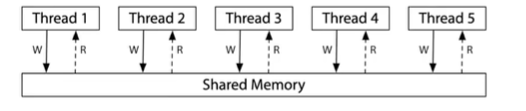
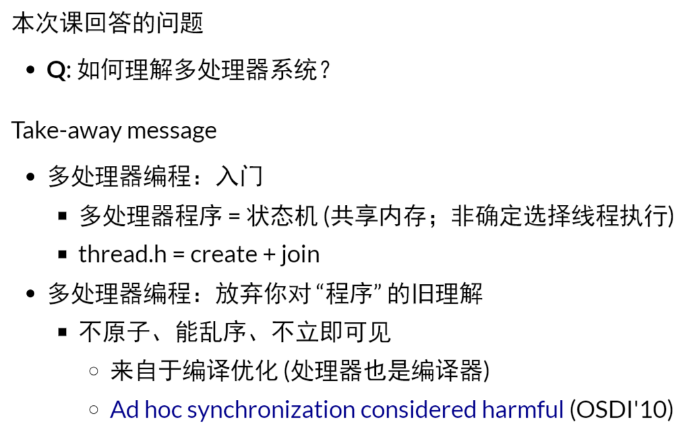
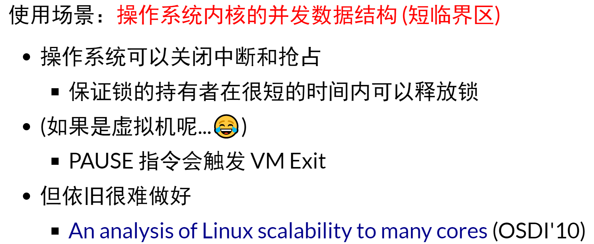
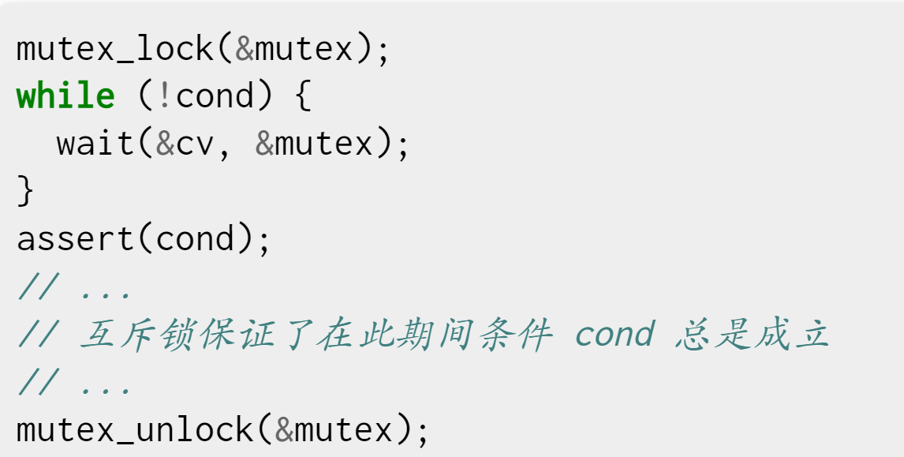
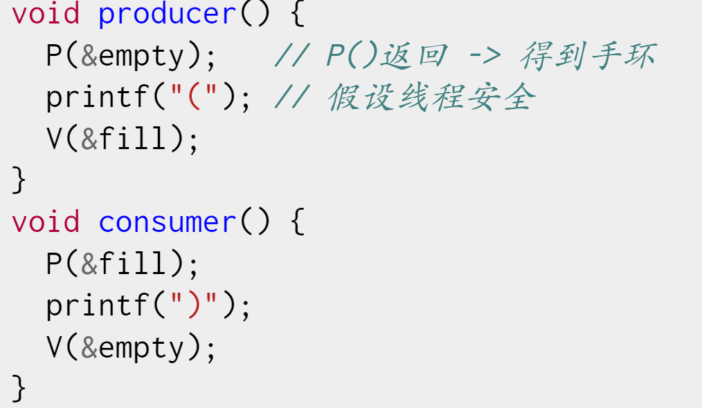

### 一、操作i系统上的程序（什么是程序和编译器）

### 二、多处理器编程（线程库、现代处理器和宽松内存模型）

1. 入门：
   - sort
   - strace
2. 原子性（lock和unlock）：
   - 利用objdump工具查看反汇编结果
   - 程序独占cpu在现在处理器上不成立 
3. 顺序：
4. 可见性：
   - 正确的前提下多处理执行
   - arm架构就是分布式系统
   - x86架构使用fence指令，共享内存写入按照原子指令
   - 现代的处理器就是i一个动态的数据流分析器，处理器从指令池子取指令执行，并不一定是原子操作
     - 

5. 总结：
   - 


### 三、理解并发程序执行（Petersoh算法、模型检验与软件自动化工具）

1. 画状态机理解并发程序
   - 互斥：保证两个线程不能同时执行一段代码
   - 小心现代处理器对程序优化 
2. 自动实现状态机（nemu，状态枚举器）---正确的语言进行状态机解析
   - model-checker.py

3. model checking和工具的故事
   - 

### 四、并发控制：互斥

1. 实现lock和unlock等函数
2. 自旋锁：**原子指令和诞生**--使用场景（不会有锁的争抢，持有自旋锁时禁止执行流切换）---得不到资源就原地等待，等待资源的释放
   - lock原子操作相当于是再lock之前的所i有操作都写入内存，但是lock的时候对所有cpu和所有线程上的lock进行排序，最后决定执行哪一个lock操作（**整个世界都停下来，并行消灭掉，按照顺序进行执行，原子指令之前的都写入内存**）
   - 多核如何访问内存：
     - 硬件上设计了一把锁，能够仲裁拿个cpu进行lock
     - **risc-v体系则会标记内存，当再次写入的时候没有标记则不执行操作**

   - 

3. 互斥锁：mutex-lock系统调用避免自旋锁被切出去，永久锁的情况
   - 自旋锁的缺陷：
     - 性能问题
       - 出发处理器的缓冲同步，延迟增加
       - 除了进入临界区的线程，其他都在空转
       - 争抢锁的处理器越多，利用率越低
       - 获得自旋锁的线程可能被切换出去、
       - 可能会切换出去，但是别的竞争不到资源

   - 性能的维度：
     - 管理长临界区


### 五、并发控制：同步

1. 复习

2. 问题：如何再多处理器协同多个线程完成任务？

   - 典型的同步问题：生产者-消费者模型，哲学家吃饭
   - 同步的实现方法：信号量，条件变量

3. 生产消费者模型：

   - 将pc.c输出的内容进行统计，压力测试pc-check.py,但是这个模型一直需要spin，不断的枷锁，并且释放，最好是能够睡眠并且唤醒

     - ```
       ./a.out 3 | python3 pc-check.py 3
       ```

     - 以上不足可以通过条件变量实现

4. 条件变量

   - 条件变量正确打开方式，if换成while，while循环退出时，条件成立
   - 
   - 信号量实现生产和消费者模型：
     - 
   - 哲学家吃饭问题：死锁现象，没有能够唤醒的信号量
     - hdfs管理方式，

### 六、真实世界的并发编程

1. 高性能计算程序：特点
   - 如何分解：分解任务作为状态转化，
   - 线程间如何通信：

### 七、并发bug和应对

### 八、操作系统的状态机模型

### 九、状态机模型的使用

### 十、操作系统上的进程

### 十一、进程的地址空间

### 十二、系统调用设shell

### 十三、c标准库的实现

### 十四、fork的应用

### 十五、什么是可执行文件

### 十六、动态链接和加载

### 十七、xc6代码导读

### 十八、xv6上下文切换

### 十九、处理器调度

### 二十、操作系统设计选讲

### 二十一、极限速通操作系统试验

### 二十二、1bit数据的存储

### 二十三、输入输出设备模型

### 二十四、设备驱动程序

### 二十五、文件系统API

### 二十六、FAT和UNIX文件系统

### 二十七、持久数据的可靠性

### 二十八、xv6文件系统实现

### 二十九、现代存储系统

### 三十、android系统

### 三十一、课程总结