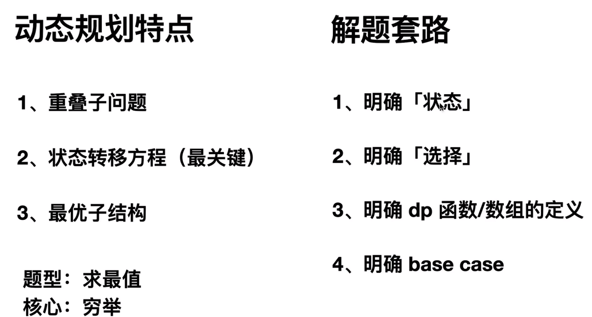
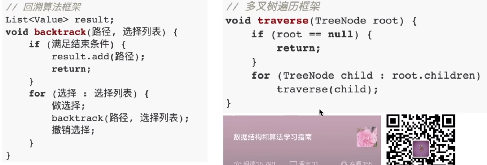

一、核心框架

1. 双指针秒杀7道链表题目

   - 合并两个有序链表（虚拟头节点，return res.next，同时p=res，）
   - 单链表的分解（制造两个虚拟头节点，一个链表存放小数据，另一个存放大数据，每次循环将原先的链表打断，防止出错）**因为此处没有新建指针，只是在改原先的p链表，所以每次循环结束最好断开链表的next**，也可以new一个新的链表出来，这样就不用操作原先的p链表
   - 合并k个有序链表（优先级队列，lambda函数实现大小排序，注意：此处存储的是最小堆，并且存放的是多个链表的头部元素的最小堆排序，每次取出最小的一个链表头部，pop之后，还要将次链表的不包含刚才头部的剩余链表重新入栈），
   - 单链表的倒数第k个节点：首先可以使用双for循环知道总共链表长度，最后第二遍找n-k+1
     - 或者采用双指针：首先定义指针p1，p1指向第k个元素，p2指向链表头部，此时p1和p2同时向后移动，当p1结束的时候，p2正好指向p-k+1的位置
     - 删除倒数第n个节点，力扣19题，也就是需要找到倒数第n-1的位置，while循环结束，然后删除第n个节点，利用虚拟头节点（避免只有一个元素，删除倒数第一个，这样还能找到dumy虚拟节点，然后删除倒数第一个节点）
   - 单链表的中点：快慢指针，快指针走两步，慢指针走一步，当快指针到尾部，慢指针正好在中间
   - 判断链表是否包含环：slow和fast指针，如果fast和slow相遇，说明遇到环，如果fast为null，说明不包含
     - 
   - 两个链表是否相交：主要问题是两个链表的头部不是一样长，将A链表遍历完继续遍历B，然后同时B遍历完继续遍历A，最后遇到了有相同元素说明有交点，（**或者采用将c2指向b1，改为求链表的环起点**）
     - 
     - 

2. 数组双指针技巧秒杀七道数组题目：（左右指针和快慢指针以及左右指针）

   - 快慢指针技巧	
     - 删除数组中的重复项（原地修改数组，比如数组搬移）：快慢指针，同样的也可以操作单链表去重，
     - 删除链表中的重复项：和数组操作一样，指针操作需要注意，并且最后while结束需要将slow的next指向null
     - 数组原地删除：fast和val一样的话进行换位，slow++，最后return slow（返回数组长度）
     - 移动0：首先采用快慢指针，将0全部移动到队尾，然后进行slow之后的元素赋值
     - 滑动窗口：在9里面单独学习
   - 左右指针的常用算法：
     - 两数之和**（有序数组）**返回一个val的两个数组之和：**12里面具体总结**
     - 反转数组：或者反转字符串，slow和fast相遇就停止
     - 找出最大的回文串（**可能数组是奇数或者是偶数**）：从中间向两边查找，奇数或者偶数，都有可能，比较fast和slow差值的最大值返回

3. 二叉树纲领篇（**回溯（遍历一遍就能知道答案）和动态规划（分解问题）**）

   - 思维模式（**单独找出一个二叉树节点，它需要做什么，前序、中序还是后序做事**）：**`快排--前序遍历（先排一个，再排序剩下的）  归并排序--后序遍历（先排序左边的，再排序右边的，再合并）`**
     - 遍历一遍二叉树得到答案？
     - 定义一个递归函数，通过子问题的答案推到出原问题答案？
     - 
     - 三个不同时间节点对二叉树进行操作的方法，多叉树不存在中序遍历，因为不纯在左右子树的切换
     - 
     - **但这里面大有玄妙，意味着前序位置的代码只能从函数参数中获取父节点传递来的数据，而后序位置的代码不仅可以获取参数数据，`还可以获取到子树通过函数返回值传递回来的数据`**。
     - 
     - 层序遍历：通过while和for循环进行叠加处理

4. 动态规划解题套路框架（重叠子问题、状态转移方程、最优子结构）**求最值、穷举**

   - 解题套路
     - 明确状态
     - 明确选择
     - 明确dp函数和数组的定义
     - 明确base case
     - 
     - 
   - 题目举例
     - 斐波那契数列（找到状态转移方程一部一部优化即可）
       - **暴力递归**--->>>带备忘录的递归算法（解决冗余计算）--自顶向下解决，自底向上求解f(20)=f(19)+f(18)等等
       - **dp数组**：自底向上状态转移，首先定义边界，f（1）和f（0），然后开始向上状态转移
       - **dp数组解法优化**：采用m和n进行存储临时变量，状态转移，不用维护dp数组
     - 零钱兑换问题（最值问题）
       - 状态：目标金额amount
       - 选择：coins数组中列出的所有硬币面额
       - 函数定义：凑出mount，至少需要coinChange(coins,amount)硬币
       - base case：amount==0，需要0硬币，amount<0，return -1；
       - 优化：
         - 此处的直接解法存在重叠子问题，比如中间的9和左子树的9，可以用备忘录优化
       - 
     - 暴力递归解法：存在冗余问题
     - 带备忘录的数组解法：自顶向下，备忘录初值只要是答案达不到的地方就可，常见负值
     - 自底向上的dp数组：取初值（求最值问题，dp数组的初始值一定是取不到的数字，amount+1或者+100都可，只要在状态转移方程取最小值的时候不要取到就可）
     - 
   - 动态规划进阶（编辑距离）：
     - 通过编辑距离问题，实践距离、选择、定义这几个框架
     - 如何写状态转移方程
     - 如何一眼卡出是否存在重叠子问题
     - dp数组的遍历顺序如何确定(base case：当i=-1，或者j=-1，需要进行j+1次insert或者是i+1次删除操作；当啥都不做的时候，i-1和j-1，和函数定义一样，算i和j、i-1和j-1一样；)
       - 
       - 
       - 
       - 
       - 
       - dp数组解法：
       - 

5. 回溯算法解题道路框架（多叉树暴力穷举）n皇后问题---**`重点是路径上的数字`**

   - 
   - 
   - **全排列问题**：优先做选择，也就是添加3，最后进行下一层，长度达到3，添加[1 2 3]，开始返回，之后将3剔除，返回上一层，也就是撤销选择
     - 全排列优化：进行剪枝操作，将重复的叶子节点continue
     - 
     - 时间复杂度：递归函数的时间复杂度*递归函数被调用的次数（递归树上节点的个数），on2x3x2x1，时间复杂度很高
   - n皇后问题：
     - 第一行按照顺序往前走，然后第二行开始看isvalid，如果有效，做选择，继续第三行递归，无效直接退出
     - isvalid剪枝函数：第一步看列方向有没有重叠，第二部看左上角，第三步看右上角
     - 时间复杂度：on2

6. 回溯算法秒杀所有排列组合、子集等问题

   - 元素无重复不可复选

     - 子集问题：子集问题可能会重复，因此需要剪枝，比如遍历过1，就第二次不在遍历，需要在函数入口初排除这个选择，所以进入下一层递归的函数backtrace（nums，start+1）；
     - 
     - 组合问题：自己长度为2的组合，只需要收集第二层的数据，base case里面当res的legth=2，返回，，，也是从i+1开始
     - 排列问题：全排列问题，上一节讲过，全排列问题需要考虑有的元素使用过，used[i]==true,continue，其他不需要剪枝，basecase：length==长度，return，

   - 元素重复不可复选：**`需要排序`**

     - 子集、组合：重复问题怎么剪枝：首先将nums数组进行排序，，backtrack函数第一步进行res.add，然后每次backtrack函数第二步进行判断nums[i]==nums[i+1]，如果等于的话说明重复了，continue即可

     - 排列问题：**`去重技巧就是维护相同元素的相对位置不变，这样的话回存在[1 2 2],而[1 2]不会出现两次`**

       - ```
         if (i > 0 && nums[i] == nums[i - 1] && !used[i - 1]) {
             // 如果前面的相邻相等元素没有用过，则跳过
             continue;
         }
         ```

   - 元素无重可以复选：

     - 比如[1 2 3]，找初和为3的子集------------，此处可以复选的话继续从i开始即可backtrack(i)开始，但是这种情况base case写不好的话可能回无线递归
     - 子集问题：求target和，下次开始从backtrack（i）开始，然后边界条件sum==target,add(track),sum>target,continue

     - 排列问题：不用剪枝直接写即可

7. BFS算法解题套路框架-----层序遍历衍生而来

   - 使用场景：**`一幅图，start到target之间的最短距离`**，
   - 起点和终点start和target，记录距离步数step，
   - 
   - 每次bfs相当于是向下走了一层，for循环每一层的节点进行寻呼那，但是dfs每次遍历的是最左侧的节点，依次向右，dfs需要将全部的节点都遍历完
   - 题目
     - 力扣752，打开密码锁
       - 首先进行穷举思路：四位的密码锁，每次四个按键，每个按键两种可能，总共四个按键，八种可能，一次类推，**`就是一个八叉树`**，然后题目要求到指定位置的最短距离，典型的bfs题目
       - 利用bfs框架可能存在的问题：
         - 会走回头路：首先，0000变成1000的时候，第二步1000有可能还会变成0000，因此需要一个数组visited将出现的记录，
         - 没有终止条件：按照题目要求，找到target应该结束返回波动的次数
         - 没有对deadends处理：遇到限制条件进行continue
     - 力扣773，滑动谜题
       - 首先进行穷举：对0周围的三个元素可以移动，也就是三个结果，一次下去，三叉树，**也就是可以抽象成三叉树，找一个特定target，并且找最小距离**
       - 利用bfs框架进行求解：
         - 
   - 双向BFS优化：从start和target同时向中间走，双向bfs必须知道终点在哪里，比如密码锁问题，但是最大深度问题就不能使用双向bfs
     - 代码层面只需要在单向bfs尾部将start和target换，

8. 二分搜索算法--双指针技巧**左闭右闭**

   - 
   - 左侧边界的二分搜索：找到之后不返回，right=mid，向左侧收缩，找第一次出现的索引，**左闭右开区间**
     - 
   - 右侧边界的二分搜索：**左闭右开**
     - 
   - 最后可以改造成统一的左闭右闭得区间

9. **滑动窗口算法**（**`字串问题`**）：数组快慢双指针的一种，窗口左闭右开（窗口里面没有数据）；双层嵌套while，外层放大right，内层缩小窗口left，O(n)

   - 
   - 具体题目：
     - 最小覆盖子串：乐扣76，接下来套框架的时候有几个问题
       - 什么时候移动right扩大窗口-----窗口内的valid数据不够length，开始扩大右侧
       - 什么时候窗口应该暂停扩大，开始移动left---当valid==length，暂停扩大
       - 什么时候更新结果？当right-left<len，也就是小于上一次的窗口大小，开始更新结果
     - 字符串的排列
       - 

10. 股票买卖问题

11. 打家劫舍问题

12. nSum问题

13. 时空复杂度分析指南

14. 骗分套路


