### 瑞萨cs+ for cc开发环境学习（RL78）

1. 按键中断：

   - 建立工程->开启时钟->关闭看门狗->设置仿真器
   - `P4_bit.no1=0;`
   - 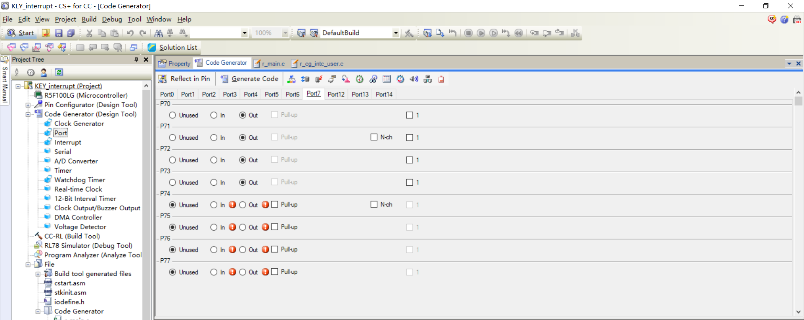
   - 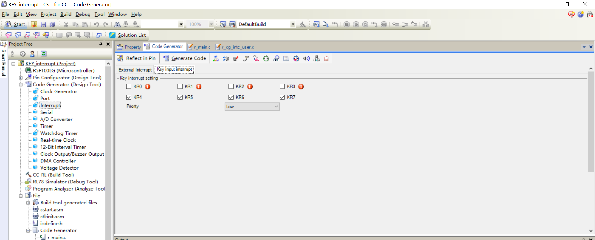
   - 设置完IO口和按键中断后电机code generator生成代码
   - 之后在按键中断intc_user.c中断函数中写自己的代码，按键中断采用延时函数进行消抖，如图所示，中断中采用执行时间很短的代码工作，其他全在中断外执行
   - 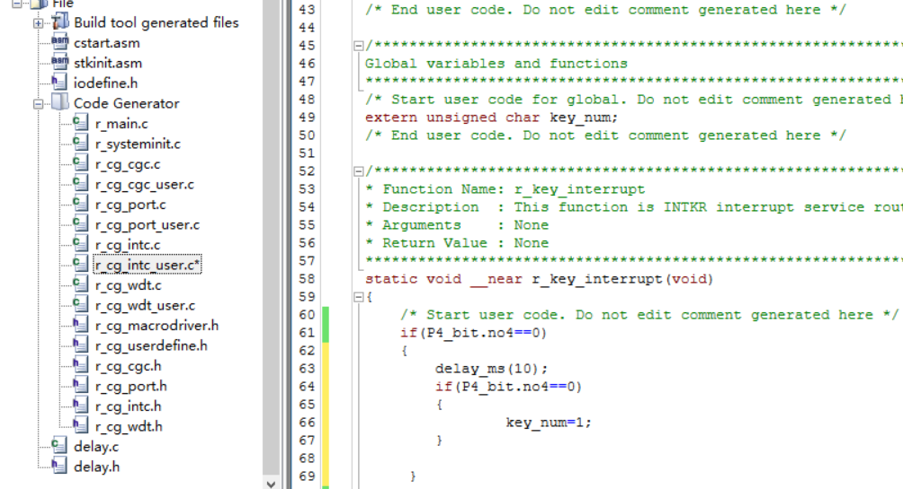

2. I2C通讯实验（eeprom）**`开漏输出，线与特性`**

   - M24C02-WMN6TP
   - 确认地址，高四位固定为1010,4-6根据电路连接确定，第七位根据读写操作确定为0/1（写：0xA0/读：0xA1）
   - 字节写入，**硬件I2C一次通信结束后必须发送stop信号，否则没法释放总线**
      - 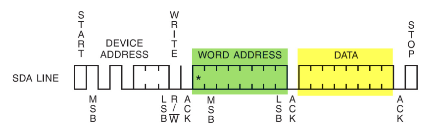
   - 页写入
      - 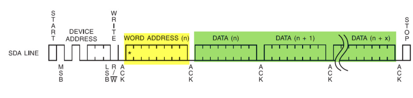
   - 读取数据时序
      - 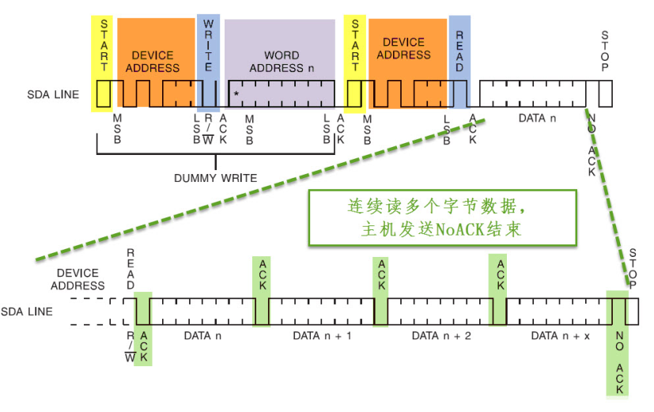
   - 注意M24C02单次写入最多16个字节，此外瑞萨生成的硬件I2C读写函数要符合eeprom的时序，需要进行改造(写入地址控制)

   - M24C02读写函数，首先传入设备地址，再次传入读写位置，要发送的或者是存储的buffer地址，最后读写长度（调用cs+ for cc生成的读写函数）

      	void M24C02_send(uint8_t Device_adr,uint8_t Byteadr,uint8_t *const Tx_buf,uint16_t Tx_num)
      	{
      	    unsigned char send_buf[257];
      		unsigned i;
      	    send_buf[0]=Byteadr;
      		for(i=0;i<Tx_num;i++)
      		{ 
      			send_buf[i+1]=Tx_buf[i];
      		}
      		tx_end=0;
      		R_IIC11_Master_Send(Device_adr,send_buf,Tx_num+1);
      		while(!tx_end);
      		delay_ms(10);
      	}
      	
      	void M24C02_read(uint8_t Device_adr,uint8_t Byteadr,uint8_t *const Rx_buf,uint16_t Rx_num)
      	{
      	    unsigned char BYTE_buf[2];	
      		BYTE_buf[0]=Byteadr;
      		tx_end=0;
      		R_IIC11_Master_Send(Device_adr,BYTE_buf,1);
      		while(!tx_end);
      		delay_ms(5);
      		
      		rx_end=0;
      		R_IIC11_Master_Receive(Device_adr,Rx_buf,Rx_num);
      		while(!rx_end);
      		delay_ms(5);	
      	}	

   - 硬件I2C和芯片时序差异：**硬件I2c需要在第一个start结束的时候发送stop，否则不能释放总线信号，不能开始下一次传输**，**`如果要和芯片的时序一样自己自己封包GPIO产生模拟I2C信号`**
     - 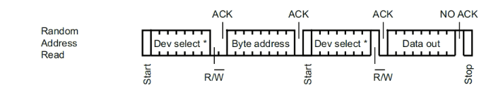
     - M24C02_read(0xA0,0x00,rx_buffer,256);首先发送设备写地址0xA0，然后内存地址0x00，其次是设备读地址0xA1，数据，存储设备默认数据为0xFF
       - 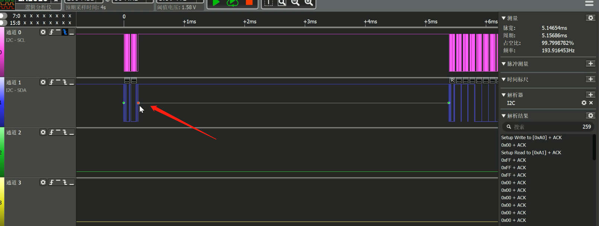
       - 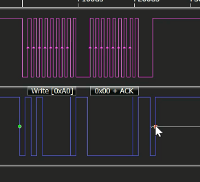
       - 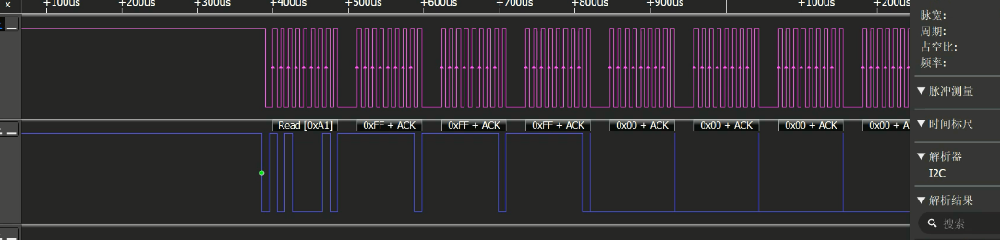
     - M24C02_send(0xA0,0x03,tx_buffer,11);首先发送写地址0xA0，其次是内存地址0x03，最后是写入的11位数据，unsigned char tx_buffer[10]={0x05,0x02,0x03,0x04,0x05,0x06,0x07,0x08,0x09,0xaa};
       - 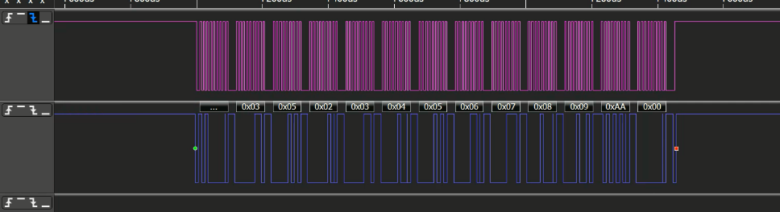

二、IAR开发瑞萨芯片

1. 

