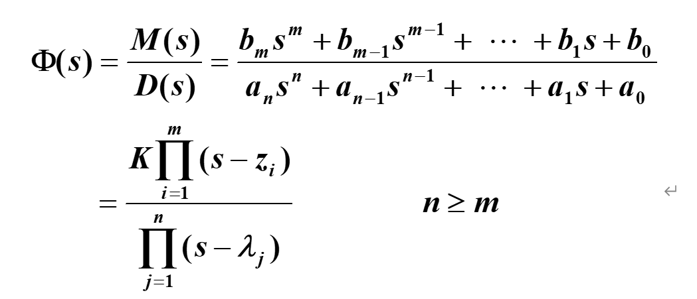
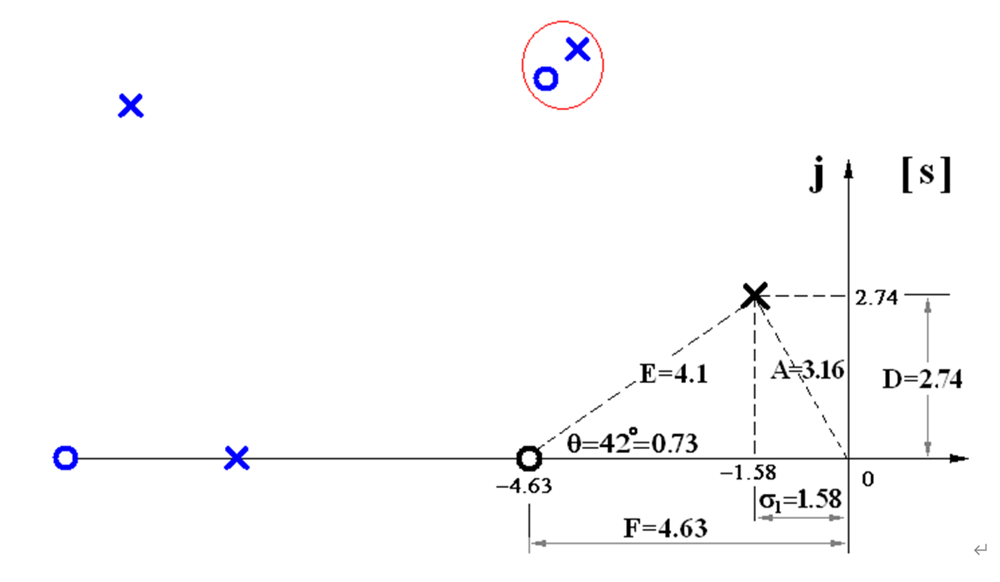
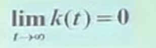
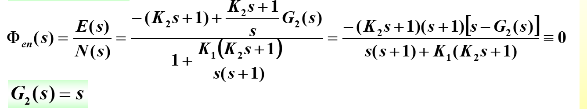
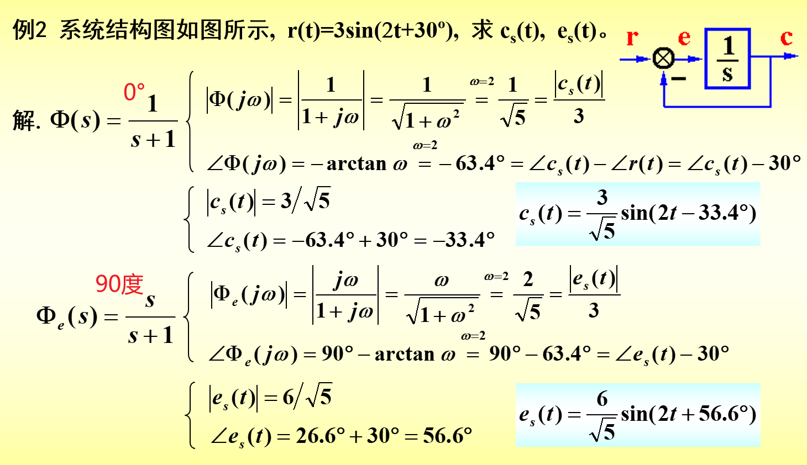

### 线性定常系统

### 一、自动控制相关概念及其数学模型

### 二、第二章：建模数学模型

1. 建模方法：解析法、实验法
   - 输入r（t），输出c（t）
   - 线性系统：满足叠加原理，
     - 
     - 线性：不能有常数项，不能有阶数不同的乘机，也不能出现阶数的乘积，
     - 时变：是不是时变系统看系数，比如e^t就是时变，
     - 建模举例：线性定常的二阶系统
       - 
   - 如果是非线性系统微分方程采用泰勒展开进行线性化求解
     - 
   - 微分方程求解问题：
     - 
     - 复数域求解：将t换成S进行求解，
       - 复数和复函数：
       - 
       - 拉式变化：
         - 定理：线性性质、微分定理、积分定理（f(-1)**代表求一次积分**）、实位移定理
         - 
         - 
         - 
         - 
         - 
         - 
         - 拉式变化用于解微分方程：
           - 
2. 拉式反变化以及复域数学模型：
   - 拉氏变换之后进行因式分解，最后查表得到反变化的结果，
   - 怎么因式分解 ：留数法之后查表得到原函数
     - 
     - 系统响应：输入条件（**阶跃信号输入-严酷的输入信号**）、初始条件（**0初始条件**）、系统的结构参数（**自身特性**）
   - 传递函数：0初始条件，输出拉氏变换和输入拉氏变换的比值G（s）
     - 首项系数为1
     - 尾项系数为1
     - 
     - 例子：
       - 
       - 
       - 由于要求给定初始状态的系统响应，需要和状态无关的微分方程进行计算，将第六步计算得到的微分方程进行拉氏变换，
       - 上图中两部分**`全响应=零初始响应+零状态响应`**
       - 
3. 控制系统的复域数学模型(2.3)：
   - 常见控制系统的复数模型
   - 多个方程也可以直接拉氏变换，不用消除中间变量，最后利用框图进行合并
   - 
   - 负载效应：一个系统输出作为另一个系统输入
   - 

4. 结构图及其等效变换：2.4
   - 
   - 结构图化简Mason公式：**`先找引出点和比较点，进行同类型合并，`**
     - 实在不能解决了采用跨节点进行合并

5. 信号流图：2.5
   - 

6. 控制系统开环传递函数：主反馈打断对应的传递函数就是开环传递函数

### 三、时域分析   快----稳----准

1. 一阶系统时间响应和动态性能：采用尾一标准型
   - 延迟时间td-第一次达到终值50%的时间
   - 上升时间tr-10到90%所需要的时间，0~1终值所需要的时间
   - 峰值时间tp-
   - 超调量
   - 调节时间ts
   - 
     - 一阶系统
     - 
     - 
     - 
2. 二阶系统时间响应和动态性能
   - 标准形式和分类：开环传递函数：二阶系统采用**`首一标准型`**
     - 
   - **临界阻尼和过阻尼动态性能计算：计算调节时间ts**
     - 
     - 例题：
       - 
       - 
       - ts=3.33*10=33.3，**第一次输出的单位阶跃响应3.33s，然后输入到第二个传递函数，输出低于标准阶跃响应的图形**，
       - **`当两个比值较大时，可以当作第一离虚轴近的一阶惯性环节响应动态性能差不多，`**也就是表格中ts/T1=3，远离虚轴的极点可以忽略，
       - h(t)对应上图第三个图黑线，-0.9衰减较快，影响很小，T1为主导极点
   - **`欠阻尼二阶系统`**动态性能指标计算（单位阶跃响应）：
     - 
     - 
     - 
     - 单位阶跃响应时域响应求导：此处求峰值时间tp的话采用对h(t)求导，**也可以采用标准传递函数拉式反变化的方式**（脉冲响应的传递函数）
     - 超调量：
     - 
     - 调节时间：包络线进入5%的时间   
       - 
       - 
   - 二阶欠阻尼系统动态性能指标：（阻尼在0~1）
     - 
     - 
   - 二阶欠阻尼最佳阻尼比：0.707  45°    **`此处采用曲线自己进入5%范围`**     **ts采用2/(1/T)**
     - 
     - 
   - 二阶欠阻尼系统变化规律：
     - 
     - 
     - 
     - 二阶欠阻尼动态性能.doc
   - **`二阶系统的性能改善`**：调参和结构改善 
     - 
     - 
     - 
     - 
3. 高阶系统时间响应和动态性能
   - 
   - 主导闭环节点：
     - 
     - 远离虚轴三倍以上的直接取消，相邻的极点和零点消除，化简成二阶系统
     - 
4. 线性系统的稳定性分析：扰动去除以后能够稳定的
   - 单位脉冲响应能够回零，则系统稳定
   - 
   - 判据：
     - 必要性：分母ai>0，也就是系数都大于0，并且每一阶都存在
     - 充分性：劳斯判据，劳斯表第一列全大于0，稳定，否则不稳定。第一列变号几次，右平面有几个根（某一行不全为0，用无穷小代替）
     - 开环稳定和闭环稳定之间没有关系
5. 线性系统的稳态误差
   - 无差系统和有差系统：阶跃响应下误差能否消除
   - 静态误差：
     - 判定稳定性：
     - 求误差传递函数：
     - 终值定理求稳态误差：
     - 
     - 
     - 静态误差系数法：
       - 
       - 
       - 
       - 
   - 动态误差：了解即可  稳态分量
     - 
6. 线性系统时域校正（反馈矫正、）
   - 反馈矫正：
   - 
     - 减少被包围环节的时间常数
       - 

     - 深度负反馈可以有效降低被包围环节的影响
       - 

     - 局部正反馈提高环节增益
       - 

   - 复合矫正：
     - 
     - 

   - 

### 四、复域法  根轨迹法  闭环系统

1. 根轨迹（**尾一标准型 开环增益   首一表标准型 根轨迹增益**）

   -  ****
     - 
     - 
     - 
     - 上图中，当阻尼大于1，相当于异界系统，再实轴上向中间移动，看似一阶系统，Ts+1=0，s变小，T变小，因此调节时间Ts=3T变小，或者利用根离实轴越远，包络线收敛变快，调节时间变小
     - 当阻尼大于1，根往上走，超调量变大，调节时间基本没变
     - 系统绝对稳定，
     - 稳态误差：非0常值稳态误差
     - 
   - 闭环零点和开环零点极点至之间关系
     - 
     - 
     - k*可以取任何值，因此模值可以是任何数
     - **`相角：s-p  由p指向s`**
     - 
   - `根轨迹法则`：8个
     - 
     - 
     - **`法则三一个点右侧的相角奇数的话，是根轨迹`**
     - 
     - 上图中根之和，n-m=2，正好对称走
     - 
     - 
     - 
     - 
     - 
     - 

2. 广义根轨迹

   - 
     - 
     - 
   - 广义根轨迹：
     - 参数根轨迹：
       - 将参数化的根轨迹问题换成等效的Ds函数，根轨迹画完等效函数就退出
     - 零度根轨迹：系统实质上处于正反馈时的根轨迹
       - 
       - 
       - 

3. 利用根轨迹分析系统性能(**`未学完`**)

   -  **⑴** **绘制系统根轨迹；**

      **⑵** **依题意确定闭环极点位置；**

      **⑶** **确定闭环零点；**

      **⑷** **保留主导极点，利用零点极点法估算系统性能**

### 五、线性系统的频域分析和矫正

1. 频率特性的基本概念
   - 正弦信号输入，幅值和相位变换，称为线性系统的稳态正弦响应
   - 频率特性：
   - 开环传递函数：G/(G+1)    误差传递函数 1/(G+1)
   - 
2. 幅相频率特性--奈奎斯特
   - 典型环节的幅相特性曲线
     - 
     - 惯性环节：
       - 
     - 震荡环节：
       - 
       - 
       - 震荡环节在当阻尼比等于0的时候，从x轴正方向出发，x轴负方向回来，
       - 
       - 
3. 对数频率特性--伯德图
   - 典型环节
     - 
     - 二阶复合微分：
   - 开环系统
4. 频域稳定判据
5. 稳定裕度
6. 利用开环频率特性分析系统的性能
7. 闭环频率特性曲线的绘制
8. 利用闭环频率特性曲线分析系统性能
9. 频率法串联矫正

 

