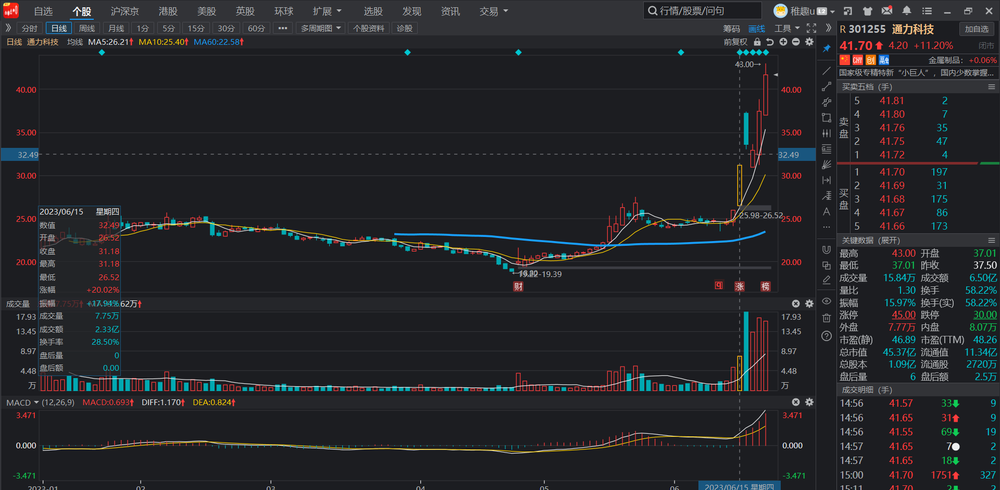

### 趋势跟踪交易体系

#### 复盘、

1. 第一步确定大盘当天情况，大盘横盘或者上涨积极做多即可，大盘下跌个股降低仓位
2. 首先复盘**三级行业指数和概念指数**，找当日最强的板块（**`三级板块和概念指数，看5日涨幅排名，以个股和概念指数为主，只买近期强势板块`**），如果存在最强板块，从中找率先涨停的领涨个股，最强共振第二天买入。
3. 如果备选的板块买入赚钱了（板块选错了是不会赚钱的），第二天继续买入同板块，将一个板块利润最大化，一个板块两只，单个20%仓位，一个板块不超过45%的总仓位
4. 如果所有的主线都破位，选择休息，耐心等下一次机会出现（敢于空仓的才是大神）。

#### 个股操作

1. 个股选择以及买入标准：
   - 不管是共振的或者回踩的板块，个股选择一定是板块内最强的，日线上最早涨停，分时上最早涨停（**`最早开始跳空攻击，拉升时间最早，幅度最大`**）。（堆量和连阳，vcp或者横盘突破，回踩过深的放弃）
   - 个股选择之后，第二天早盘没有符合强势特征的，尾盘买入即可，比如2023.6.9的CPO，对应的最强太辰光，第二天早上低开并且没有快速拉升，因此选择尾盘买入

2. 个股卖出标准（除非异常公告导致的大幅低开，其他早盘不卖出）：

   - 板块放量滞涨，对应的手里龙头也是放量滞涨，比如2023年7月3号的减速器和300503，同时放量，并且板块放量阴包阳，可**`卖出三分之一`**
   - 板块缩量跌破5日线，但是**`个股走势正常`**，比如：2023.7.10的存储芯片，个股缩量十字星；2023.6.23的CPO，板块缩量跌破，减半应对，第二天早盘确认低开直接处理
   - 板块缩量跌破5日线，但是**`个股跌幅较大`**，比如：2023.7.10的汽车零部件，板块缩量轻微跌破10日，但是个股跌幅巨大，当日跌幅-17%，可选择减仓应对，三分之一或者一半
   - 板块放量跌破5日线，2023.6.23，人脸识别，个股选择清仓
   - **龙头个股卖出之后在10日线止跌，不管此时板块什么位置，都可以进行试错，龙头的领涨作用可能会带动板块进行强势修复（参考上次的昆仑万维）**
   - 个股跌破５日线，必须要走
   - 另外，一些异常信号处理：
     - **`对于市场异常公告导致大幅低开开盘价卖出即可`**
     - 个股跟踪（可能存在卖飞的情况）
     - **`严格杜绝盘中止损，尤其是股票三五日横盘期间卖出；如果尾盘跌破5日不收回卖出，持续跟踪看是否第二日修复`**
     - 如果按照条件卖出了，选择3日跟踪，没有反弹放弃

   ### 实战举例：

   1. cpo板块：6月9号cpo概念指数突破新高，对应的三级行业指数通信网络设备及器件同时创新高，确定了板块最强只需要找到当日最强的个股（主力租金选择的最强个股），太辰光优先20cm涨停，第二天买入，同板块利润最大化，赚钱的继续买入同板块个股，买入天孚通信
      1. 
      2. 
      3. 
      4. 
      5. 实战交易截图：
         1. 
   2. 机器人板块（6月15日`机器人板块`，并且对应的概念指数`减速器`新高，）：
      1. 个股选择，找6月15日当天机器人板块和减速器概念指数最强的个股（**`新时达和通力科技`**）-----资金选择的最强个股
      2. 
      3. 
      4. 
      5. 
      6. 实战截图：
         1. 

   

   

   

​	